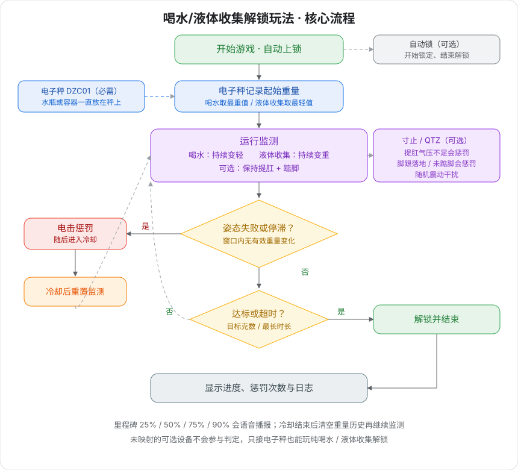

# 喝水/憋尿解锁玩法

把水瓶或容器放电子秤上，喝水变轻或排泄变重，达到目标重量变化或超时即自动解锁；可叠加提肛、踮脚监测，失败会电击惩罚。

> 🛒 **电子秤（必需）**：[淘宝购买](https://item.taobao.com/item.htm?id=1078737864164)
> 🛒 **寸止综合设备（可选，踮脚检测和电击）**：[淘宝购买](https://item.taobao.com/item.htm?id=1044468799434)  
> 🛒 **自动锁（可选）**：[淘宝购买](https://item.taobao.com/item.htm?id=925058360048)

## 玩法说明

- **喝水模式（默认）：** 水瓶一直放秤上，用吸管持续喝水使秤变轻，减轻达标即解锁。
- **排泄模式：** 容器一直放秤上，向其中排出使秤变重，增重达标即解锁。
- **姿态约束（可选）：** 映射气压 / 踮脚设备后，必须保持提肛和踮脚，否则电击。
- **可选锁定：** 连接自动锁后，开始即锁定，达标或超时才解锁。

## 设备要求

| 设备 | 逻辑 ID | 是否必需 | 作用 |
| --- | --- | --- | --- |
| [电子秤](../device/简单智能电子秤终端.md) | scale / DZC01 | 是 | 实时称重，判定喝水变轻或排泄变重 |
| [寸止综合设备](../device/寸止综合设备.md) | sensor / cunzhi / punish / vibe | 否 | 提肛气压、踮脚压力、电击惩罚、随机震动 |
| [自动锁](../device/简单智能锁定终端.md) | lock / ZIDONGSUO | 否 | 开始锁定，结束解锁 |

> 无寸止主机时，这三个产品也可单独接入：QTZ 脚踏（距离感应终端）替代踮脚、DIANJI 脉冲终端替代电击、TD01 电机终端替代震动。

未映射的可选设备不会参与判定。只接电子秤时，就是纯喝水 / 排泄解锁。

寸止综合设备一台可同时承担提肛、踮脚、电击、震动四个角色，在客户端里分别映射到对应槽位即可。

## 穿戴与连接

请先安装客户端并连接设备，详见 [客户端下载与设备连接](client/new-phone-client.md)。

- **电子秤**：放在平整地面。水瓶（喝水）或容器（排泄）整局都放在秤上，不要整瓶端起来。
- **盆底肌传感器（可选）**：配合润滑液，侧卧放松后缓慢置入。
- **电脉冲片（可选）**：贴在大腿内侧，左右各一片。禁止贴在躯干、心脏、头部。
- **踮脚传感器（可选）**：塞入袜子贴紧脚后跟，或放在鞋内脚跟位置。
- **主机固定（可选）**：绑带把寸止主机绑在大腿上。
- **自动锁（可选）**：独立无线设备，不连主机。

线路连接见 [寸止玩法二代使用教程](./寸止玩法二代使用教程.md#operation-steps)。

## 软件设置

1. 在客户端进入玩法库，选择「喝水/憋尿解锁玩法」。
2. 映射电子秤（必需），再按需要映射气压、踮脚、电击、震动、自动锁。
3. 选择喝水或排泄，设定目标重量、最长时长、惩罚参数。
4. 点击开始。语音默认开启，可在参数里关闭。

## 游戏玩法

### 核心规则

+ **喝水模式**：以过程中的最重值为起点，按相对起点减轻的克数计进度。
+ **排泄模式**：以过程中的最轻值为起点，按相对起点增重的克数计进度。
+ 历史窗口（默认 30 秒）内无一次超过「有效变化阈值」的变化，视为停滞并惩罚。
+ 映射气压时，气压须高于提肛阈值。
+ 映射寸止踮脚时，脚跟压力超阈值并持续超防抖时间，视为落地并惩罚。

### 状态循环

+ **运行中**：每秒检查姿态、停滞、随机震动，并累计重量进度。
+ **惩罚**：触发电击（未映射电击则只记原因），播放对应语音。
+ **冷却**：默认 10 秒暂停检测；结束后清空重量历史，重新开始监测。
+ **已解锁**：进度达标，或到达最长时长，开锁并结束。

### 语音与干扰

+ 开场、惩罚原因、冷却、达标 / 超时 / 手动结束都会播报。
+ 进度到 25% / 50% / 75% / 90% 各播一次。
+ 运行中会随机鼓励，并提醒已接入的提肛 / 踮脚。
+ 每秒按概率触发一次震动干扰（默认约 5%）。

### 游戏结束

+ 累计变化达到目标重量：成功解锁。
+ 到达最长时长：超时解锁。
+ 手动结束也会开锁。
+ 界面保留进度、电击次数、最后一次惩罚原因和日志。

## 参数说明

### 基础参数

| 参数 | 默认 | 说明 |
| --- | --- | --- |
| 玩法模式 | 喝水（变轻） | 喝水：秤变轻达标；排泄：秤变重达标 |
| 最长时长 | 1800 秒 | 超时自动结束并解锁。初学者可先用 900–1800 |
| 目标重量变化 | 500 g | 相对起点需要变化的克数 |
| 语音提示 | 开 | 阶段、惩罚、里程碑播报 |

### 判定与难度

| 参数 | 默认 | 说明 |
| --- | --- | --- |
| 有效变化阈值 | 1 g | 小于此变化视为噪声，不刷新停滞倒计时 |
| 历史窗口 | 30 秒 | 窗口内无有效变化即惩罚 |
| 提肛气压阈值 | 20 kPa | 低于此值视为未提肛（需映射气压） |
| 踮脚压力阈值 | 100 | 高于此值视为脚跟落地 |
| 踮脚防抖 | 300 ms | 寸止压力抖动过滤，过小易误判 |

### 惩罚与干扰

| 参数 | 默认 | 说明 |
| --- | --- | --- |
| 惩罚冷却 | 10 秒 | 电击结束后的暂停检测时间 |
| 电击强度 | 24 V | 建议 15–24 V，不超过 30 V |
| 电击持续 | 2 秒 | 单次电击时长 |
| 振动启动概率 | 0.05 / 秒 | 约每秒 5% |
| 振动强度 | 255 | 0–255 |
| 振动时长 | 3 秒 | 单次震动时长 |

## 界面说明

+ **任务进度**：已变化克数 / 目标克数，并显示起始重量。
+ **当前重量 / 气压 / 踮脚状态**：实时读数。
+ **惩罚倒计时**：距离下一次「停滞惩罚」还剩多少秒。
+ **电击信息**：触发次数、是否已映射、当前是否在电击、冷却剩余、上次原因。
+ **系统指标**：模式、窗口内最小/最大重量、采样数等。
+ **系统日志**：启动、进度、惩罚、冷却、结束记录。

## 使用建议

+ 水瓶或容器必须一直放在秤上。喝水请用吸管，不要把整瓶拿起来，否则重量会骤降、可能直接判定达标。
+ 人不要站到秤上，避免体重干扰判定。
+ 第一次只接电子秤，先跑通喝水流程，再加提肛、踮脚和电击。
+ 目标先用 200–300 g，窗口先放到 45–60 秒，熟悉后再收紧。
+ 接电击时从低电压、短时长开始。

## 安全提醒

+ 请确保身体健康，无心脏病、癫痫等疾病。
+ 建议从较低强度和较短时间开始；不适请立即停止。
+ 仅限 18 岁以上成年人使用。
+ 禁止在心脏、头部、躯干等核心部位使用电脉冲，或让电流流经以上部位；人体使用电压不得高于 36 V。
+ 喝水不要过量、不要过快；有肠胃或泌尿系统不适时不要使用排泄模式。
+ 连接自动锁时，请确保周围有人可协助，并了解长按 60 秒强制解锁、电量低于 20% 自动解锁。
