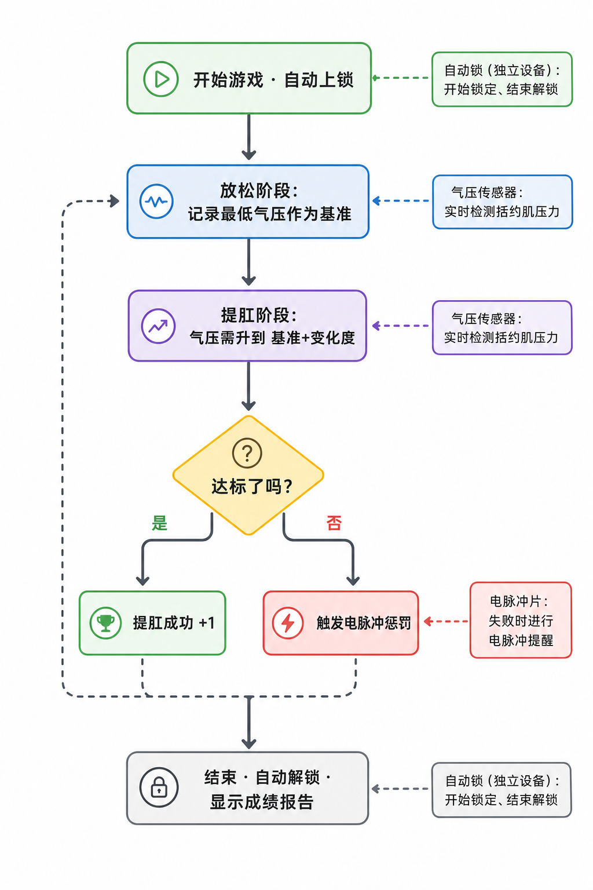
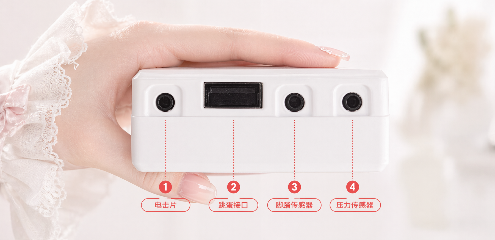

# 提肛训练玩法（第二代）

通过「放松阶段」和「提肛阶段」交替进行盆底肌训练，在规定时间内完成尽可能多的「提肛成功」，失败会触发电脉冲提醒。

> 🛒 **设备获取**：[淘宝购买](https://item.taobao.com/item.htm?id=1044468799434)

## 玩法说明

- **提肛训练玩法：** 设备通过气压传感器实时检测括约肌压力变化，引导你在「放松」与「提肛」两个阶段间交替训练。
- **目标：** 在规定时间内完成尽可能多的「提肛成功」，成功或失败会在界面直观提示。
- **可选锁定：** 连接自动锁后，游戏开始即锁定，不玩完不许走。

## 穿戴与连接

请先安装客户端并连接设备，详见 [客户端下载与设备连接](client/new-phone-client.md)。

- **盆底肌传感器（肛塞）**：配合润滑液使用，侧卧放松后缓慢置入，用于检测括约肌压力变化。
- **电脉冲片**：贴在大腿内侧，左右各一片，用于失败时的提醒反馈。
- **主机固定**：通过绑带将寸止综合设备主机绑在大腿上。
- **自动锁（可选）**：独立无线设备，不连主机。连接后游戏开始即锁定，不玩完不许走；结束自动解锁。购买链接：[简单智能锁定终端](https://item.taobao.com/item.htm?ft=t&id=925058360048)
- **线路连接**：将各组件的另一端连接到主机，连接方式如下图所示：

## 软件设置

1. **进入游戏选择界面**：在客户端中进入游戏选择界面。
2. **选择玩法**：选择「提肛训练」玩法。
3. **设置参数**：设定持续时间、提肛次数目标、气压变化度、电击强度等参数（游玩过程中可随时修改）。
4. **开始体验**：点击「开始」，进入游戏。

## 游戏玩法

### 核心规则
按「放松 → 提肛 → 放松 → …」循环交替，在提肛阶段将气压提升到目标值即判定「提肛成功」。

### 玩法流程
+ **放松阶段**
    - 放松并自然呼吸，系统会记录本阶段的「最低气压」作为参考
    - 倒计时结束后进入提肛阶段
+ **提肛阶段**
    - 需要在本阶段时长内，将气压提升到「最低气压 + 气压变化度」
    - 达到目标即判定为「已达成」，但仍需等本阶段倒计时结束才进入下一轮
    - 若阶段结束前未达标，判定「挑战失败 · 开始电击」
+ **阶段交替**
    - 每轮按「放松 → 提肛 → 放松 → …」循环，直至时间结束或达到目标次数

### 游戏结束
+ 到达设定的持续时间或成功次数达到目标时结束
+ 结束后自动解锁（若已连接自动锁）
+ 界面显示累计成功次数与电击次数等

## 参数说明
+ `持续时间(分钟)`：整局游戏的时长
+ `提肛次数目标`：期望完成的成功次数，用于显示总进度
+ `气压变化度(kPa)`：提肛阶段需要达到的气压增量阈值（相对于放松阶段的最低气压）
+ `电击强度(V)`：失败时的电击强度
+ `电击持续时间(秒)`：失败时电击持续的时间
+ `单个循环时间(秒)`：每个阶段的时长，默认 10 秒（放松 10 秒 → 提肛 10 秒 → 循环）

## 使用建议
+ 初次使用建议将「气压变化度」设置较低，以熟悉节奏
+ 若连接电击设备，请从低强度开始并逐步调节
+ 保持呼吸平稳，提肛阶段专注提升压力到达目标

## 安全提醒
+ 请确保身体健康，无心脏病、癫痫等疾病
+ 建议从较低强度和较短时间开始
+ 游戏过程中如有不适请立即停止
+ 仅限18岁以上成年人使用
+ 电脉冲强度请谨慎设置，过高可能导致伤害，风险需自行承担
+ 禁止在心脏、头部、躯干等核心部位使用电脉冲功能或电流流经以上部位；人体使用电压不得高于 36V
+ 确保游戏环境安全，建议有人监督

## 版本升级说明

第二代版本中，气压传感器（QIYA）、电击（DIANJI）等独立设备进行了升级，整合为一台寸止综合设备（气压传感 + 震动 + 电脉冲三合一），设置方式没有变化。

老版本设备请参考教程：[提肛训练玩法（老版本）](./old/提肛训练玩法.md)
