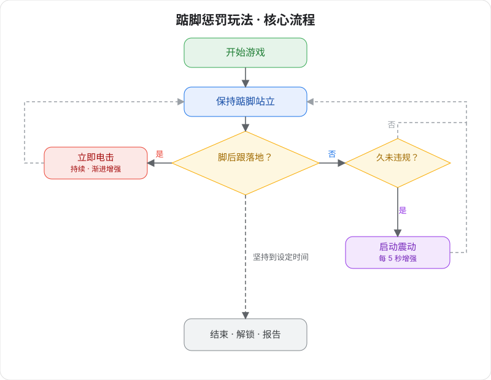

# 踮脚惩罚玩法 v2（第二代）

高科技体感自律训练游戏 —— 保持踮脚站立，脚后跟落地即被惩罚。

> 🛒 **设备获取**：[淘宝购买](https://item.taobao.com/item.htm?id=1044468799434)

## 玩法说明

- **踮脚惩罚玩法：** 设备会实时检测你的脚后跟位置。一旦脚后跟落地，就会通过电脉冲进行惩罚，让你必须始终保持踮脚姿态。
- **可选锁定：** 连接自动锁后，游戏开始即锁定，不玩完不许走。

## 穿戴与连接

请先安装客户端并连接设备，详见 [客户端下载与设备连接](client/new-phone-client.md)。

- **电脉冲片**：贴在大腿内侧，左右各一片，用于惩罚反馈。
- **踮脚传感器**：塞入袜子里贴紧脚后跟，或放置在鞋子的脚后跟位置。
- **主机固定**：通过绑带将寸止综合设备主机绑在大腿上。
- **线路连接**：将各组件的另一端连接到主机。

## 软件设置

1. **进入游戏选择界面**：在客户端中进入游戏选择界面。
2. **选择玩法**：选择「踮脚惩罚玩法」。
3. **设置参数**：设定游戏时长、电脉冲强度、渐进模式等参数（游玩过程中可随时修改）。
4. **开始体验**：点击「开始」，进入游戏。

## 游戏玩法

### 核心规则
保持踮脚站立姿态，脚后跟绝对不能接触地面！

### 监控机制
+ 踮脚传感器实时监测脚后跟位置
+ 脚后跟一旦落地 = 违规，立即触发电脉冲惩罚
+ 脚后跟抬起后，惩罚才会停止

### 惩罚系统
+ 🔴 **即时惩罚**：脚后跟落地瞬间开始电脉冲
+ 📈 **渐进强度**：违规次数越多，电脉冲强度自动递增
+ ⏱️ **持续惩罚**：只要脚后跟落地就持续电脉冲，直到完全抬起
+ 🎮 **震动增强**：表现良好（未违规）一段时间后，主机启动震动干扰，强度逐渐递增

### 震动增强机制
+ **延时启动**：未触发电脉冲指定时间后自动启动
+ **强度递增**：强度随时间逐步增加
+ **自动停止**：触发电脉冲时自动停止并重置

### 游戏结束
+ 坚持到设定时间后自动解锁
+ 系统显示完整的表现报告，统计违规次数、惩罚次数等数据

## 挑战要点
+ **体力挑战**：长时间踮脚站立考验腿部肌肉耐力
+ **意志力考验**：面对疲劳时仍需保持标准姿态
+ **精准控制**：任何细微的脚后跟下沉都会被检测到
+ **心理博弈**：在电脉冲威慑下保持冷静和专注
+ **双重压力**：既要避免惩罚，又要应对震动干扰

## 胜利条件
成功坚持到设定时间结束，违规次数越少表现越优秀：

+ 🌟 **完美表现**：0次违规
+ ⭐ **优秀表现**：1-2次违规
+ 👍 **良好表现**：3-5次违规
+ 😅 **需要改进**：5次以上违规

## 安全提醒
+ 请确保身体健康，无心脏病、癫痫等疾病
+ 建议从较低强度和较短时间开始
+ 游戏过程中如有不适请立即停止
+ 仅限18岁以上成年人使用
+ 电脉冲强度请谨慎设置，过高可能导致伤害，风险需自行承担
+ 禁止在心脏、头部、躯干等核心部位使用电脉冲功能或电流流经以上部位；人体使用电压不得高于 36V
+ 确保游戏环境安全，建议有人监督

## 版本升级说明

第二代版本中，TD01（震动）、电击、踮脚传感三款设备进行了升级，整合为一台寸止综合设备，设置方式没有变化。

老版本设备请参考教程：[踮脚惩罚玩法 v2（老版本）](./old/踮脚惩罚玩法v2.md)
