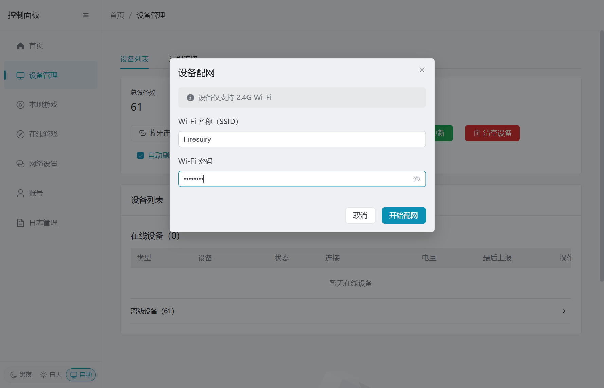
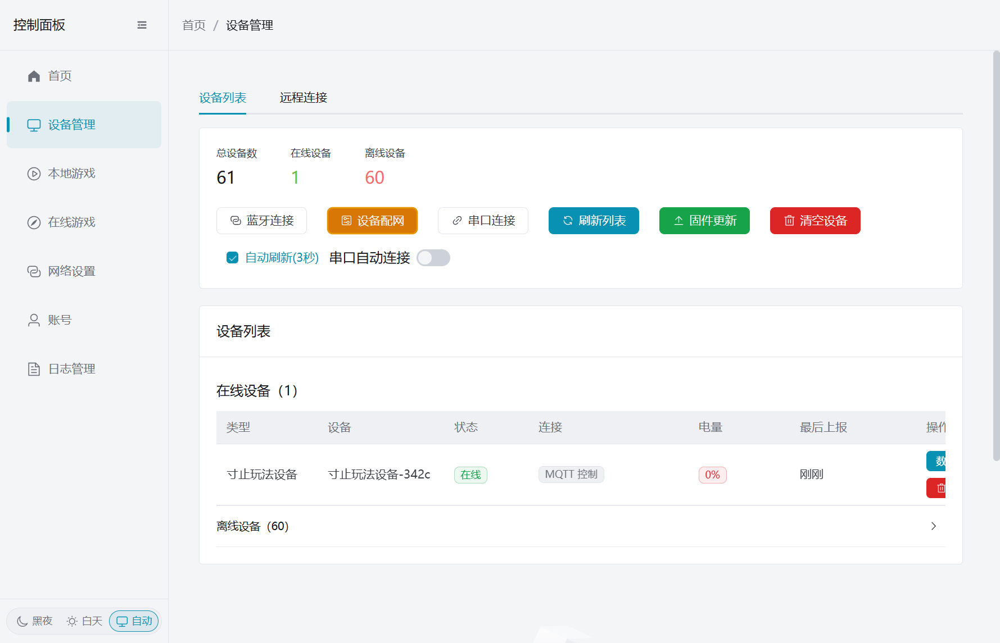

---
slug: /other/wifi-config/pc-bluetooth
---

# 通过电脑客户端配网（需要电脑支持蓝牙）

注意：该方式还在测试 可能不稳定 如失败可尝试结束配网重新开始配网 或者使用其他方法

**注意：设备的 BLE（蓝牙）连接和 WiFi 连接是二选一的，不能同时使用。配网成功后设备会自动关闭蓝牙，此时蓝牙将不可用。如需使用蓝牙直连控制设备，需切换到 BLE 模式（此时 WiFi 会断开）。**

**注意：如您想使用默认wifi 请勿配网 默认wifi名 easysmart 密码 11111111 设备会自动连接默认wifi**

1. 打开电脑客户端，进入「设备管理」，点击「设备配网」。

2. 输入需要连接的 2.4G Wi-Fi 名称和密码，然后点击「开始配网」。请仔细核对名称和密码，设备不支持 5G Wi-Fi。

3. 客户端会扫描附近名称包含 `BLUFI` 的设备。在列表中找到要配网的设备，点击「选择」。

4. 客户端连接设备并写入 Wi-Fi 配置，请保持设备通电并等待，不要关闭配网窗口。

5. 看到「配网成功」后，点击「完成」。如设备固件上报了 IP 地址，成功页面会同时显示该地址；未显示 IP 不影响配网结果。

配网成功后，设备会关闭蓝牙并通过 Wi-Fi 上线。可以在设备列表中确认设备状态和连接方式；连接方式显示为 `MQTT` 即表示设备已通过 Wi-Fi 接入。

如扫描不到 `BLUFI` 设备，请先重启设备，再结束配网并重新开始扫描。
