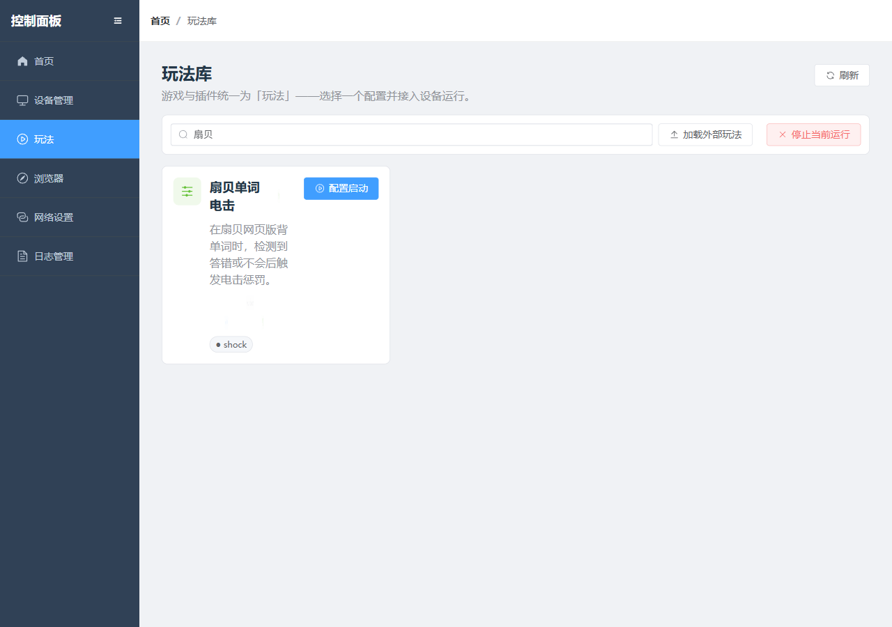
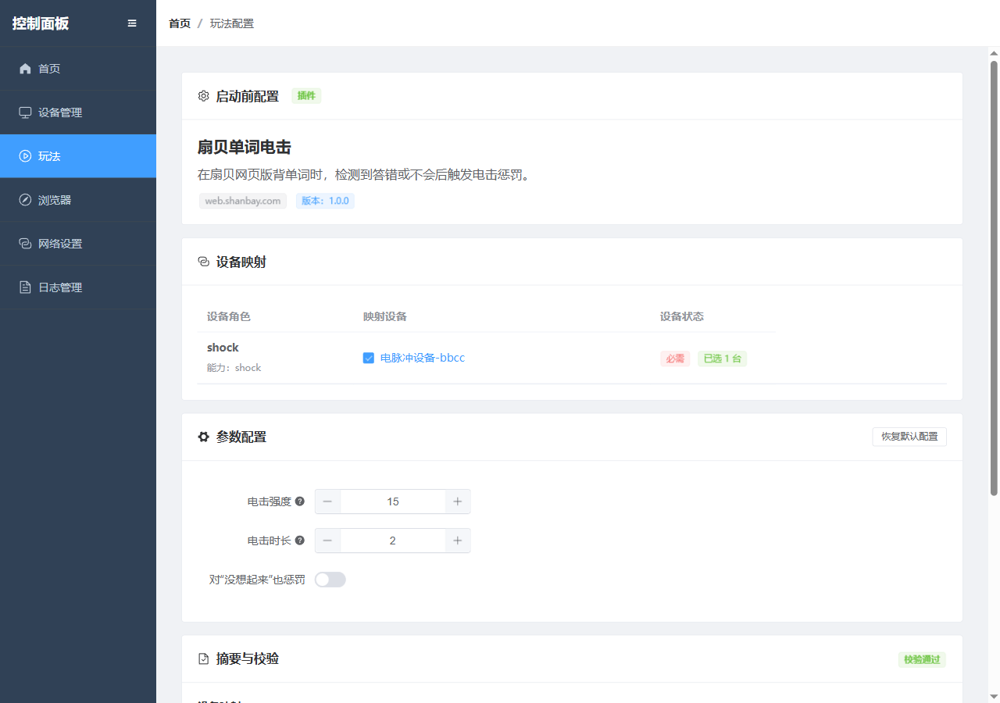
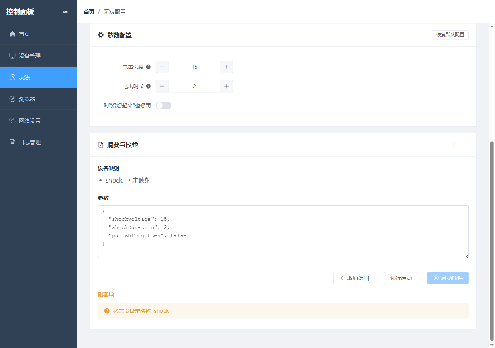
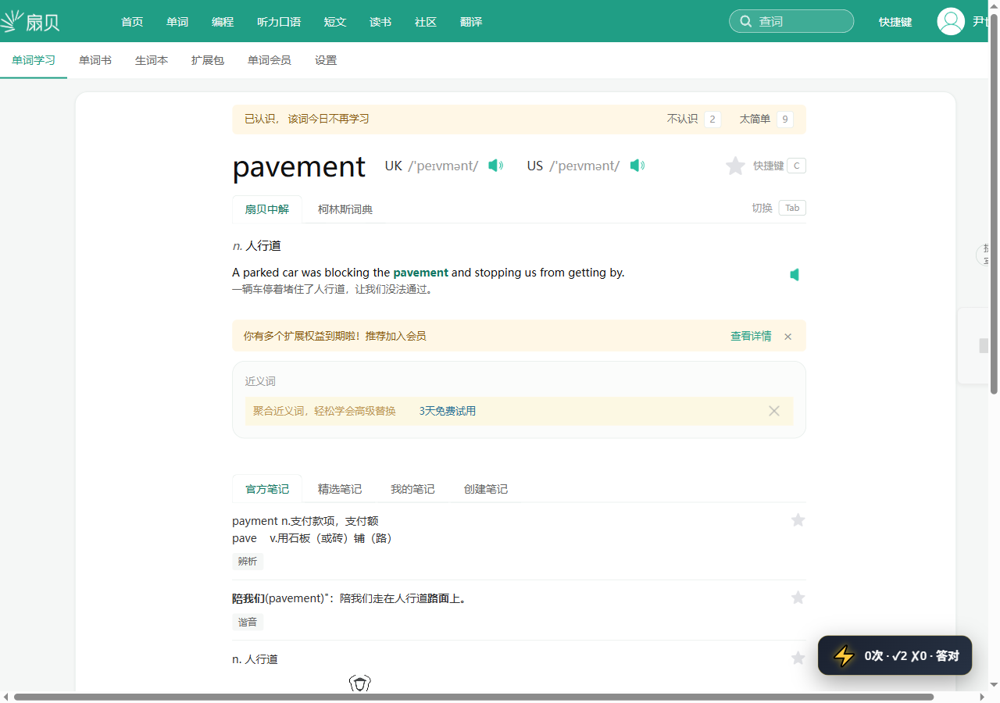

扇贝单词电击是一个基于扇贝网页版单词学习页面的插件玩法：在识别到答错、不会，或开启相应选项后识别到“没想起来”时，触发已连接的电击设备。

## 玩法说明

- 目标站点：`web.shanbay.com/wordsweb`
- 触发信号：`认识`、`不认识`、`想起来了`、`没想起来`
- 默认行为：`不认识` 触发电击，`没想起来` 默认不惩罚
- 可调参数：电击强度、电击时长、是否惩罚“没想起来”

## 启动前检查

- 控制客户端已连接到电击设备
- 设备映射里至少有一台具备 `shock` 能力的设备
- 浏览器能正常打开扇贝网页版单词学习页
- 第一次使用时，先用低强度、短时长测试触发效果

## 操作步骤

### 1. 进入玩法库

在控制面板的玩法库中找到“扇贝单词电击”。

### 2. 打开启动前配置

点击“配置启动”，进入插件配置页。

### 3. 映射电击设备

在“设备映射”里选择一台具备 `shock` 能力的设备。

### 4. 设置参数

根据需要调整：

- 电击强度
- 电击时长
- 是否对“没想起来”也惩罚

### 5. 启动插件

点击“启动插件”，在确认弹窗里继续。

### 6. 实际练习画面

学习页会先展示当前单词、音标和两个判断选项。

答对后会切到结果状态，提示该词今天不再学习。

## 信号规则

| 扇贝页面信号 | 插件判断 | 默认是否电击 |
| --- | --- | --- |
| `认识` | 答对 | 否 |
| `不认识` | 答错 | 是 |
| `想起来了` | 答对 | 否 |
| `没想起来` | 未回忆成功 | 默认否，开启“对‘没想起来’也惩罚”后触发 |

## 常见问题

- 没有触发电击：检查设备映射是否选择了 `shock` 设备，并确认插件配置页没有报错
- 触发太频繁：关闭“对‘没想起来’也惩罚”，或降低强度和时长
- 页面没有进入学习状态：先在扇贝网页版确认账号已登录，并能正常开始单词学习

## 使用建议

- 先确认电击设备已正确映射
- 先用低强度、短时长测试
- 切换页面或退出插件时，先停止当前运行
