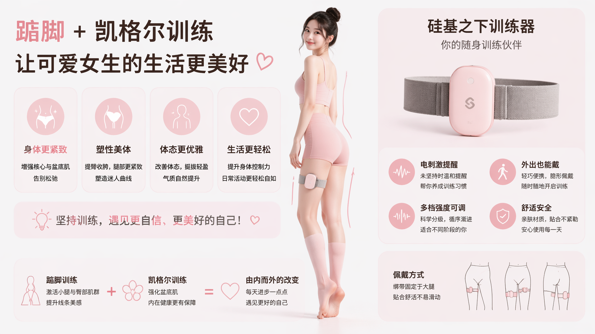

作为合格的小南娘，身体自然要时刻保持紧致。踮脚结合提肛，正是帮你养成这种绝佳体态的好方法。本教程将教你如何使用设备进行严格的踮脚提肛训练。

> 🛒 **设备获取**：[淘宝购买](https://item.taobao.com/item.htm?id=1044468799434)  
> 🎬 **视频教程**：[夸克网盘](https://pan.quark.cn/s/256abeaaa5e5?pwd=SWdR)（提取码：`SWdR`） | [YouTube](https://youtu.be/Q7ti6oOdhpc) | B站（即将上传）

## 准备工作

1. **连接客户端**：请先安装APP并连接主机，详见 [客户端下载与设备连接](new-phone-client.md)。
2. **穿戴设备**：
   - **肛塞**：涂抹充足的润滑液，侧卧放松括约肌后缓慢置入。切勿大力硬塞，慢慢适应即可。
   - **电极片**：贴在大腿内侧（左右各一），用于提供惩罚刺激。
   - **踮脚传感器**：塞入袜子或鞋内，贴紧脚后跟位置。
   - **主机**：用绑带固定在大腿上，将以上配件的线缆接入主机。连接方式如下图所示：

   

## 开始训练

1. **选择设备**：在APP中点击已连接的设备。
2. **选择玩法**：模式选择为“**踮脚提肛**”。
3. **设置参数**：设定你能承受的惩罚强度（电刺激参数）。
4. **开始体验**：点击开始，进入训练状态。

## 训练规则

设备会实时检测你的身体动作。在训练过程中：
- 你必须**时刻保持括约肌紧绷**。
- 你必须**时刻保持脚后跟悬空（离地）**。

只要稍微松懈，设备就会立即对你进行电击惩罚，强迫你的身体重新“紧绷”起来。坚持下去，享受紧致带来的改变吧。
