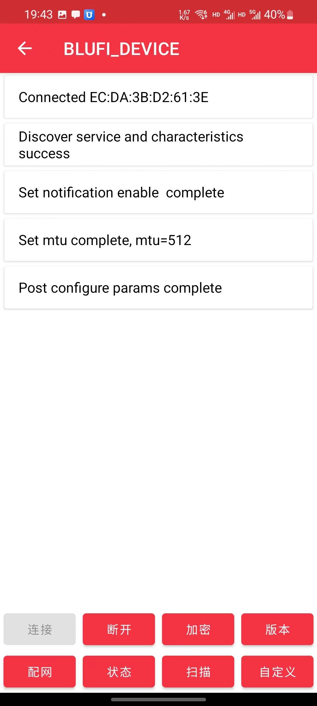

# 通过APP将设备连接到wifi

**注意：如您想使用默认wifi 请勿配网 默认wifi名 easysmart 密码 11111111 设备会自动连接默认wifi**

**前提：**

1. 所在空间有2.4G无线wifi

如果无法成功，也可[通过小程序将设备连接到 WiFi](./通过小程序将设备连接到wifi.md)

### 1. 将电池放入设备或者插入USB电源
### 2. （首次使用设备需要此操作）下载配网app
安卓：[https://github.com/EspressifApp/EspBlufiForAndroid/releases](https://github.com/EspressifApp/EspBlufiForAndroid/releases)

苹果：[https://apps.apple.com/cn/app/espblufi/id1450614082](https://apps.apple.com/cn/app/espblufi/id1450614082)

### 3. 以安卓客户端为例开始配网
注意：操作前请启动手机蓝牙

1. 打开客户端

1. 往下滑刷新设备

1. 点击设备

1. 点击连接

1. 点击配网

1. 选择Station模式（默认就是），输入wifi名称和密码（注意 仅支持2.4Gwifi）

1. 如果是双频合一的话选继续就行

1. 之后就完工了

**注意：设备连接上wifi后会自动关闭蓝牙，如果显示失败但是重新搜索搜不到设备了，就是已经成功了。**

