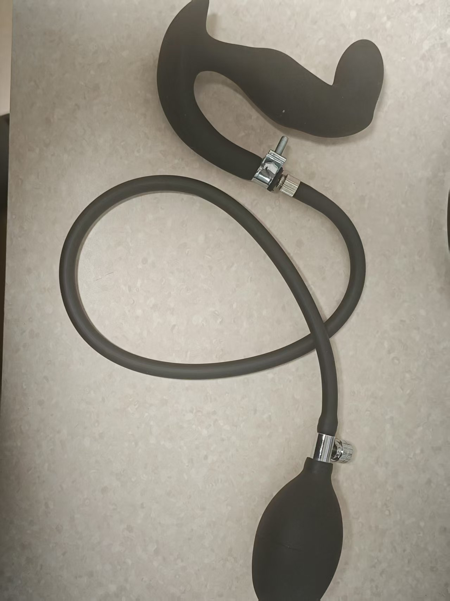

# 边缘控制（寸止）玩法

一个基于气压传感器的寸止训练游戏，通过检测括约肌压力变化，结合偏轴电机控制器和电击设备进行智能刺激控制。

玩法套件购买链接：

[https://item.taobao.com/item.htm?id=1017049175869](https://item.taobao.com/item.htm?id=1017049175869)

# 手机版玩法教程： 
[https://www.bilibili.com/video/BV1xA1fBsErr/](https://www.bilibili.com/video/BV1xA1fBsErr/?share_source=copy_web&vd_source=3dd9ee8089c213072e87f2745c7050aa)

语雀原教程：https://www.yuque.com/easysmart/easysmart/oe8gsvyhtflb9pqt

# 电脑版相关教程：
  
客户端下载：[新版电脑客户端使用指南](../（电脑版）控制客户端/新版电脑客户端使用指南.md)

视频教程：[【玩法教程】寸止套装大公开：3步玩出巅峰体验，视频教你征服它_哔哩哔哩_bilibili](https://www.bilibili.com/video/BV1WXWpzUEoW/?spm_id_from=333.1007.top_right_bar_window_dynamic.content.click)

建议用热点和默认wifi，此方案不用配网，如果要用路由器方案，开始游玩前请先将设备进行**<font>配网</font>** 请查看左侧目录中的配网部分~

# 注意事项
1. 充气肛塞有升级，更加密封，减少漏气，和下面的样子不太一样
2. 玩的时候气压**<font>不要过高</font>**（会导致漏气），一般在22-24就行，能在夹紧时有变化就可以。
3. 进去的时候可以打一点气压 要不然太软可能进不去。

# 套件组装（必读）
将充气肛塞的打气球拔下来 连接到气压传感器的皮管上，充气肛塞的皮管连接到气压传感器的三通上即可~

1. 收到肛塞的样子



2. 拆除打气球


3. 连接到气压传感器的两端


4. 成品样子


5. 如果觉得漏压较快，可选增强


将这个锁扣在连接处拧紧，可以降低漏压速度

锁扣购买地址：[https://item.taobao.com/item.htm?id=724827233726](https://item.taobao.com/item.htm?id=724827233726) （11-13mm）

### 游戏机制
1. **压力监测**：气压传感器实时检测括约肌压力变化
2. **智能调节**：压力高时降低刺激，压力低时增强刺激
3. **电击警示**：压力超过临界值时触发电击使用户清醒
4. **延迟启动**：压力低时延迟一段时间后才开始缓慢刺激
5. **动态平衡**：维持在临界压力附近的平衡状态

## 状态转移图


## 设备要求
### 设备配置
| 设备类型 | 逻辑ID | 设备名称 | 是否必需 | 作用 |
| --- | --- | --- | --- | --- |
| QIYA | pressure_sensor | 气压传感器 | 是 | 检测括约肌压力变化 |
| TD01 | motor_controller | 偏轴电机控制器 | 是 | 提供可调节强度的刺激 |
| DIANJI | shock_device | 电击设备 | 否 | 压力过高时的警示电击 |
| ZIDONGSUO | auto_lock | 自动锁设备 | 否 | 游戏开始时锁定，结束时解锁 |


## 游戏参数配置
### 基础参数
| 参数名 | 类型 | 范围 | 默认值 | 说明 |
| --- | --- | --- | --- | --- |
| duration | 数字 | 1-120分钟 | 20分钟 | 游戏持续时间 |
| criticalPressure | 数字 | 0-40kPa | 20kPa | 临界气压值 |
| maxMotorIntensity | 数字 | 1-255 | 200 | TD01最大强度 |


### 刺激控制参数
| 参数名 | 类型 | 范围 | 默认值 | 说明 |
| --- | --- | --- | --- | --- |
| lowPressureDelay | 数字 | 1-30秒 | 5秒 | 压力低时延迟刺激时间 |
| stimulationRampRateLimit | 数字 | 1-50 | 10 | 刺激强度递增速率限制（每s变化不超过此值） |
| pressureSensitivity | 数字 | 0.1-5.0 | 1.0 | 压力变化敏感度系数 |
| stimulationRampRandomPercent | 数字 | 0-100% | 0% | 刺激强度随机扰动百分比 |


### 电击参数
| 参数名 | 类型 | 范围 | 默认值 | 说明 |
| --- | --- | --- | --- | --- |
| shockIntensity | 数字 | 10-100V | 20V | 电击强度 |
| shockDuration | 数字 | 0.5-5秒 | 1秒 | 电击持续时间 |


## 算法逻辑
### 压力-强度映射算法
```plain
if (currentPressure >= criticalPressure) {
    motorIntensity = 0
    triggerShock()
} else if (currentPressure < criticalPressure) {
    pressureDiff = criticalPressure - currentPressure
    targetIntensity = (pressureDiff / criticalPressure) * maxMotorIntensity
    
    // 延迟启动机制，刺激强度渐变，刺激强度随机扰动
}
```
