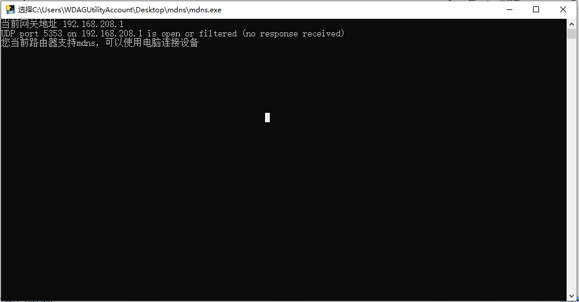

# Prüfen, ob der Router mdns unterstützt (die meisten Router unterstützen es)

Prüftool: [https://wwcg.lanzouu.com/i13Al2owjkra](https://wwcg.lanzouu.com/i13Al2owjkra)

Wenn das Prüfergebnis zeigt, dass mdns unterstützt wird, gibt es kein Problem.

Wenn der angezeigte Inhalt nicht so ist, kann die Funktion nicht direkt unter dem aktuellen Router verwendet werden.

Bekannt:

Huawei AX2 unterstützt möglicherweise nicht.

Alle anderen getesteten Routermodelle unterstützen es.