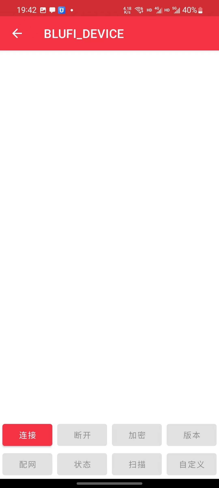
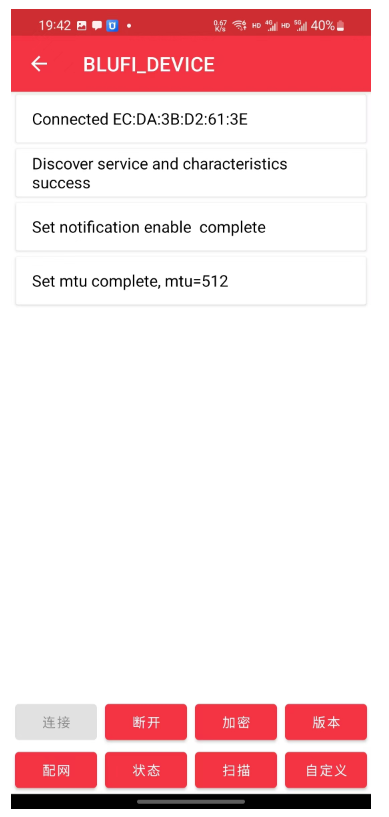
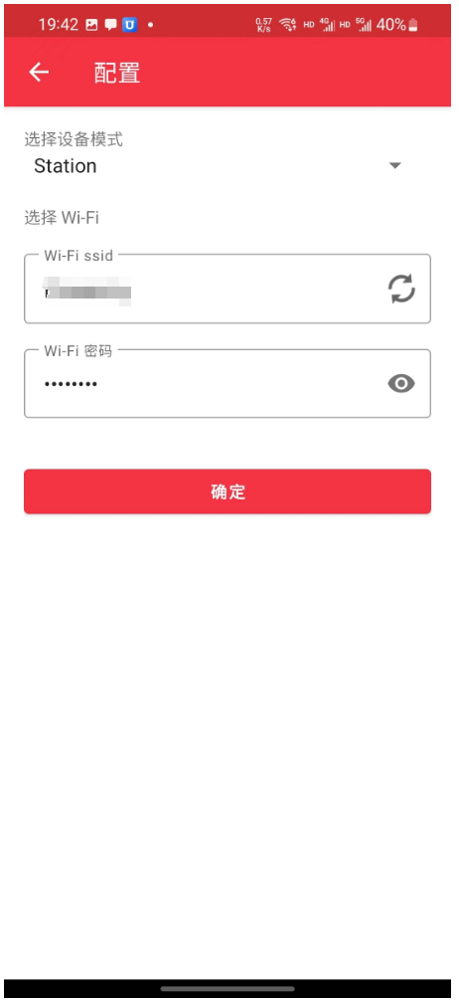
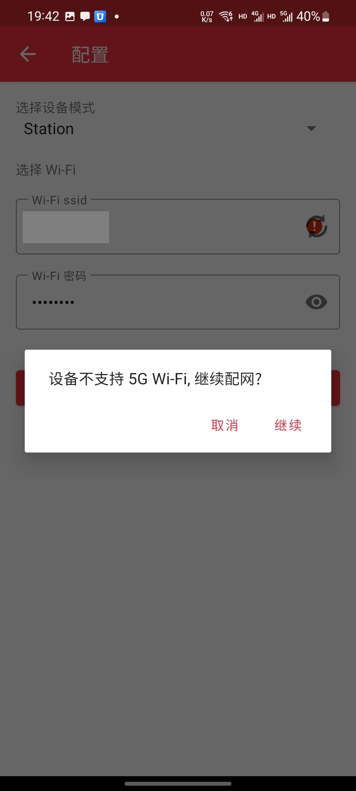

# Gerät über APP mit WLAN verbinden

**Hinweis: Wenn Sie das Standard-WLAN verwenden möchten, führen Sie keine Netzwerkkonfiguration durch. Das Standard-WLAN heißt "easysmart", Passwort "11111111". Das Gerät verbindet sich automatisch mit dem Standard-WLAN.**

**Voraussetzung:**

1.  Im Raum muss ein 2,4-GHz-WLAN verfügbar sein.

Falls dies nicht erfolgreich ist, können Sie das Gerät auch [über ein Mini-Programm mit WLAN verbinden](./通过小程序将设备连接到wifi.md).

### 1. Batterien in das Gerät einlegen oder USB-Stromversorgung anschließen
### 2. (Erstmalige Nutzung des Geräts erfordert diesen Schritt) Netzwerkkonfigurations-App herunterladen
Android: [https://github.com/EspressifApp/EspBlufiForAndroid/releases](https://github.com/EspressifApp/EspBlufiForAndroid/releases)

Apple: [https://apps.apple.com/cn/app/espblufi/id1450614082](https://apps.apple.com/cn/app/espblufi/id1450614082)

### 3. Netzwerkkonfiguration am Beispiel der Android-App starten
Hinweis: Bitte Bluetooth auf dem Smartphone vor der Bedienung aktivieren.

1.  App öffnen

2.  Nach unten scrollen, um Geräte zu aktualisieren

3.  Gerät antippen

4.  "Verbinden" antippen

5.  "Netzwerkkonfiguration" antippen

6.  Station-Modus auswählen (Standard), WLAN-Namen und Passwort eingeben (Achtung: Nur 2,4-GHz-WLAN wird unterstützt)

7.  Bei kombiniertem Dualband einfach "Fortfahren" wählen

8.  Danach ist alles fertig.

**Hinweis: Nach erfolgreicher WLAN-Verbindung schaltet das Gerät Bluetooth automatisch ab. Wenn ein Fehler angezeigt wird, aber bei erneuter Suche kein Gerät mehr gefunden wird, war die Konfiguration erfolgreich.**

