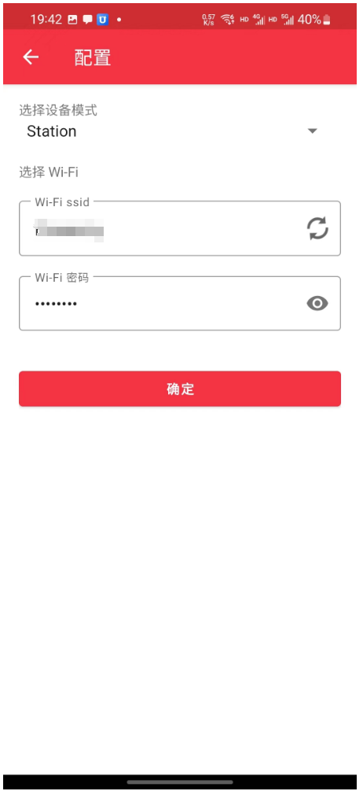
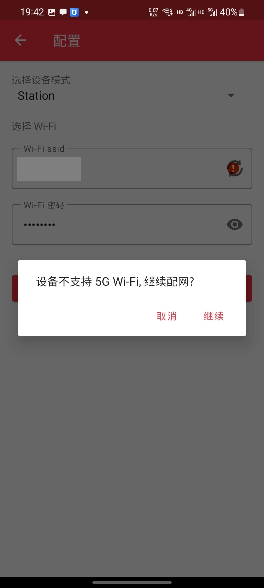

# Gerät per App mit WLAN verbinden

**Hinweis: Wenn Sie das Standard-WLAN verwenden möchten, führen Sie keine Netzwerkkonfiguration durch. Der Standard-WLAN-Name ist »easysmart«, das Passwort »11111111«. Das Gerät verbindet sich automatisch mit dem Standard-WLAN.**

**Voraussetzung:**

1. Im Raum ist ein 2,4 GHz-WLAN verfügbar.

Falls dies nicht erfolgreich ist, können Sie auch [das Gerät per Mini-Programm mit WLAN verbinden](./通过小程序将设备连接到wifi.md).

### 1. Batterien in das Gerät einlegen oder über USB mit Strom versorgen
### 2. (Bei erstmaliger Verwendung des Geräts erforderlich) Netzwerkkonfigurations-App herunterladen
Android: [https://github.com/EspressifApp/EspBlufiForAndroid/releases](https://github.com/EspressifApp/EspBlufiForAndroid/releases)

Apple: [https://apps.apple.com/cn/app/espblufi/id1450614082](https://apps.apple.com/cn/app/espblufi/id1450614082)

### 3. Netzwerkkonfiguration am Beispiel der Android-App starten
Hinweis: Bitte aktivieren Sie vor der Bedienung die Bluetooth-Funktion Ihres Smartphones.

1. App öffnen

1. Nach unten scrollen, um Geräte zu aktualisieren

1. Gerät antippen

1. Auf »Verbinden« tippen

1. Auf »Netzwerkkonfiguration« tippen

1. Station-Modus auswählen (Standard), WLAN-Namen und Passwort eingeben (Hinweis: Nur 2,4 GHz WLAN wird unterstützt)

1. Bei kombiniertem Dualband-WLAN einfach »Weiter« wählen

1. Danach ist alles erledigt

**Hinweis: Nach erfolgreicher WLAN-Verbindung schaltet das Gerät Bluetooth automatisch ab. Falls »Fehler« angezeigt wird, aber bei erneuter Suche kein Gerät mehr gefunden wird, bedeutet dies, dass die Konfiguration erfolgreich war.**

