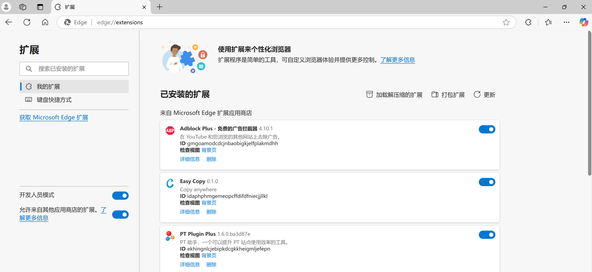
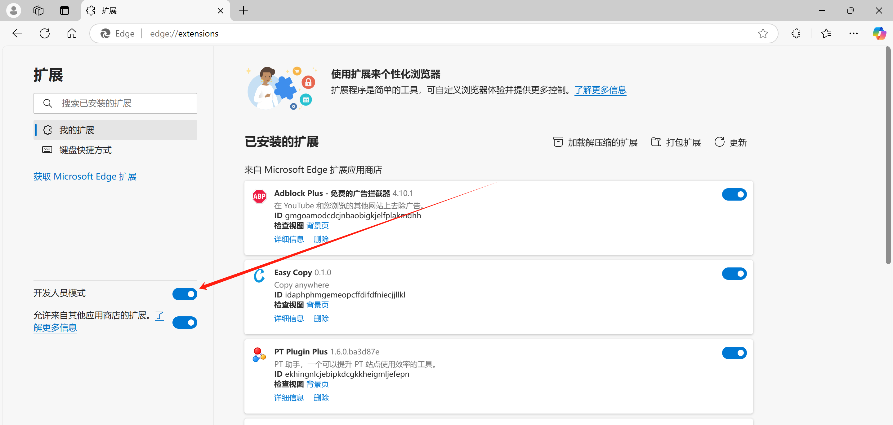
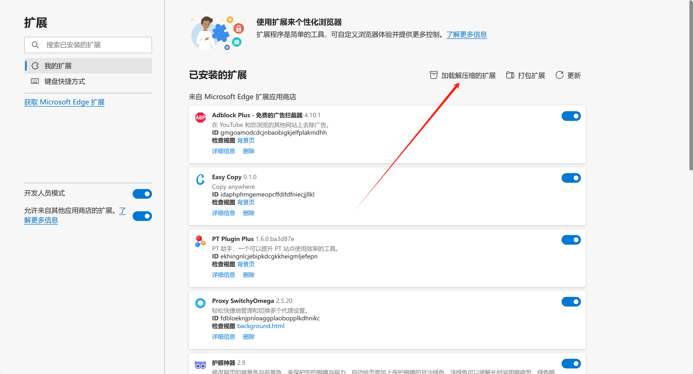
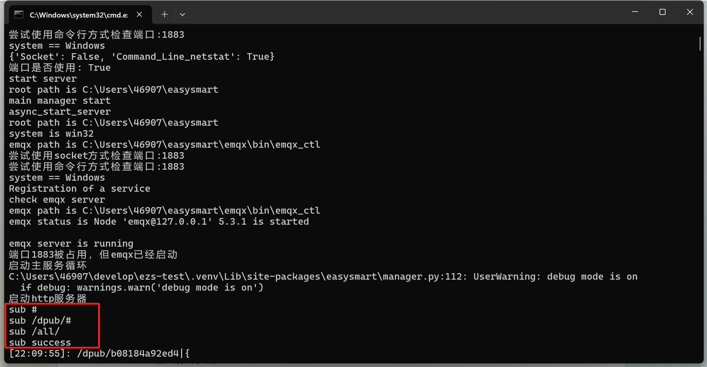
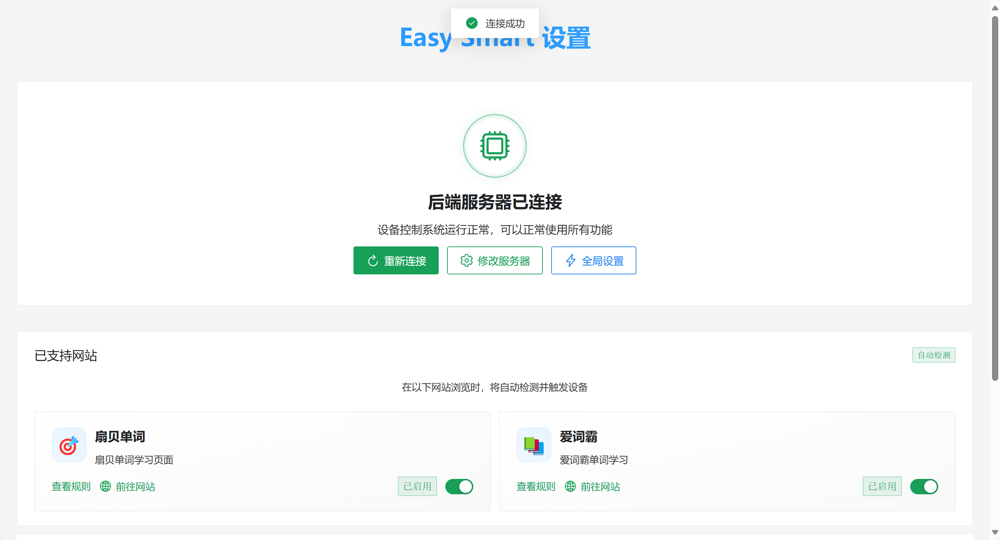
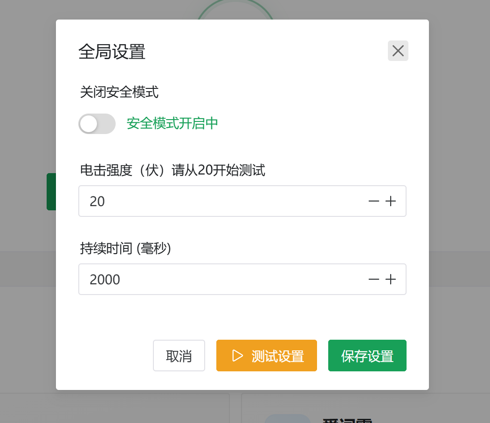
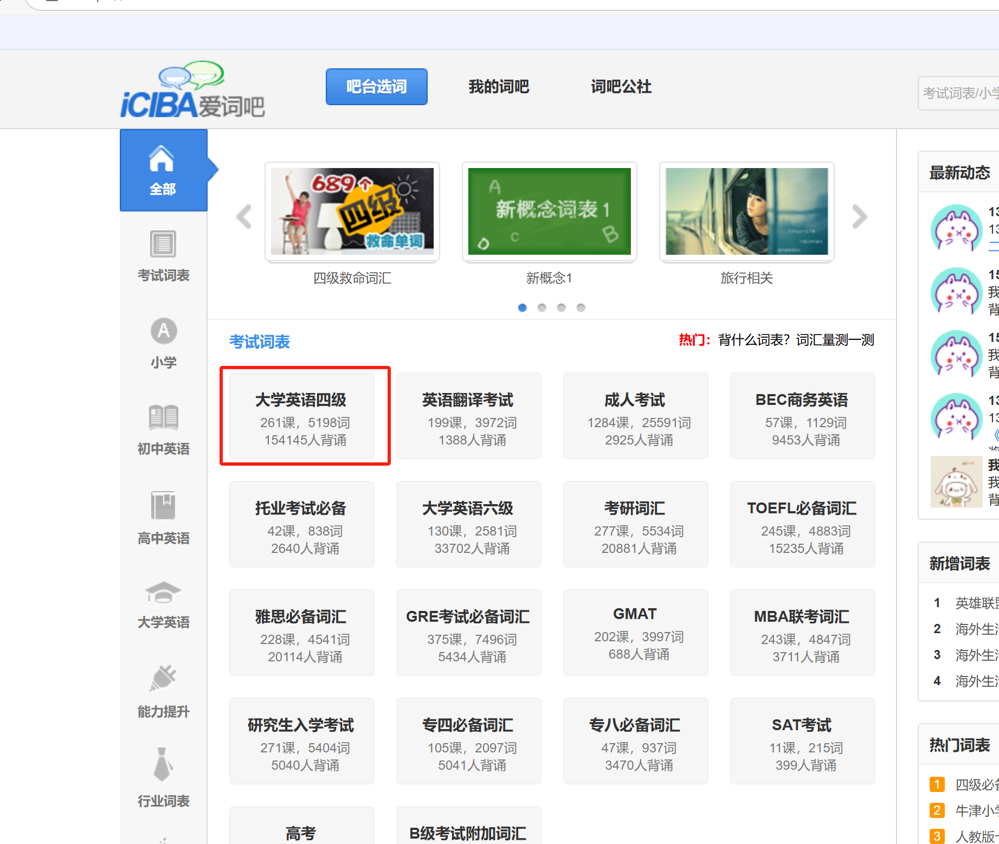
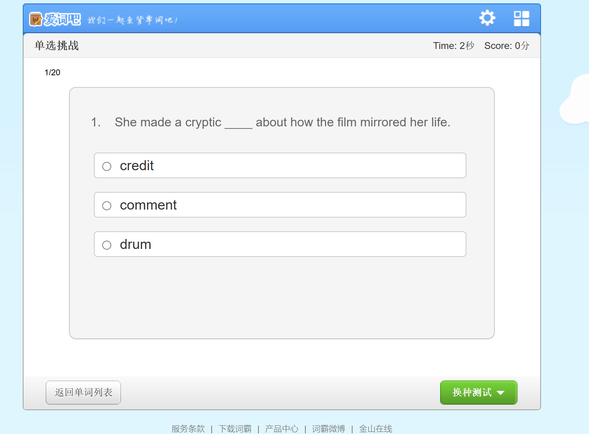

# Anleitung zur Verwendung von "Dornenstachel im Rücken" Vokabeltrainer

# Spielanleitung:
Beim Vokabeltraining wird man oft müde.

In diesem Moment braucht man ein kleines bisschen Stimulation, um die Schläfrigkeit zu vertreiben.

Indem du dieses Gerät einfach an deinem Körper anbringst, kannst du einen geistigen Anstoß bekommen, wenn du einen Fehler machst.

Dadurch steigt die Effizienz schlagartig!

# Voraussetzungen für die Nutzung
1. Verfügbarer 2,4-GHz-WLAN zu Hause
2. Das WLAN und der Computer müssen sich im selben lokalen Netzwerk befinden (d.h. am selben Router angeschlossen sein)
3. Der Router muss mDNS unterstützen (falls nicht, muss ein Mobilfunk-Hotspot verwendet werden) [Überprüfen Sie, ob Ihr Router mDNS unterstützt (die meisten Router unterstützen es)](../../other/检测路由器是否支持mdns（大部分路由器都支持）.md)
4. Vorhandensein eines einfachen intelligenten Impulsterminals: [Einfaches intelligentes Impuls- (Elektroschock-) Terminal](../../device/简单智能脉冲（电击）终端.md) oder [Taobao-Link](https://item.taobao.com/item.htm?id=892309919507)

# Detaillierte Anleitung
Download der relevanten Dateien:

Lanzou Cloud

[https://wwcg.lanzouu.com/ielL62nsy9cj](https://wwcg.lanzouu.com/ielL62nsy9cj)

Passwort: 95pt

Diskussion und Austausch: [WeChat-Gruppe](https://www.yuque.com/easysmart/easysmart/az9i4x3us4xu870f)

## Browser-Erweiterung installieren
1. Öffne den Edge-Browser.
2. Gib in die Adressleiste **edge://extensions/** ein und drücke Enter.

1. Den Entwicklermodus einschalten.

1. "Entpackte Erweiterung laden" auswählen.

1. Den Ordner "easysmart" im "Schritt1"-Ordner auswählen.

1. Installation abgeschlossen.

1. Die Erweiterung kann anschließend hier gefunden werden.

## Gerät mit Netzwerk verbinden
(Vor der ersten Nutzung wird empfohlen, das Gerät zunächst aufzuladen.)

1. Schiebeschalter umlegen, um das Gerät einzuschalten.
2. Starte die Mini-App, um das Gerät mit dem Netzwerk zu verbinden.

Für diesen Schritt siehe: [Verbinden des Geräts mit WiFi über die APP](../../other/设备连接wifi（配网）/通过APP将设备连接到wifi.md) oder [Verbinden des Geräts mit WiFi über die Mini-App](../../other/设备连接wifi（配网）/通过小程序将设备连接到wifi.md)

## Serverseite auf dem Computer starten
1. Führe auf dem Computer die Datei "Schritt2启动.bat" aus. Der Startvorgang ist nach etwa 2 Minuten abgeschlossen (beim ersten Mal dauert es länger). Wenn der rote umrahmte Inhalt erscheint, war der Start erfolgreich (falls die Datei fehlt, lade sie im Dokumentenkopf herunter).

1. Die Elektroden können am Körper befestigt und in das Gerät eingesteckt werden.

## Spannung und Dauer einstellen
1. Klicke, um die Erweiterung zu öffnen.

Nach dem Öffnen sieht es wie folgt aus:

Wenn das lokale Programm gestartet ist, klicke auf "Neu verbinden".

Nun sollte das Gerät unten angezeigt werden.

1. Klicke auf "Globale Einstellungen", um Spannung und Verzögerungszeit festzulegen.

Ein Klick auf "Einstellung testen" sendet einen Impulsspannungsstoß.

**Hinweis: Bitte beginne mit 20 Volt zu testen und teste jede Stufe mehrmals. Wenn der Effekt nicht spürbar ist, erhöhe die Spannung, jeweils empfohlen um 10V oder weniger.**

Klicke anschließend auf "Einstellungen speichern".

## Vokabeltraining starten
Für Shanbay Wörter kann direkt begonnen werden.

Im Folgenden wird Ciba Vokabeltrainer vorgestellt.

Zur Website navigieren.

Eine Wortliste auswählen, z. B. Stufe 4.

Eine Lektion auswählen.

Auf "Single Choice Challenge" klicken.

Wenn nun falsch ausgewählt wird, wird ein Stromstoß ausgelöst.