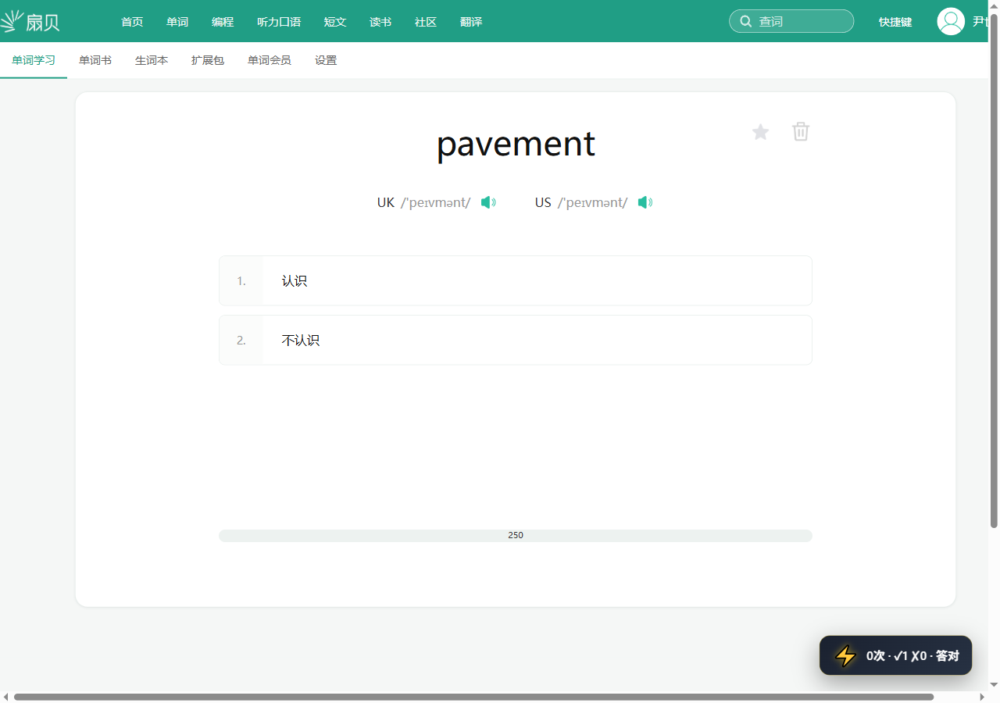

## Warum einen elektrischen Schlag?

Warum sind Spiele aufregender als Lernen? Weil es Konsequenzen gibt – man kann es sich nicht leisten zu verlieren, also konzentriert man sich auf jeden Schritt und hat einen Riesenspaß.

Aber wie ist es beim Vokabellernen? Entweder man "kennt" das Wort oder "kennt es nicht", ob man richtig oder falsch antwortet, ändert nichts. Das Gehirn denkt sich "egal, nächste", und die Wörter gehen einfach nicht in den Kopf 😭

Aber was wäre, wenn** man bei einer falschen Antwort einen echten Stromschlag bekäme**? Das gäbe dem Fehler einen realen Preis, und jedes Wort würde plötzlich zu einer Frage von Leben und Tod – das ist die Kernidee des elektrisierenden "Shanbay-Wörter"-Modus: **Falsch antworten → einen Schlag bekommen → sich das Wort beim nächsten Mal garantiert merken** 🔌⚡

---

Der elektrische "Shanbay-Wörter"-Modus ist ein Plugin für die Shanbay Web-Version: Wenn das Plugin erkennt, dass du auf "nicht kennen" (falsch geantwortet) klickst, oder – falls die Strafoption aktiviert ist – erkennt, dass du "nicht daran erinnern" gewählt hast, löst es das angeschlossene Elektroschockgerät aus und versetzt dir einen kleinen Schlag ⚡.

> 🛒 **Gerät erwerben**: [Auf Taobao kaufen](https://item.taobao.com/item.htm?id=1065205279302) | [Auf der offiziellen Website kaufen](https://shop.undersilicon.cn/zh/products/beidanci) | [Rabattgutschein einlösen](../优惠券.md)
> 🎬 **Video-Tutorial**: [Silicon-Based Video Website (noch nicht hochgeladen)](https://video.undersilicon.com/w/pcesS2gYvbfuU5Wcf5v7fQ) | [YouTube (noch nicht hochgeladen)](https://youtu.be/Q7ti6oOdhpc)

<!-- TODO: Das Video-Tutorial ist vorübergehend ein Platzhalter für das 'Inch-Stop'-Spielvideo und wird später durch einen spezifischen Link für den Shanbay-Wörter-Elektroschock-Modus ersetzt. -->

## Spielbeschreibung

Der gesamte Kreislauf in einem Satz: **Auf Shanbay antworten → Das Plugin beurteilt Richtig/Falsch → Bei falscher Antwort wird das Elektroschockgerät ausgelöst** – Lernen durch Schmerz, doppelte Effizienz.

## Betriebsschritte

### 1. Vorbereitungen

Bitte installiere zuerst den Client und verbinde das Gerät, siehe [PC-Steuerungsclient](./client/PC版控制客户端.md).

Vor dem Start stelle folgende Punkte sicher:

- Der Steuerungsclient ist mit dem Elektroschockgerät verbunden (keine Verbindung bedeutet keinen Schlag!)
- In der Gerätezuordnung ist mindestens ein Gerät mit `shock`-Fähigkeit vorhanden
- Der Browser kann die Shanbay Wörter-Lernseite normal öffnen
- Beim ersten Gebrauch mit niedriger Intensität und kurzer Dauer starten, nicht gleich voll aufdrehen! ⚠️

### 2. Spielbibliothek aufrufen

Finde "Shanbay-Wörter-Elektroschock" in der Spielbibliothek des Kontrollpanels.

### 3. Konfiguration vor dem Start öffnen

Klicke auf "Konfiguration starten", um zur Plugin-Konfigurationsseite zu gelangen.

### 4. Elektroschockgerät zuordnen

Wähle unter "Gerätezuordnung" ein Gerät mit `shock`-Fähigkeit aus. Falls keines vorhanden ist, verbinde zuerst eins 😉.

### 5. Parameter einstellen

Passe die folgenden Parameter nach Bedarf an:

- Elektroschock-Intensität (Empfehlung: niedrig beginnen und langsam steigern)
- Elektroschock-Dauer (Ebenso: erst kurz, dann länger)
- Soll "nicht daran erinnern" auch bestraft werden? (Option für Hardcore-Lerner 💀)

### 6. Plugin starten

Klicke auf "Plugin starten" und bestätige im Pop-up-Fenster. Letzte Chance zum Zurückziehen!

### 7. Starte deine elektrisierende Lernreise ⚡

Die Lernseite zeigt zunächst das aktuelle Wort, die Lautschrift und zwei Auswahlmöglichkeiten an.

Bei richtiger Antwort wechselt die Seite in den Ergebniszustand und zeigt an, dass das Wort heute nicht mehr gelernt wird. Gratulation, du bist einer ausgewichen 🎉.

## Signalregeln

| Shanbay-Seitensignal | Plugin-Beurteilung | Standardmäßig Elektroschock? |
| --- | --- | --- |
| `Kennen` | Richtig beantwortet | ❌ Kein Schlag (gutes Kind) |
| `Nicht kennen` | Falsch beantwortet | ⚡ Schlag! |
| `Daran erinnern` | Richtig beantwortet | ❌ Kein Schlag (erfolgreich erinnert) |
| `Nicht daran erinnern` | Nicht erfolgreich erinnert | Standardmäßig Gnade, mit aktivierter Strafoption ⚡ |

## Häufig gestellte Fragen 🛠️

- **Kein Elektroschock wird ausgelöst**: Überprüfe, ob in der Gerätezuordnung ein Gerät mit `shock`-Fähigkeit ausgewählt ist, und stelle sicher, dass die Plugin-Konfigurationsseite keinen Fehler anzeigt. Nicht getroffen zu werden ist keine gute Sache!
- **Zu häufige Auslösung**: Deaktiviere "Auch 'nicht daran erinnern' bestrafen" oder reduziere Intensität und Dauer. Sei ein bisschen nett zu dir selbst 😅.
- **Seite befindet sich nicht im Lernzustand**: Stelle zuerst sicher, dass du auf der Shanbay-Webseite angemeldet bist und normal mit dem Wörterlernen beginnen kannst.

## Nutzungsempfehlungen 💡

- Zuerst sicherstellen, dass das Elektroschockgerät korrekt zugeordnet ist (Mit dem Elektroschocker in der Hand gehört einem die Welt).
- Erst mit niedriger Intensität und kurzer Dauer testen, um deine individuelle "Schmerzschwelle" zu finden.
- Beim Wechsel der Seite oder Beenden des Plugins zuerst den aktuellen Betrieb stoppen.
- Nach dem Durcharbeiten einer Sätzeinheit gönn dir eine kleine Belohnung – denn diejenigen, die dabei bleiben können, sind echte Hardcore-Lerner 💪⚡.