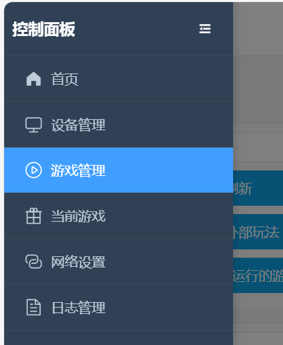

# Kegel-Training-Spielmodus

# Spielbeschreibung
+ Kegel-Training erfolgt durch abwechselnde „Entspannungsphase“ und „Kontraktionsphase“
+ Ziel ist es, innerhalb der vorgegebenen Zeit so viele „erfolgreiche Kontraktionen“ wie möglich abzuschließen
+ Erfolg oder Misserfolg werden auf der Benutzeroberfläche visuell angezeigt; bei Misserfolg wird ein Elektroschock ausgelöst (falls verbunden und aktiviert)

## Software-Download und Vorbereitung
Android-Handy: [Handy-Client](/docs/player/new-phone-client)

Windows-Computer: [PC-Steuerungsclient](./client/PC版控制客户端.md)

# Geräte und Vorbereitung
+ Erforderliches Gerät: `Luftdrucksensor (QIYA)`
+ Optionale Geräte: `Elektroschockgerät (DIANJI)`, `Automatisches Schloss (ZIDONGSUO)`
+ Startet die automatische Verriegelung und beendet die automatische Entriegelung (falls das automatische Schloss angeschlossen ist)

## Gerätezusammenbau
Nehmen Sie den Aufblasballon des aufblasbaren Analstöpsels ab und verbinden Sie ihn mit dem Schlauch des Luftdrucksensors. Verbinden Sie den Schlauch des Analstöpsels mit dem T-Stück des Luftdrucksensors.

1. Aussehen des Analstöpsels beim Erhalt (neue Version hat eine veränderte Form, bessere Dichtungsleistung, ähnlich wie unten)

2. Entfernen des Aufblasballons

3. Verbinden mit beiden Enden des Luftdrucksensors

4. Fertiges Aussehen

5. Optionale Verstärkung bei schnellem Druckverlust

Diesen Klickverschluss an der Verbindungsstelle festziehen, um den Druckverlust zu verlangsamen

Klickverschluss-Kaufadresse: [https://item.taobao.com/item.htm?id=724827233726](https://item.taobao.com/item.htm?id=724827233726) (11-13mm)

## Spielzugang

# Parametererläuterung
+ `Dauer (Minuten)`: Gesamtspielzeit
+ `Kontraktionszielanzahl`: Erwartete Anzahl erfolgreicher Kontraktionen, zur Anzeige des Gesamtfortschritts
+ `Luftdruckänderung (kPa)`: Der für die Kontraktionsphase zu erreichende Schwellenwert der Druckerhöhung (relativ zum niedrigsten Druck der Entspannungsphase)
+ `Elektroschockstärke (V)`: Elektroschockstärke bei Misserfolg
+ `Elektroschockdauer (Sekunden)`: Dauer des Elektroschocks bei Misserfolg
+ `Einzelzykluszeit (Sekunden)`: Dauer jeder Phase, standardmäßig 10 Sekunden (Entspannung 10 s → Kontraktion 10 s → Wiederholung)

# Spielablauf
+ Entspannungsphase
    - Entspannen und natürlich atmen, das System zeichnet den „niedrigsten Druck“ dieser Phase als Referenz auf
    - Nach Ablauf der Zeit startet die Kontraktionsphase
+ Kontraktionsphase
    - Innerhalb der Phasendauer muss der Druck auf „niedrigster Druck + Luftdruckänderung“ erhöht werden
    - Erreichen des Ziels wird als „erreicht“ gewertet, aber erst nach Ende der Phase beginnt die nächste Runde
    - Wird das Ziel vor Phasenende nicht erreicht, erfolgt die Meldung „Herausforderung fehlgeschlagen · Elektroschock startet“ (falls Elektroschockgerät verfügbar)
+ Phasenwechsel
    - Jede Runde folgt dem Zyklus „Entspannen → Kontrahieren → Entspannen → …“, bis die Zeit abläuft oder die Zielanzahl erreicht ist

# Benutzeroberflächenhinweise
+ Große Schrift oben zeigt aktuelle Phase (Entspannungsphase/Kontraktionsphase) und verbleibende Zeit der Phase an
+ Gesamtfortschritt
    - Fortschrittsbalken nach Anzahl: Abgeschlossene Kontraktionen / Zielanzahl
    - Fortschrittsbalken nach Zeit: Verbrauchte Zeit / Gesamtdauer
+ Druck und Ziel
    - Aktueller Druck (kPa)
    - Niedrigster Druck der Entspannungsphase (Referenzwert)
    - Zielkontraktionsdruck (niedrigster Druck + Luftdruckänderung)
+ Erfolgs-/Misserfolgsmeldungen
    - Erfolg: Grüne Kapsel „Erreicht“ neben der Zahl
    - Misserfolg: Rote Kapsel „Herausforderung fehlgeschlagen · Elektroschock startet“ neben der Zahl
+ Aktionen und Protokoll
    - Buttons: Pause, manueller Elektroschock
    - Protokoll: Zeigt neueste Informationen und Systemhinweise an

**Ende und Statistiken**

+ Endet, wenn die eingestellte Dauer erreicht ist oder die Erfolgszahl das Ziel erreicht hat
+ Automatische Entriegelung nach Ende (falls automatisches Schloss angeschlossen)
+ Benutzeroberfläche zeigt kumulierte Erfolge, Anzahl Elektroschocks etc.

**Nutzungsempfehlungen**

+ Für Erstbenutzer empfiehlt es sich, die „Luftdruckänderung“ niedrig zu setzen, um den Rhythmus kennenzulernen
+ Falls Elektroschockgerät angeschlossen, bitte mit niedriger Intensität beginnen und schrittweise anpassen
+ Atmung ruhig halten, in der Kontraktionsphase konzentriert Druck erhöhen, um Ziel zu erreichen

**Schnellstart**

+ Luftdrucksensor anschließen (optional Elektroschockgerät, automatisches Schloss)
+ Parameter einstellen und starten
+ In der Entspannungsphase keine Anstrengung, auf den Countdown warten; in der Kontraktionsphase Druck bis zum Ziel erhöhen
+ Bei „Erreicht“ Meldung bis Phasenende halten; bei Misserfolg Meldung und Elektroschock
+ Zyklus wiederholen bis zum Ende, Statistiken und Fortschrittsbalken zur Erfolgskontrolle anzeigen