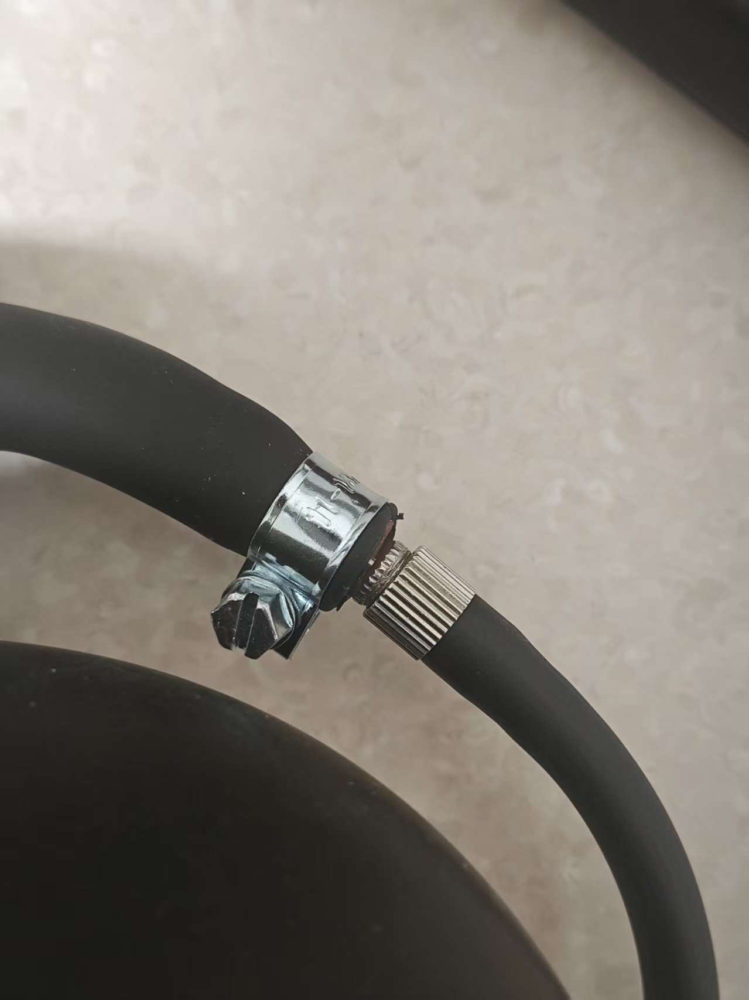

# Edge Control (寸止) Spielweise

Ein auf Luftdrucksensoren basierendes Training-Spiel, das durch Erkennung von Druckveränderungen des Schließmuskels in Kombination mit einem Exzenter-Motorcontroller und einem Elektroschockgerät eine intelligente Stimulationssteuerung durchführt.

Link zum Kauf des Spiel-Sets:

[https://item.taobao.com/item.htm?id=1017049175869](https://item.taobao.com/item.htm?id=1017049175869)

# Anleitung für die Handy-Version:
[https://www.bilibili.com/video/BV1xA1fBsErr/](https://www.bilibili.com/video/BV1xA1fBsErr/?share_source=copy_web&vd_source=3dd9ee8089c213072e87f2745c7050aa)

Yuque Originalanleitung: https://www.yuque.com/easysmart/easysmart/oe8gsvyhtflb9pqt

# Anleitungen für die PC-Version:
  
Client-Download: [PC-Client](./client/PC版控制客户端.md)

Video-Anleitung: [【玩法教程】寸止套装大公开：3步玩出巅峰体验，视频教你征服它_哔哩哔哩_bilibili](https://www.bilibili.com/video/BV1WXWpzUEoW/?spm_id_from=333.1007.top_right_bar_window_dynamic.content.click)

Es wird empfohlen, Hotspot und das Standard-WLAN zu verwenden, diese Lösung erfordert keine Netzwerkkonfiguration. Wenn die Router-Lösung verwendet werden soll, **<font>muss das Gerät vor Spielbeginn konfiguriert werden</font>**. Bitte überprüfen Sie den Abschnitt zur Netzwerkkonfiguration im linken Inhaltsverzeichnis.

# Wichtige Hinweise
1.  Der aufblasbare Analplug wurde aktualisiert und ist jetzt besser abgedichtet, um Luftverlust zu reduzieren. Er sieht anders aus als unten abgebildet.
2.  Der Luftdruck während des Spiels sollte **<font>nicht zu hoch sein</font>** (führt zu Luftverlust). Normalerweise sind 22-24 kPa ausreichend, solange sie bei Anspannung eine Veränderung zeigen.
3.  Zum Einführen kann man etwas Luftdruck aufbauen, da er sonst zu weich sein und möglicherweise nicht hineingehen könnte.

# Zusammenbau des Kits (Pflichtlektüre)
Ziehen Sie den Ballon vom aufblasbaren Analplug ab und verbinden Sie ihn mit dem Schlauch des Luftdrucksensors. Verbinden Sie den Schlauch des Analplugs mit dem T-Stück des Luftdrucksensors.

1.  So sieht der Analplug beim Erhalt aus


2.  Ballon entfernen


3.  Mit beiden Enden des Luftdrucksensors verbinden


4.  Fertiges Ergebnis


5.  Optionales Upgrade bei zu schnellem Druckverlust



Drehen Sie diesen Verschluss an der Verbindungsstelle fest, um die Geschwindigkeit des Druckverlusts zu verringern.

Link zum Kauf des Verschlusses: [https://item.taobao.com/item.htm?id=724827233726](https://item.taobao.com/item.htm?id=724827233726) (11-13mm)

### Spielmechanik
1.  **Drucküberwachung**: Der Luftdrucksensor erkennt Druckveränderungen des Schließmuskels in Echtzeit.
2.  **Intelligente Anpassung**: Die Stimulation wird verringert, wenn der Druck hoch ist, und erhöht, wenn er niedrig ist.
3.  **Elektroschock-Warnung**: Bei Überschreiten des kritischen Druckwerts wird ein Elektroschock ausgelöst, um den Benutzer wachzurütteln.
4.  **Verzögerter Start**: Bei niedrigem Druck beginnt die Stimulation erst nach einer Verzögerung langsam.
5.  **Dynamisches Gleichgewicht**: Hält einen Gleichgewichtszustand nahe dem kritischen Druck aufrecht.

## Zustandsübergangsdiagramm


## Geräteanforderungen
### Gerätekonfiguration
| Gerätetyp | Logik-ID | Gerätename | Erforderlich? | Funktion |
| --- | --- | --- | --- | --- |
| QIYA | pressure_sensor | Luftdrucksensor | Ja | Erkennt Druckveränderungen des Schließmuskels |
| TD01 | motor_controller | Exzenter-Motorcontroller | Ja | Bietet Stimulation mit einstellbarer Intensität |
| DIANJI | shock_device | Elektroschockgerät | Nein | Warnschock bei zu hohem Druck |
| ZIDONGSUO | auto_lock | Automatisches Schloss | Nein | Sperrt zu Spielbeginn, entsperrt am Ende |

## Spielparameter-Konfiguration
### Grundparameter
| Parametername | Typ | Bereich | Standardwert | Erklärung |
| --- | --- | --- | --- | --- |
| duration | Zahl | 1-120 Minuten | 20 Minuten | Spielzeit |
| criticalPressure | Zahl | 0-40 kPa | 20 kPa | Kritischer Luftdruckwert |
| maxMotorIntensity | Zahl | 1-255 | 200 | Maximale TD01-Intensität |

### Stimulationskontrollparameter
| Parametername | Typ | Bereich | Standardwert | Erklärung |
| --- | --- | --- | --- | --- |
| lowPressureDelay | Zahl | 1-30 Sekunden | 5 Sekunden | Verzögerung bei niedrigem Druck vor Stimulationsstart |
| stimulationRampRateLimit | Zahl | 1-50 | 10 | Begrenzung der Anstiegsrate der Stimulationsintensität (Änderung pro Sekunde nicht höher als dieser Wert) |
| pressureSensitivity | Zahl | 0.1-5.0 | 1.0 | Sensitivitätskoeffizient für Druckänderungen |
| stimulationRampRandomPercent | Zahl | 0-100% | 0% | Prozentuale zufällige Variation der Stimulationsintensität |

### Elektroschock-Parameter
| Parametername | Typ | Bereich | Standardwert | Erklärung |
| --- | --- | --- | --- | --- |
| shockIntensity | Zahl | 10-100 V | 20 V | Elektroschock-Intensität |
| shockDuration | Zahl | 0.5-5 Sekunden | 1 Sekunde | Elektroschock-Dauer |

## Algorithmus-Logik
### Druck-Intensitäts-Zuordnungsalgorithmus
```plain
if (currentPressure >= criticalPressure) {
    motorIntensity = 0
    triggerShock()
} else if (currentPressure < criticalPressure) {
    pressureDiff = criticalPressure - currentPressure
    targetIntensity = (pressureDiff / criticalPressure) * maxMotorIntensity
    
    // Verzögerter Startmechanismus, graduelle Intensitätsänderung, zufällige Intensitätsschwankung
}
```