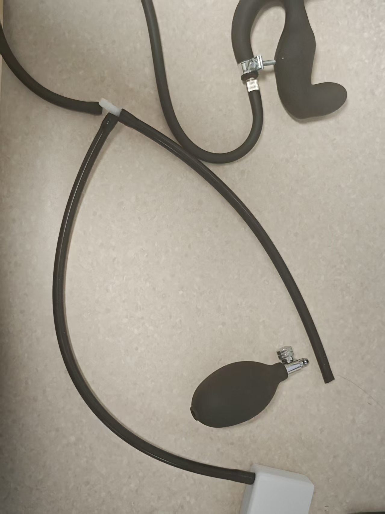

# Beckenbodentraining-Spielmodus

# Spielbeschreibung
+ Beckenbodentraining erfolgt durch abwechselnde "Entspannungsphasen" und "Beckenbodenanspannungsphasen"
+ Ziel ist es, innerhalb der vorgegebenen Zeit so viele erfolgreiche "Beckenbodenkontraktionen" wie möglich durchzuführen
+ Erfolg oder Misserfolg wird auf der Benutzeroberfläche klar angezeigt, bei Misserfolg wird ein Elektroschock ausgelöst (falls verbunden und aktiviert)

## Software-Download und Vorbereitung
Android-Handy: [Handy-Client (empfohlen: Standard-WiFi verwenden, kein Netzwerkkonfiguration durchführen)](../手机客户端（建议采用默认wifi，不要进行配网）.md)

Windows-Computer: [Anleitung für die neue PC-Client-Version](../PC版控制客户端.md)

# Geräte und Vorbereitung
+ Erforderliches Gerät: `Drucksensor (QIYA)`
+ Optionale Geräte: `Elektroschockgerät (DIANJI)`, `Automatisches Schloss (ZIDONGSUO)`
+ Automatisches Verriegeln beim Start, automatisches Entriegeln am Ende (falls automatisches Schloss verbunden ist)

## Gerätezusammenbau
Den Aufblasballon des aufblasbaren Analplugs abnehmen und mit dem Schlauch des Drucksensors verbinden. Den Schlauch des Analplugs mit dem T-Stück des Drucksensors verbinden.

1. So sieht der Analplug bei Erhalt aus (das Design der neuen Version hat sich geändert, bessere Dichtung, ähnlich wie unten)

2. Aufblasballon entfernen

3. Mit beiden Enden des Drucksensors verbinden

4. Fertiges Aussehen

5. Optional: Verstärkung bei schnellem Druckverlust

Diese Klemme an der Verbindungsstelle festziehen, um die Druckverlustgeschwindigkeit zu verringern.

Klemmen-Kaufadresse: [https://item.taobao.com/item.htm?id=724827233726](https://item.taobao.com/item.htm?id=724827233726) (11-13mm)

## Spielzugang

# Parametererklärung
+ `Dauer (Minuten)`: Gesamtspieldauer
+ `Zielanzahl Kontraktionen`: Erwartete Anzahl erfolgreicher Durchgänge, dient zur Anzeige des Gesamtfortschritts
+ `Druckänderung (kPa)`: Schwellenwert für den erforderlichen Druckanstieg in der Anspannungsphase (relativ zum niedrigsten Druck in der Entspannungsphase)
+ `Schockstärke (V)`: Stärke des Elektroschocks bei Misserfolg
+ `Schockdauer (Sekunden)`: Dauer des Elektroschocks bei Misserfolg
+ `Einzelzykluszeit (Sekunden)`: Dauer jeder Phase, standardmäßig 10 Sekunden (Entspannung 10s → Anspannung 10s → Zyklus)

# Spielablauf
+ Entspannungsphase
    - Entspannen und natürlich atmen, das System zeichnet den "niedrigsten Druck" dieser Phase als Referenz auf
    - Nach Ablauf des Countdowns beginnt die Anspannungsphase
+ Anspannungsphase
    - Innerhalb der Phasendauer muss der Druck auf "niedrigster Druck + Druckänderung" erhöht werden
    - Wird das Ziel erreicht, gilt es als "erreicht", dennoch muss der Countdown dieser Phase ablaufen, bevor die nächste Runde beginnt
    - Wird das Ziel vor Ende der Phase nicht erreicht, gilt es als "Herausforderung fehlgeschlagen · Schock startet" (falls Elektroschockgerät verfügbar)
+ Phasenwechsel
    - Jede Runde folgt dem Zyklus "Entspannung → Anspannung → Entspannung → …", bis die Zeit abläuft oder die Zielanzahl erreicht ist

# Oberflächenhinweise
+ Große Schrift oben zeigt aktuelle Phase (Entspannungsphase/Anspannungsphase) und verbleibende Zeit dieser Phase an
+ Gesamtfortschritt
    - Fortschrittsbalken nach Anzahl: Abgeschlossene Durchgänge / Zielanzahl
    - Fortschrittsbalken nach Zeit: Verbrauchte Zeit / Gesamtdauer
+ Druck und Ziel
    - Aktueller Druck (kPa)
    - Niedrigster Druck in Entspannungsphase (Referenzwert)
    - Ziel-Druck für Anspannung (Niedrigster Druck + Druckänderung)
+ Erfolgs-/Misserfolgshinweis
    - Erfolg: Grüne Kapsel "Erreicht" hinter der Zahl
    - Misserfolg: Rote Kapsel "Herausforderung fehlgeschlagen · Schock startet" hinter der Zahl
+ Bedienung und Protokoll
    - Schaltflächen: Pause, manueller Schock
    - Protokoll: Zeigt letzte Informationen und Systemhinweise an

**Ende und Statistik**

+ Endet, wenn die eingestellte Dauer erreicht ist oder die Zielanzahl erfolgreicher Durchgänge erreicht wurde
+ Automatisches Entriegeln nach Ende (falls automatisches Schloss verbunden ist)
+ Oberfläche zeigt kumulierte Anzahl erfolgreicher Durchgänge und Schockanzahl usw. an

**Nutzungsempfehlungen**

+ Bei erstmaliger Nutzung empfiehlt es sich, "Druckänderung" niedrig einzustellen, um den Rhythmus kennenzulernen
+ Falls Elektroschockgerät verbunden ist, mit niedriger Stärke beginnen und schrittweise anpassen
+ Ruhig atmen, in der Anspannungsphase konzentriert den Druck bis zum Ziel erhöhen

**Schnellstart**

+ Drucksensor verbinden (optional Elektroschockgerät, automatisches Schloss verbinden)
+ Parameter einstellen und starten
+ In Entspannungsphase keine Kraft aufwenden, auf Countdown warten; in Anspannungsphase Kraft aufwenden, um Ziel zu erreichen
+ Bei "Erreicht" bis zum Ende der Phase halten; bei Misserfolg erfolgt Hinweis und Schock
+ Zyklus bis zum Ende wiederholen, Statistik und Fortschrittsbalken zur Erfolgskontrolle nutzen