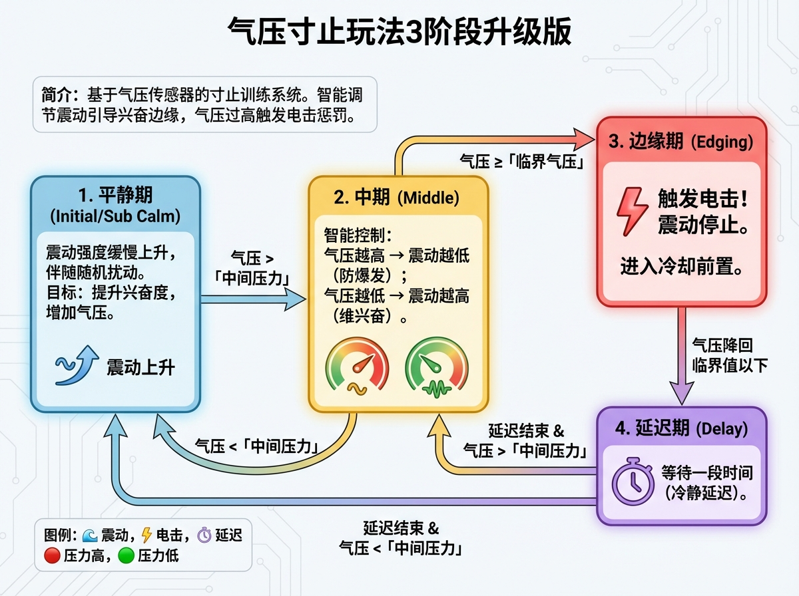

# Druck-basierte Edging-Spielweise – 3-Phasen-Upgrade

## Einführung
Dies ist eine Edging-Trainingsspielweise, die auf einem Drucksensor basiert. Das System passt die Vibrationsintensität intelligent basierend auf dem Druckwert an und führt den Nutzer an die Erregungsschwelle. Wird ein kritischer Druckwert überschritten, wird eine Elektroschock-Bestrafung ausgelöst.

## Spielablauf
Das Spiel durchläuft folgende Zustände im Zyklus:

1. **Ruhephase (Initial/Sub Calm)**
   - Die Vibrationsintensität steigt langsam an, begleitet von zufälligen Störungen.
   - **Ziel**: Erregung steigern, Druck erhöhen.
   - **Übergang**: Bei Überschreiten des "mittleren Drucks" in die Mittelphase.

2. **Mittelphase (Middle)**
   - Intelligente Steuerung: Je höher der Druck, desto niedriger die Vibrationsintensität (verhindert zu schnellen Höhepunkt); je niedriger der Druck, desto höher die Vibrationsintensität (hält Erregung aufrecht).
   - **Übergang**:
     - Druck >= "kritischer Druck": **Elektroschock** wird ausgelöst, Übergang in die Edging-Phase.
     - Druck < "mittlerer Druck": Rückfall in die Ruhephase.

3. **Edging-Phase (Edging)**
   - **Elektroschock wird ausgelöst**! Vibration stoppt.
   - **Übergang**: Sinkt der Druck wieder unter den kritischen Wert, tritt eine Abkühlverzögerung ein.

4. **Verzögerungsphase (Delay)**
   - Wartezeit (Abkühlverzögerung).
   - **Übergang**: Nach Ende der Verzögerung wird basierend auf dem aktuellen Druck entschieden: Rückkehr in die Mittelphase (bei > mittlerem Druck) oder Ruhephase (bei < mittlerem Druck).

## Erforderliche Geräte
1. **Drucksensor (QIYA)**: Erforderlich. Misst den Erregungsgrad.
2. **Exzentermotor-Controller (TD01)**: Erforderlich. Liefert Vibrationsreize.
3. **Elektroschock-Gerät (DIANJI)**: Optional. Für Edging-Bestrafung.
4. **Automatisches Schloss (ZIDONGSUO)**: Optional. Verriegelt automatisch zu Spielbeginn und entriegelt am Ende.

## Bedienungsanleitung

1. Montieren Sie das Druckgerät und verbinden Sie alle Geräte mit dem Netzwerk.
2. Führen Sie das Druckgerät in den Körper ein. Üblicherweise auf 20-25 kPa aufpumpen. Stellen Sie sicher, dass der Druck bei leichtem Druck deutlich ansteigt und angemessen niedrig ist, um Luftverlust zu verlangsamen.
3. Legen Sie den mittleren und den kritischen Druck fest. Beim ersten Spielen können Sie diese Werte während des Spiels anpassen – senken Sie sie, wenn es unerträglich wird, erhöhen Sie sie, wenn keine Empfindung spürbar ist.

## Konfigurationserklärung

| Parametername | Erklärung | Empfohlener Wert |
| :--- | :--- | :--- |
| **Spieldauer** | Gesamtlaufzeit des Spiels (Minuten). | 20 |
| **Kritischer Druck** | Maximaler Druck-Schwellenwert zum Auslösen von Elektroschock und Edging (kPa). | 23 |
| **TD01 Maximalintensität** | Maximale Vibrationsstärke (1-255). | 255 |
| **Mittlerer (Erregungs-)Druck** | Druck-Schwelle für den Eintritt in die intelligente Steuerungsphase (kPa). | 22 |
| **Elektroschock-Stärke** | Spannungsstärke bei Bestrafung (V). | 20 |
| **Elektroschock-Dauer** | Dauer der Bestrafung (Sekunden). | 3 |
| **Niederdruck-Verzögerung** | Abkühl- und Ruhezeit nach Auslösen des Edging (Sekunden). | 5 |
| **Maximale Intensitätssteigerungsrate** | Höchstgeschwindigkeit der Vibrationsverstärkung, um abrupte Änderungen zu vermeiden. | 10 |
| **Intensitäts-Zufallsstörung** | Zufällige Schwankungsamplitude der Vibrationsintensität (%). | 0 |
| **Schrittweise Steigerung nach Verzögerung** | Wert, um den die Vibration in der Ruhephase pro Sekunde automatisch ansteigt. | 10 |