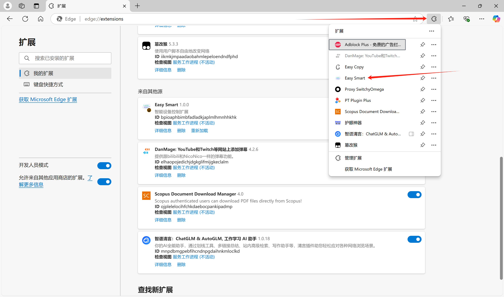

# Gebrauchsanweisung für "Nadelstich-Rücken-Vokabeltraining"

# Spielanleitung:
Beim Vokabellernen wird man oft schläfrig

Dann braucht man eine kleine Prise Stimulation, um die Schläfrigkeit zu vertreiben

Sie müssen das Gerät nur am Körper anbringen, und es wird Ihnen neue Energie geben, wenn Sie einen Fehler machen

Auf diese Weise wird die Effizienz geradezu in die Höhe schnellen

# Voraussetzungen für die Nutzung
1. Sie haben 2,4-GHz-WLAN zu Hause.
2. Das WLAN und der Computer befinden sich im selben lokalen Netzwerk (verbunden mit demselben Router).
3. Der Router unterstützt mDNS (falls nicht unterstützt, müssen Sie einen mobilen Hotspot verwenden) [Überprüfen, ob der Router mDNS unterstützt (die meisten Router unterstützen es)](../其他使用说明/检测路由器是否支持mdns（大部分路由器都支持）.md)
4. Sie besitzen bereits ein einfaches intelligentes Puls-(Elektroschock-)Endgerät: [Einfaches intelligentes Puls-(Elektroschock-)Endgerät](../设备介绍&购买/简单智能脉冲（电击）终端.md) oder [Taobao-Link](https://item.taobao.com/item.htm?id=892309919507)

# Detaillierte Anwendungsmethode
Zugehörige Dateien herunterladen:

LanZouYun

[https://wwcg.lanzouu.com/ielL62nsy9cj](https://wwcg.lanzouu.com/ielL62nsy9cj)

Passwort:95pt

Austausch zur Nutzung: [WeChat-Gruppe für Austausch](https://www.yuque.com/easysmart/easysmart/az9i4x3us4xu870f)

## Browser-Erweiterung installieren
1. Öffnen Sie den Edge-Browser.
2. Geben Sie in die Adressleiste `edge://extensions/` ein und drücken Sie die Eingabetaste.

1. Entwicklermodus einschalten

1. Entpackte Erweiterung laden

1. Wählen Sie den Ordner `easysmart` im Verzeichnis "Schritt1" aus.

1. Installation abgeschlossen

1. Sie können sie später hier finden

## Gerät mit Netzwerk verbinden
(Es wird empfohlen, das Gerät vor der ersten Verwendung aufzuladen.)

1. Schalten Sie das Gerät mit dem Schalter ein. Nach dem Einschalten leuchtet die LED des Geräts.
2. Starten Sie das Mini-Programm, um das Gerät mit dem Netzwerk zu verbinden.

Für diesen Schritt lesen Sie bitte [Gerät über APP mit WiFi verbinden](../其他使用说明/设备连接wifi（配网）/通过APP将设备连接到wifi.md) oder [Gerät über Mini-Programm mit WiFi verbinden](../其他使用说明/设备连接wifi（配网）/通过小程序将设备连接到wifi.md)

## Server auf dem Computer ausführen
1. Führen Sie auf dem Computer die Datei `Schritt2启动.bat` aus. Nach dem Start dauert es etwa 2 Minuten, bis der Vorgang abgeschlossen ist (der erste Start dauert länger). Wenn der rote Rahmeninhalt erscheint, war der Start erfolgreich. (Wenn diese Datei nicht vorhanden ist, laden Sie sie bitte im Kopfbereich des Dokuments herunter.)

1. Sie können die Elektroden am Körper anbringen und in das Gerät stecken.

## Spannung und Dauer einstellen
1. Klicken Sie, um die Erweiterung zu öffnen.

Nach dem Öffnen sieht es wie folgt aus:

Wenn das lokale Programm gestartet ist, klicken Sie auf "Neu verbinden".

Jetzt können Sie das Gerät unten sehen.

1. Klicken Sie auf "Globale Einstellungen", um Spannung und Verzögerung einzustellen.

Ein Klick auf "Testeinstellungen" sendet einen Puls-Impuls.

**Hinweis: Beginnen Sie mit 20 Volt zu testen. Testen Sie jede Stufe mehrmals. Wenn Sie alle nicht stark spüren, können Sie die Spannung erhöhen. Eine Erhöhung um 10V oder weniger wird empfohlen.**

Danach klicken Sie auf "Einstellungen speichern".

## Beginnen Sie mit dem Vokabellernen
Für "Shanbei Vokabeln" können Sie direkt loslegen.

Hier wird "Ciba Vokabeln" vorgestellt.

Gehen Sie zur Website.

Wählen Sie eine Vokabelliste, zum Beispiel für Level 4.

Wählen Sie eine Lektion aus.

Klicken Sie auf "Einzelauswahl-Herausforderung".

Wenn Sie jetzt eine falsche Wahl treffen, wird ein elektrischer Impuls ausgelöst.