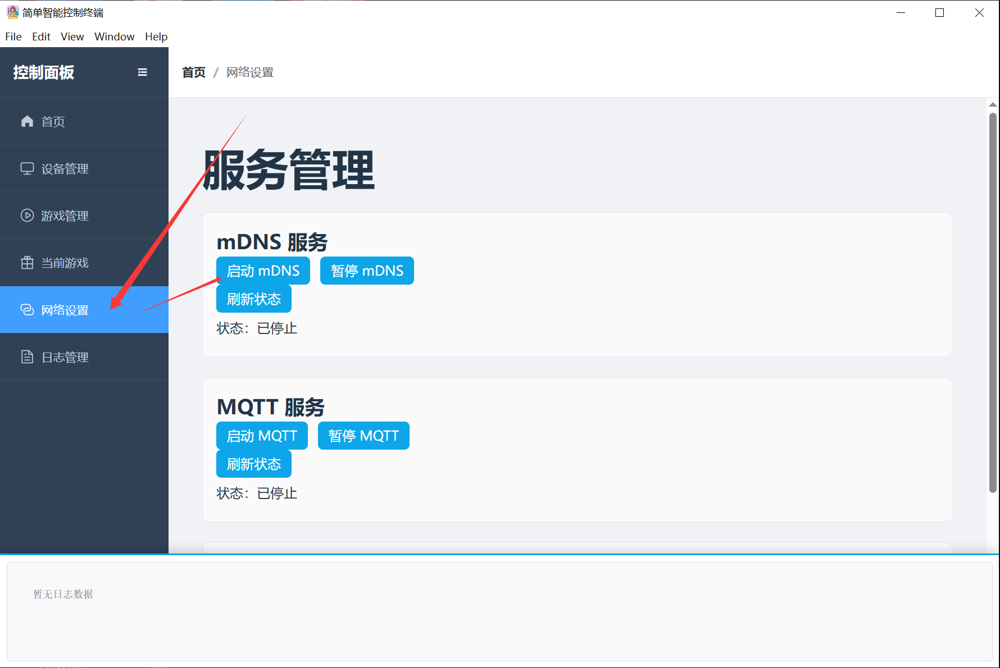

# PC Client User Guide

1. Download link: [https://update.ezsapi.top/control-panel/UnderSilicon.zip](https://update.ezsapi.top/control-panel/UnderSilicon.zip)
2. **Please extract the file before installation. If extraction fails, install [7zip](https://www.7-zip.org/download.html) and use it to extract the file.**
3. **Launch the client.**
4. **Enable the PC hotspot, set the WiFi name to `easysmart`, password to eight `1`s, and band to **2.4G** band ([Configuration without PC hotspot](#usage-without-pc-hotspot)).**
5. **(Important) If the device is connected to WiFi but does not appear in the client, it may be blocked. Turn off the computer firewall.**
6. **Start the device. It will automatically connect to the PC about 15-30 seconds after startup.**
7. **You can start having fun!**

## Usage without PC Hotspot
1. Configure device network: Refer to [Connecting Device to WiFi via APP](./其他使用说明/设备连接wifi（配网）/通过APP将设备连接到wifi.md) to connect the device to your home WiFi (must be 2.4G WiFi).
2. Enable mDNS in the client.

