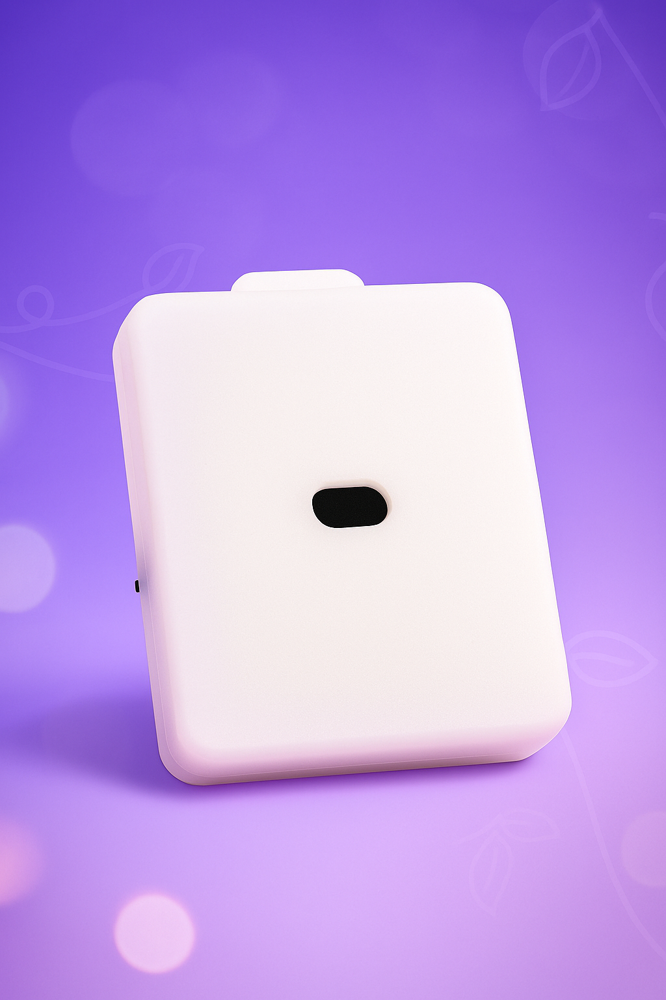

# Simple Smart Distance Sensing Terminal

> Logic ID `QTZ`. A distance sensor for body height and motion, used by push-up, tiptoe, and other motion plays.

## Features

- Live distance reports (millimeters)
- Dual-button foot pedal
- Low / high band judgment
- USB-C charging

## Specifications

| Item | Detail |
| :--- | :--- |
| Logic ID | QTZ |
| Function | Distance / height sensing |
| Control fields | distance / low_band / high_band / button0 / button1 |
| Power | Built-in battery + USB-C charging |
| Radio | Wi-Fi (2.4G) / BLE |

## Related play

- [Push-up detection game](../player/俯卧撑（大概）检测训练游戏.md)
- [Tiptoe penalty v2 (legacy)](../player/old/踮脚惩罚玩法v2.md)
- [Drink / liquid-collection unlock](../player/喝水液体收集解锁玩法.md)

## Before you start

- Client: [phone client](../player/client/new-phone-client.md) | [PC client](../player/client/PC版控制客户端.md)

## Notes

- Switch direction: away from the charging port is ON; the other way is OFF.

## Buy

- Taobao (Easy IoT shop): [https://item.taobao.com/item.htm?id=944256618610](https://item.taobao.com/item.htm?id=944256618610)
