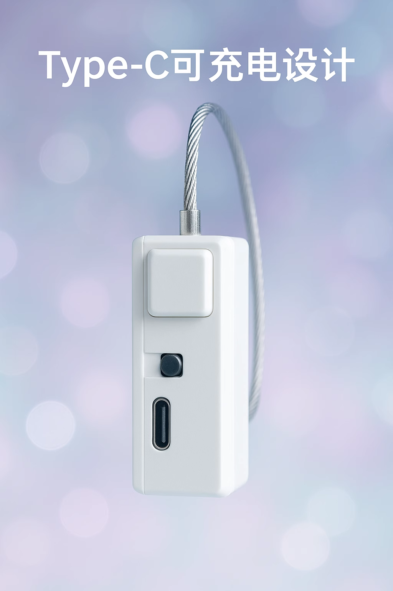

# Simple Smart Lock Terminal

> Logic ID `ZIDONGSUO`. It locks and unlocks over Wi-Fi for plays that should not end early.

## Features

- Wireless lock / unlock (Wi-Fi / BLE)
- Hold the button for 60 seconds to force unlock
- Auto unlock below 20% battery (so you are not stuck)
- Programmable, including timed control
- USB-C charging

## Specifications

| Item | Detail |
| :--- | :--- |
| Logic ID | ZIDONGSUO |
| Function | Auto lock |
| Control field | open |
| Power | Built-in battery + USB-C charging |
| Radio | Wi-Fi (2.4G) / BLE |

## Related play

- [Tiptoe penalty v2](../player/踮脚惩罚玩法v2.md)
- [Push-up detection game](../player/俯卧撑（大概）检测训练游戏.md)
- [Edge control](../player/old/边缘控制（寸止）玩法.md)
- [Kegel training](../player/提肛训练玩法.md)
- [Drink / liquid-collection unlock](../player/喝水液体收集解锁玩法.md)

## Before you start

- Client: [phone client](../player/client/new-phone-client.md) | [PC client](../player/client/PC版控制客户端.md)

## Notes

1. Keep an escape tool within reach. Network problems mean the device cannot guarantee unlock.
2. Switch direction: away from the charging port is ON; the other way is OFF.

## Buy

- Taobao (Easy IoT shop): [https://item.taobao.com/item.htm?id=925058360048](https://item.taobao.com/item.htm?id=925058360048)
