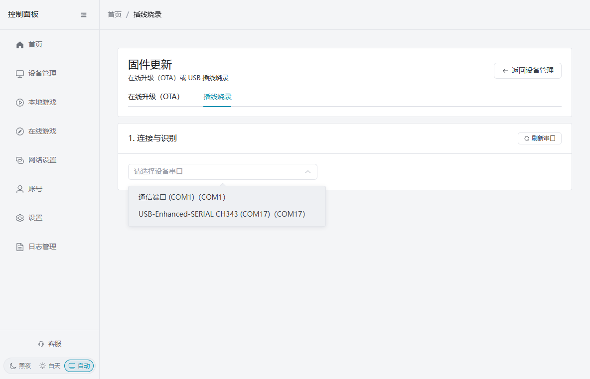
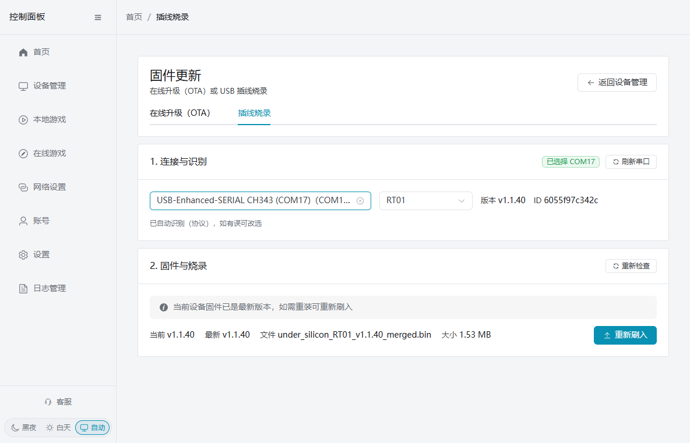
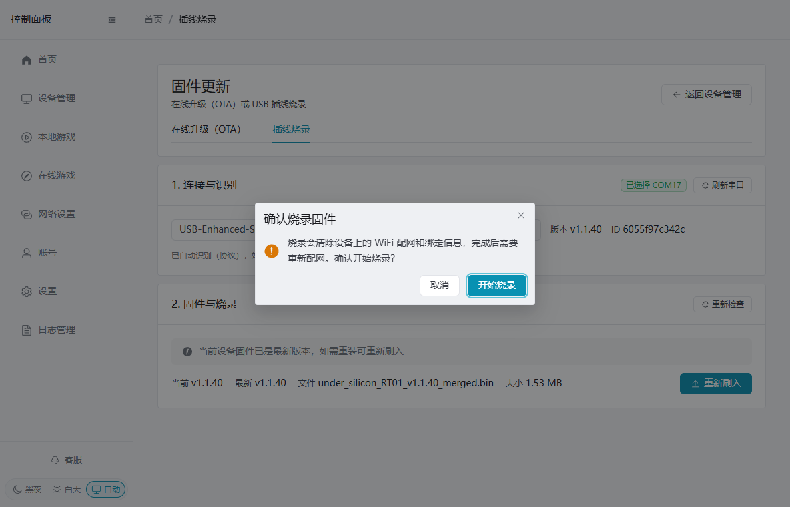
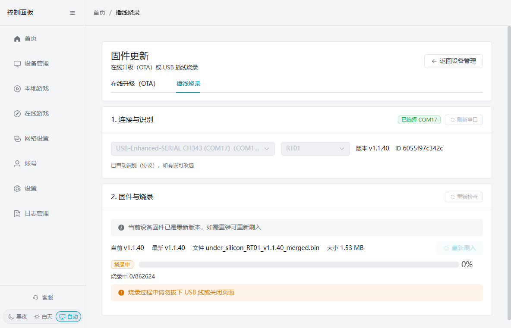
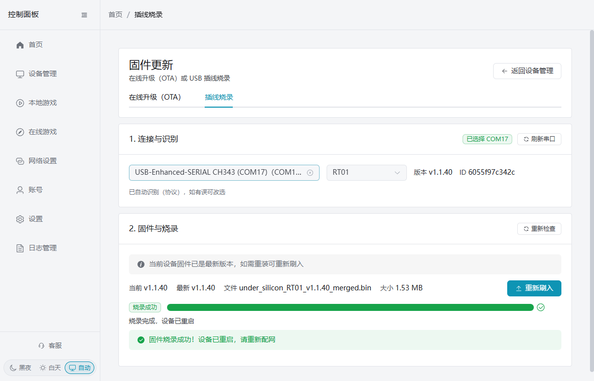
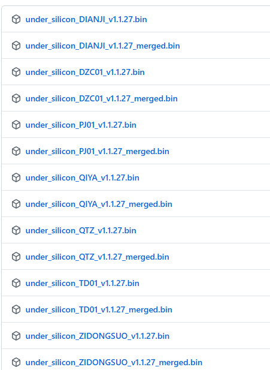

# Update firmware over USB from the control panel

If the device cannot reach the network, OTA fails, or you need to reinstall the current firmware, use the PC client and a USB cable. The client identifies the device, downloads and checks the firmware, enters download mode, writes the image, and reboots. You do not use Flash Tool by hand, and you do not hold a device button to enter download mode.

## Before you update

- Use a data-capable USB cable. A charge-only cable cannot update the device.
- Keep the computer and the device powered. Do not unplug the cable or close the client page during the update.
- **Flashing clears the device's Wi-Fi setup and binding.** You will need to provision the network again.

### First time: install the serial driver

The first time you update over USB on this computer, install the WCH CH340/CH341 driver:

- [CH340/CH341 driver](https://www.wch.cn/downloads/CH341SER_EXE.html)

Run the installer. Unplug and replug the device, then click Refresh ports in the client. If the page says a CH34x device was detected but the driver is not installed, install the driver and refresh.

## Automatic USB update in the client

1. Open the control panel. Go to Device management → Device tools → Firmware update, then choose USB flash.
2. Under Connection and identify, select the device's serial port. It is usually named CH340, CH343, or USB-Enhanced-SERIAL. Do not choose the computer's built-in `COM1`.

3. The client identifies the model and current version, then shows the full firmware, version, and file size. If identification fails, pick the correct model in the dropdown and continue.

4. If a newer version is available, click Update firmware. If it already shows the latest version and you need a repair or reinstall, click Flash again. In the confirm window, read the note that Wi-Fi setup and binding will be cleared, then click Start flash.

5. The client downloads and checks the firmware, enters download mode, flashes, and reboots. You do not enter download mode by hand. Do not unplug USB or close the page before or during the progress bar.

6. "Firmware flashed. The device has rebooted. Provision Wi-Fi again." means it finished. Provision the network, then return to device management and confirm the device is online.

## Common cases

### No serial port

Confirm the device is plugged in, the cable carries data, and the driver above is installed. Unplug and replug, then click Refresh ports.

### Model not identified

Wait for automatic identification to finish, then pick the real model in the dropdown. If you still cannot confirm the model, do not flash another model's firmware.

### Flash failed

Keep the USB cable connected and click Retry flash. If it still fails, try another data cable or USB port and start again. Do not keep plugging and unplugging during a flash.

## Manual flash (only if the client cannot be used)

1. Install the driver
    1. CH340 serial driver: [https://www.wch.cn/downloads/CH341SER_EXE.html](https://www.wch.cn/downloads/CH341SER_EXE.html)
    2. Run the downloaded installer
2. Download Flash Tool
    1. [https://dl.espressif.com/public/flash_download_tool.zip](https://dl.espressif.com/public/flash_download_tool.zip)
    2. Unzip and run it
    3. Usage:
    4. [https://docs.espressif.com/projects/esp-test-tools/zh_CN/latest/esp32/production_stage/tools/flash_download_tool.html#id5](https://docs.espressif.com/projects/esp-test-tools/zh_CN/latest/esp32/production_stage/tools/flash_download_tool.html#id5)
    5. In step 3 of that guide, change the COM port. Leave the other settings as they are
3. Download firmware
    1. [https://github.com/jiandanzhineng/hardware/releases/latest](https://github.com/jiandanzhineng/hardware/releases/latest)
    2. 
    3. Download the firmware for your device type. Use the file whose name contains `merged`. Shock: DIANJI. Air-pressure sensor: QIYA. Off-axis motor controller: TD01. Distance sensor: QTZ
    4. Flash that file to address 0x0

## OTA wireless update

If the device is already on Wi-Fi and online, update firmware from the control client. No USB cable is required.

1. Open the PC or phone client and go to **Device management**
2. Find the device and click **Firmware update** (or Check for updates)
3. The client compares the device version with the latest firmware
4. If a newer version exists, click **Update**
5. The client sends an MQTT update command, the device downloads the firmware, writes it, and reboots
6. After the update, the device comes back online

**Notes:**
- OTA needs the device online on Wi-Fi
- Do not power the device off during the update
- Several devices can be updated together
- Firmware downloads: [https://github.com/jiandanzhineng/hardware/releases/latest](https://github.com/jiandanzhineng/hardware/releases/latest)
