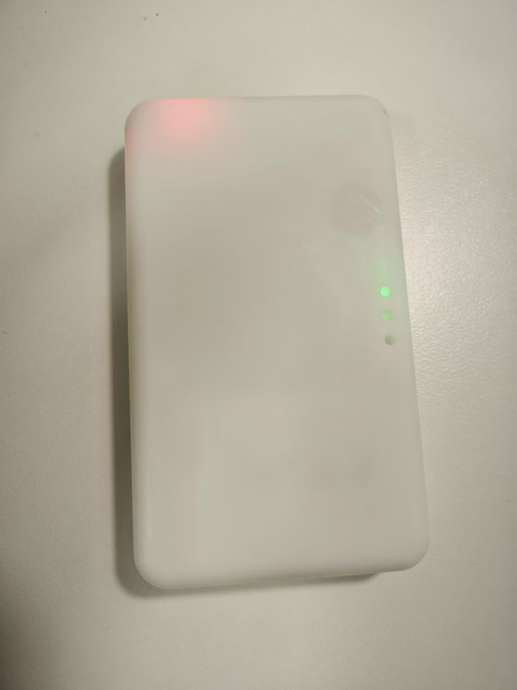
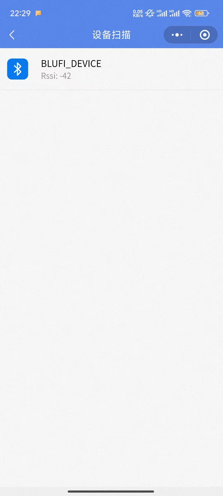
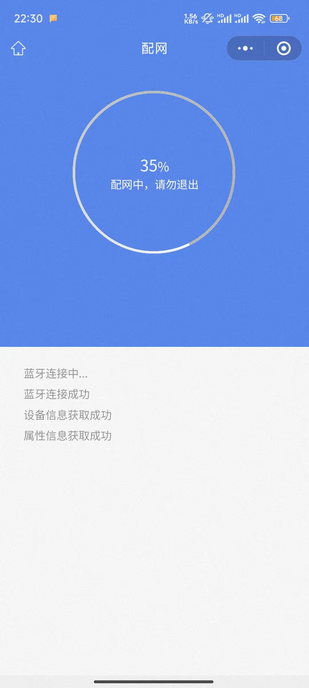

# Connect Device to WiFi via Mini Program

All devices can connect to WiFi according to this document.

**Note: If you want to use the default WiFi, do not configure the network. The default WiFi name is easysmart, password is 11111111. The device will automatically connect to the default WiFi.**

Video Tutorial:

Douyin: [https://v.douyin.com/l_QWua94sRA/](https://v.douyin.com/l_QWua94sRA/)

YT: [https://www.youtube.com/watch?v=W7ITGIC0lw8](https://www.youtube.com/watch?v=W7ITGIC0lw8)

**Prerequisites:**

1. The space has a 2.4GHz wireless WiFi.
2. The mobile phone is currently connected to that wireless WiFi (if it is a combined 2.4G/5G network, connecting to the same-name 5G WiFi is also acceptable).

If unsuccessful, you can also [Connect Device to WiFi via APP](./通过APP将设备连接到wifi.md).

## Step 1: Start the device. The device should light up at this point.
Example:

## Step 2: Search for the mini program "物联地带蓝牙配网" in WeChat and click to enter.
Note: Please turn on mobile Bluetooth before operation.

After entering, it looks like the following:

Click "Start Network Configuration". After a few seconds, it looks like the following:

(Note: The device can only be found after it is turned on.
If the device successfully configures the network and connects to WiFi, it will not be searchable.)

Select the found device.
Enter the password of the WiFi the phone is currently connected to (must be 2.4GHz or have the same name for 2.4G/5G combined).
Click "Next".

After a few seconds, the network configuration will succeed.

If it shows configuration failure, it does not matter; it is still successful. At this point, the network configuration is complete.

**Note: After the device connects to WiFi, it will automatically turn off Bluetooth. If it shows failure but re-searching does not find the device, then it has succeeded.**

