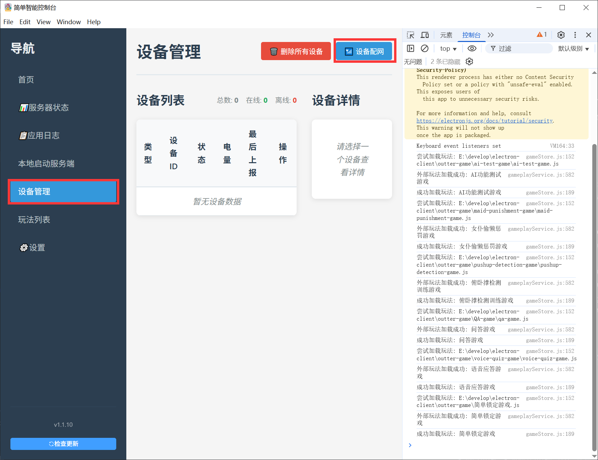
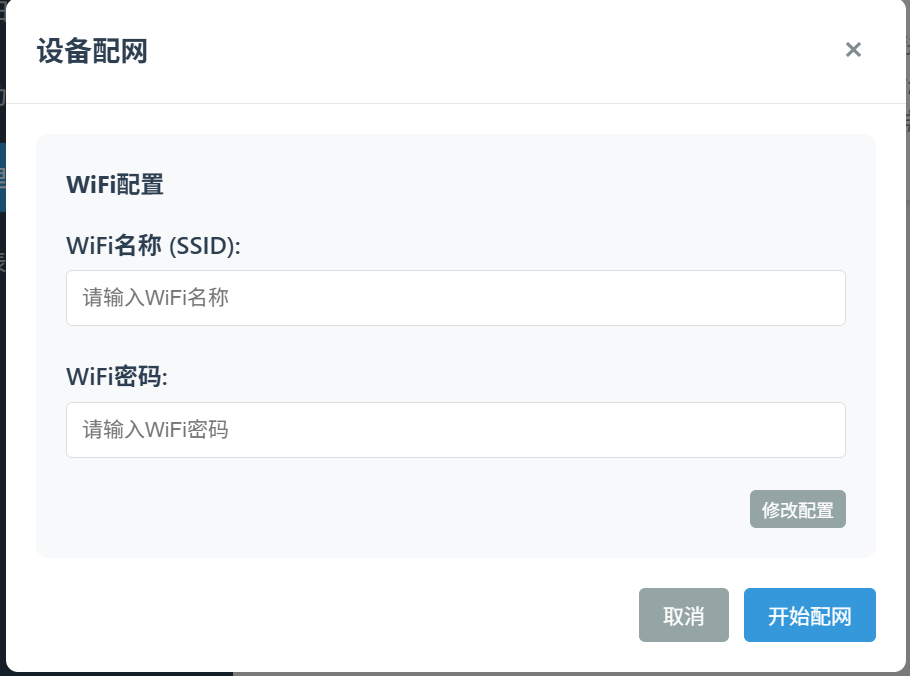

# Network Configuration via PC Client (Requires PC Bluetooth Support)

Note: This method is still under testing and may be unstable. If it fails, you can try ending the configuration process and restarting or use other methods.

**Note: If you wish to use the default Wi-Fi, please do not configure the network. The default Wi-Fi name is easysmart, password is 11111111. The device will automatically connect to the default Wi-Fi.**

1. Open the client, click "Device Management" -> "Network Configuration"

2. Enter the Wi-Fi name and password (Be careful not to input incorrectly; otherwise, the device will still fail to connect to the internet even after successful configuration).
3. Click "Modify Configuration"
4. Click "Start Configuration" to begin the network setup process.