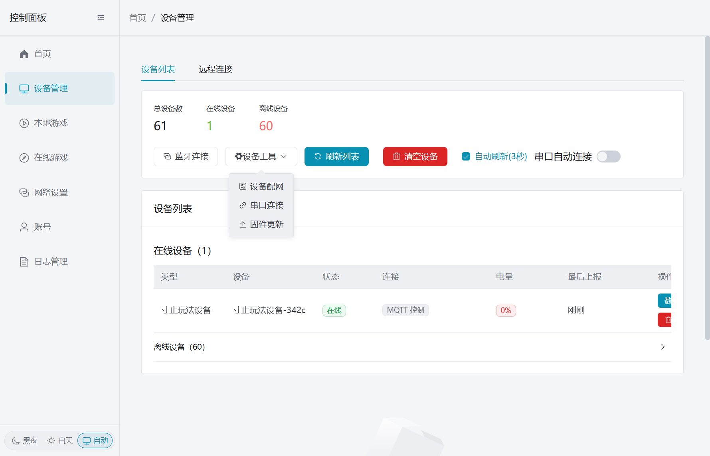
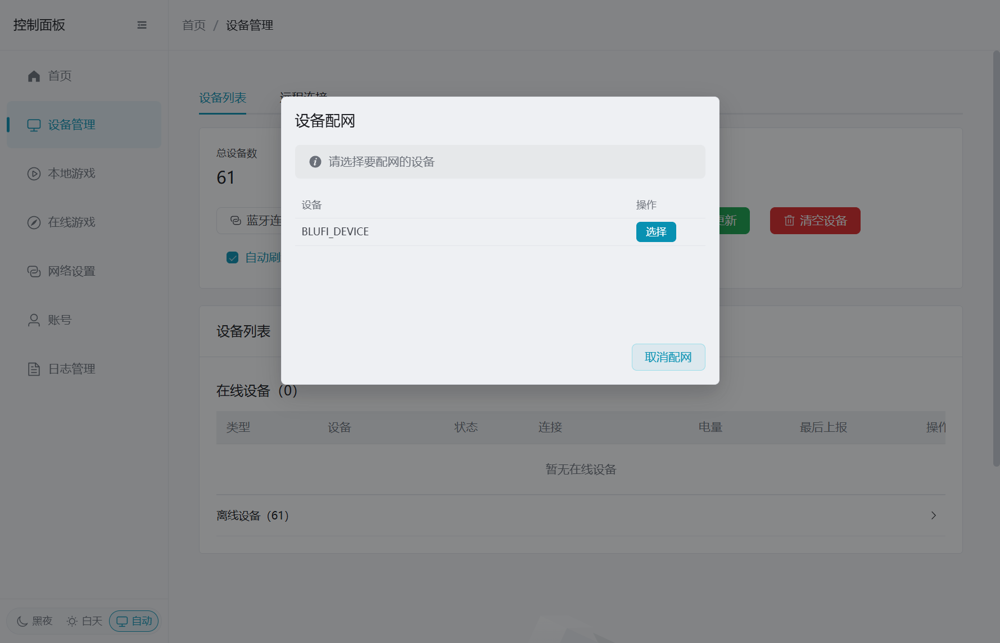
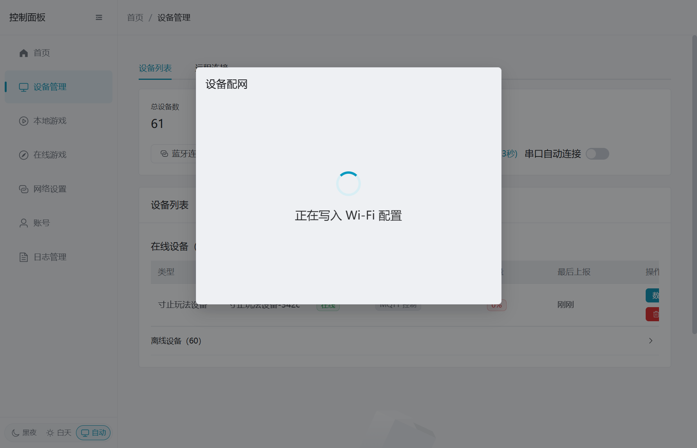
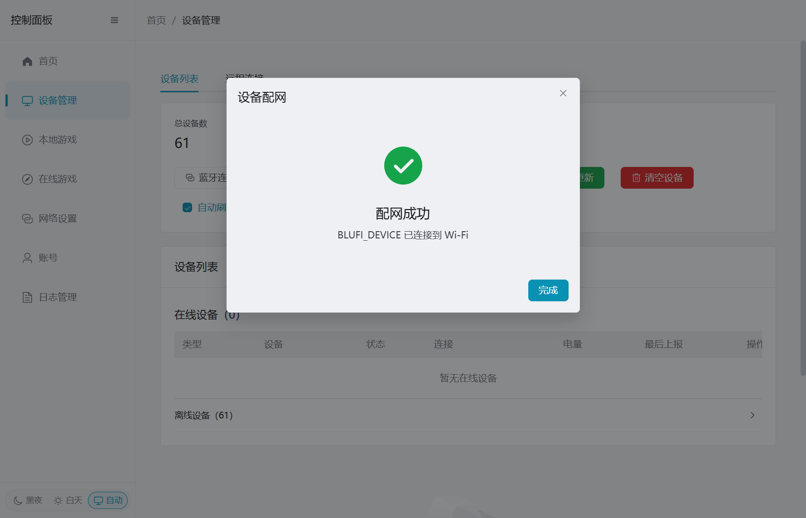

# Provision Wi-Fi from the PC client (the PC needs Bluetooth)

Note: this method is still in testing and may be unstable. If it fails, end provisioning and start again, or use another method.

**Note: BLE and Wi-Fi are mutually exclusive. They cannot be used at the same time. After provisioning succeeds, the device turns Bluetooth off, so Bluetooth is unavailable. To control the device over Bluetooth again, switch it to BLE mode. Wi-Fi disconnects when you do that.**

**Note: if you want the default Wi-Fi, do not provision. Default name: easysmart. Password: 11111111. The device connects to that network by itself.**

1. Open the PC client, go to Device management, click Device tools, then Device provisioning.

2. Enter the 2.4G Wi-Fi name and password, then click Start provisioning. Check the name and password carefully. The device does not support 5G Wi-Fi.

3. The client scans for nearby devices whose names contain `BLUFI`. Find the device in the list and click Select.

4. The client connects and writes the Wi-Fi settings. Keep the device powered and wait. Do not close the provisioning window.

5. When you see Provisioning succeeded, click Done. If the firmware reported an IP address, the success page shows it. A missing IP does not mean provisioning failed.

After success, the device turns Bluetooth off and comes online over Wi-Fi. In the device list, a connection type of `MQTT` means the device is on Wi-Fi.

If no `BLUFI` device appears, restart the device, end provisioning, and scan again.
