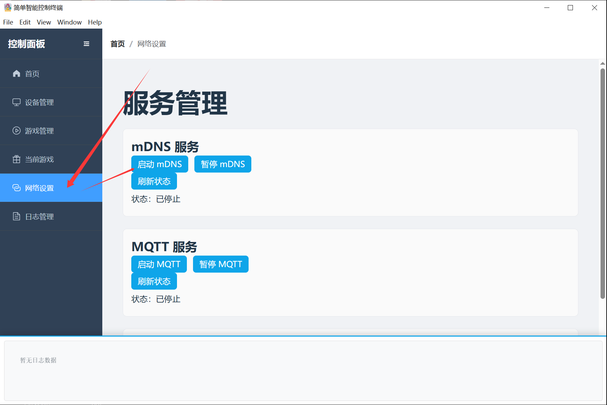

# Video Tutorial

Bilibili: https://www.bilibili.com/video/BV1jBcuzGEyC/
YouTube: https://youtu.be/1m-OEwx_Gjg

# PC Client User Guide

1. Download Link: [https://firmware.undersilicon.cn/control-panel/stable/UnderSilicon.zip](https://firmware.undersilicon.cn/control-panel/stable/UnderSilicon.zip)
2. **Please extract the files after downloading and then install. (If extraction fails, you can install [7zip](https://www.7-zip.org/download.html) and use it to extract the archive.)**
3. **Launch the client**
4. **Enable your computer's hotspot, set the WiFi name as easysmart with password as eight 1s, and the band to **2.4G** band. (See [Usage without Computer Hotspot](#无电脑热点情况使用方式) for alternative setup)**
Note: If the device has already connected to a 5G WiFi network, it might still operate on the 5G band even after being configured for 2.4G. In this case, the device needs to be connected to a 2.4G WiFi network (or via Ethernet) for proper hotspot setup.
5. **If the device connects to WiFi but does not appear in the client, it might be blocked. Please turn off your computer's firewall.**
6. **Power on the device. It will automatically connect to the computer approximately 15-30 seconds after startup.**
7. **You're ready to have fun!**

 

## Usage without Computer Hotspot
1. Device Network Configuration: Refer to [Connecting the Device to WiFi via APP](../other/设备连接wifi（配网）/通过APP将设备连接到wifi.md) to connect the device to your home WiFi (Note: Must be 2.4G WiFi)
2. Enable mDNS in the client

## Other Download Links

Stable Version: https://firmware.undersilicon.cn/control-panel/stable/UnderSilicon.zip

Test Version: https://firmware.undersilicon.cn/control-panel/test/UnderSilicon.zip

Historical Versions: https://github.com/jiandanzhineng/control-panel/releases