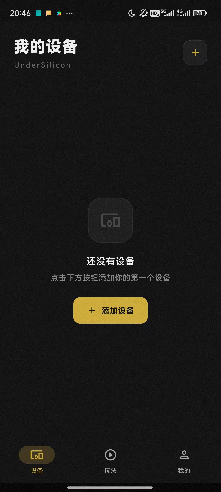
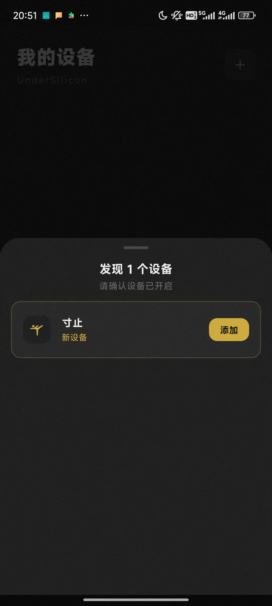
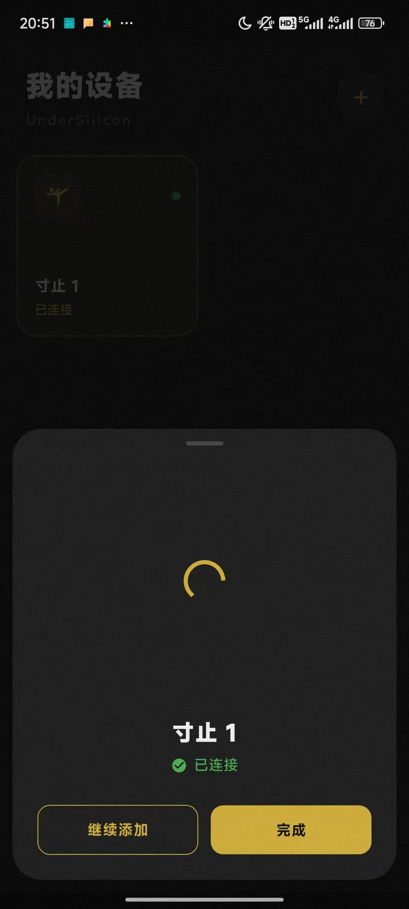
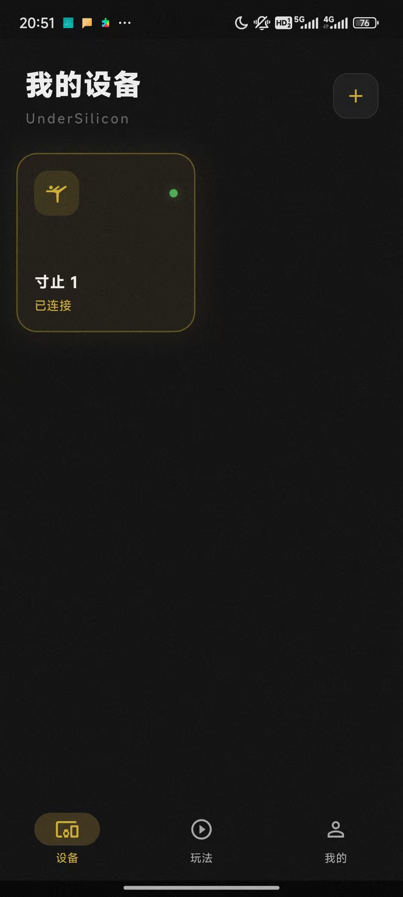

# Client Download

Currently, only Android devices are supported; iOS support is coming soon.

Android download link: https://dl.undersilicon.com/apk/latest/app-release.apk

# Device Connection (using cunzhi01 as an example)

1. Power on the device. The device should be in a blue blinking light state (if it is not blinking, please charge it first).
2. Open the client, click "Add Device" or the plus sign in the top right corner.
   
3. Click "Add Device".
   
4. Click "Complete".
   
5. At this point, the device has been successfully added and properly connected. After a successful connection, the blue light will stay on for a few seconds and then turn off.
   