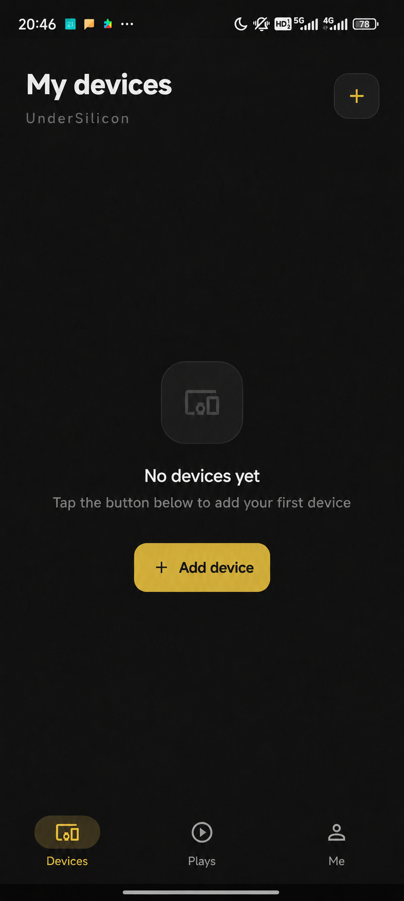
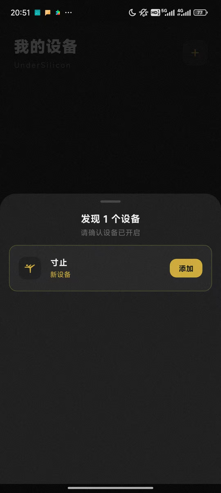
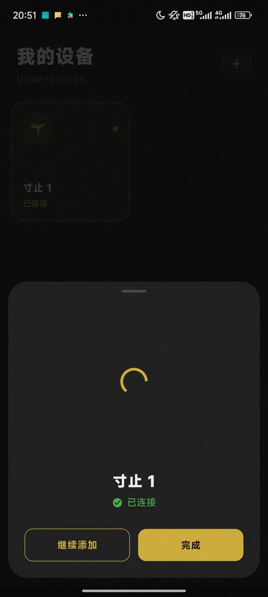
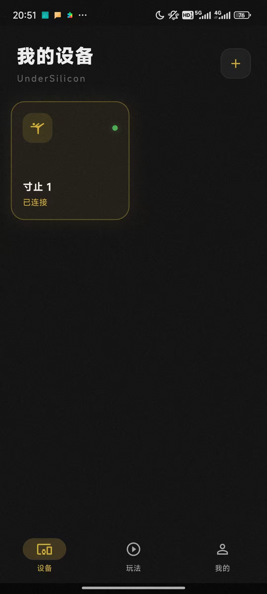

# Android client

Android download: https://dl.undersilicon.cn/apk/latest/app-release.apk

# Other clients

[HarmonyOS](./鸿蒙客户端.md) | [iOS](./iOS客户端.md)

# Connect a device (CUNZHI01 example)

1. Power the device on. The blue light should blink. If it does not blink, charge it first.
2. Open the client and tap Add device, or the plus button at the top right.
   
3. Tap Add device.
   
4. Tap Done.
   
5. The device is connected. After a successful connection the blue light stays on for a few seconds, then turns off.
   
