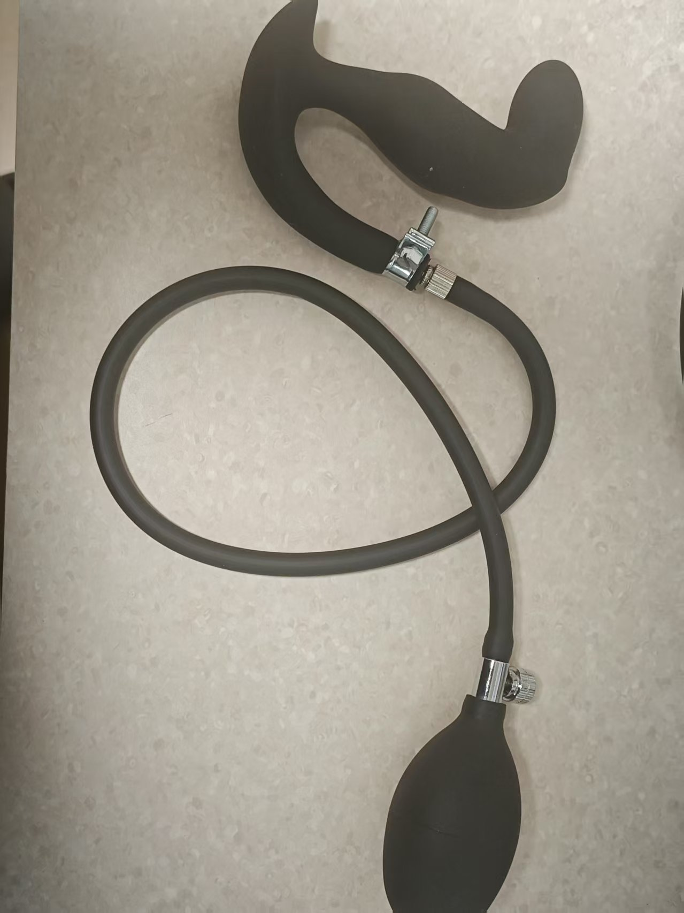
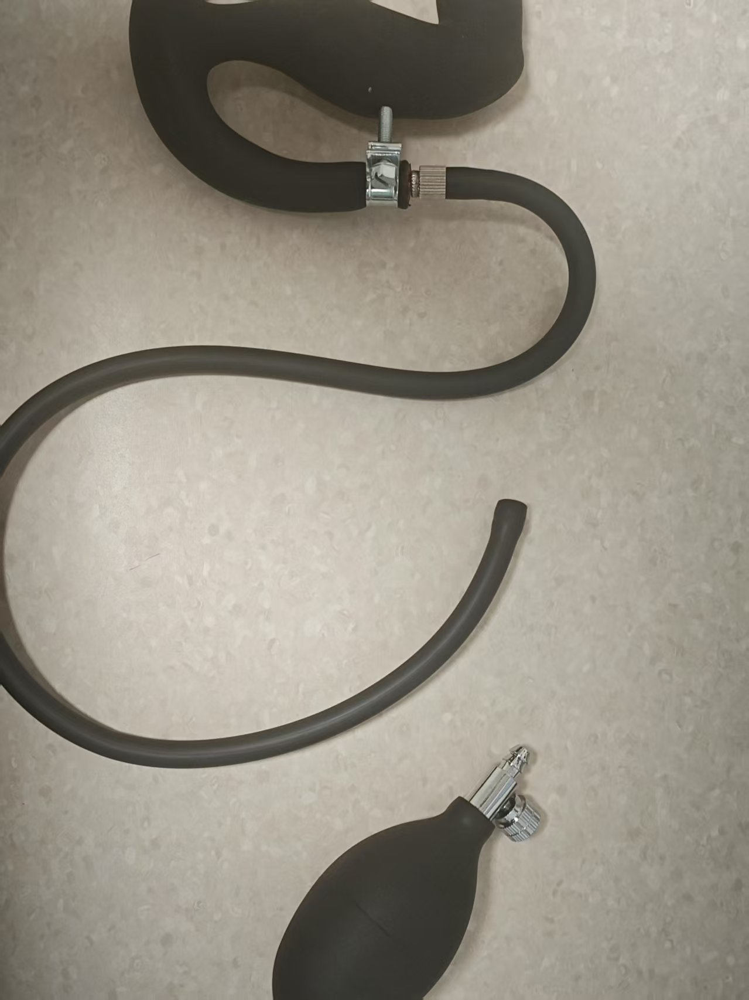
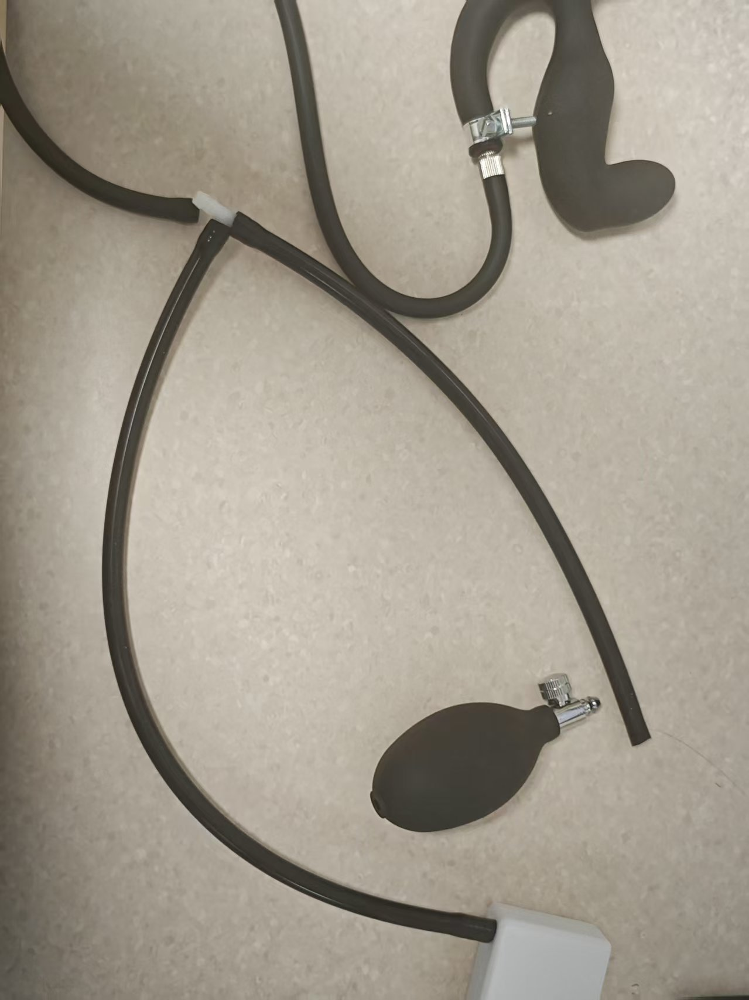
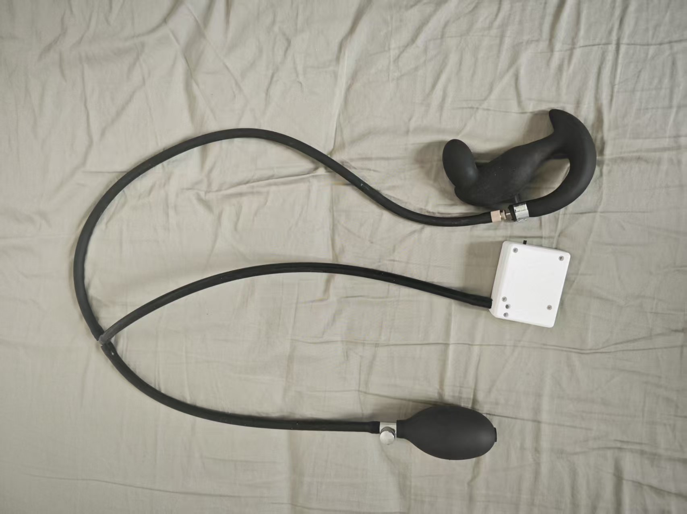
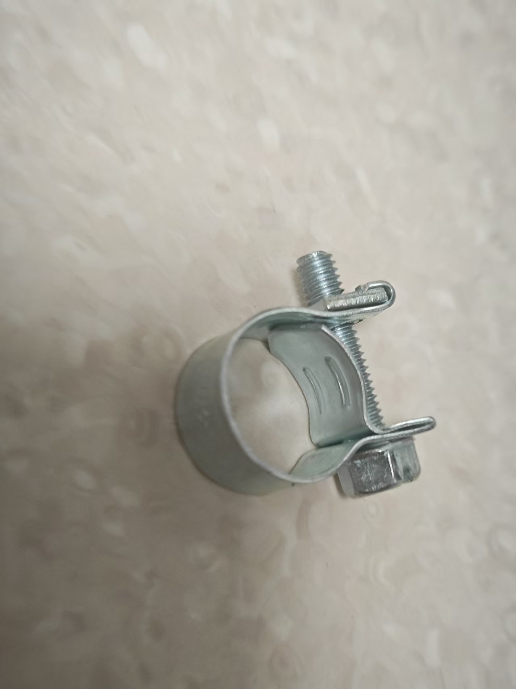
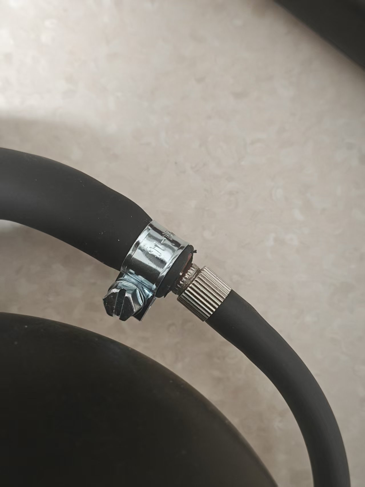
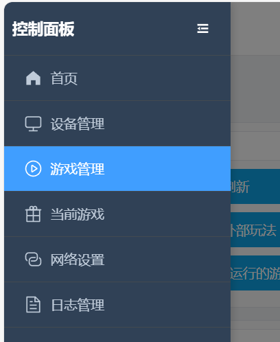
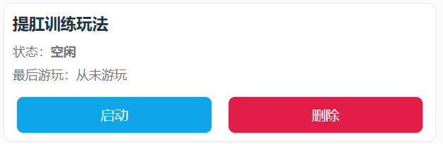

# Kegel Training

> This is a legacy guide. Devices and steps have changed. Read the current tutorial first: [Edging + Kegel tutorial](../寸止玩法二代使用教程.md).

# Overview

+ Kegel training alternates a relax phase and a Kegel phase
+ The goal is as many successful Kegels as possible in the set time
+ Success and failure show on screen. A miss can trigger a shock if a shock device is connected and enabled

## Software

Android: [phone client](/docs/player/new-phone-client)

Windows: [PC control client](../client/PC版控制客户端.md)

# Devices

+ Required: `air-pressure sensor (QIYA)`
+ Optional: `shock device (DIANJI)`, `auto lock (ZIDONGSUO)`
+ A connected auto lock locks at start and unlocks at the end

## Assembly

Pull the bulb pump off the inflatable plug and connect it to the pressure sensor tube. Connect the plug tube to the sensor tee.

1. The plug as received (newer plugs look a little different and seal better; the idea is the same)

2. Remove the bulb pump

3. Connect both ends of the pressure sensor

4. Finished assembly

5. Optional clip if pressure leaks too fast

Tighten this clip on the joint to slow the leak.

Clip: [https://item.taobao.com/item.htm?id=724827233726](https://item.taobao.com/item.htm?id=724827233726) (11–13 mm)

## Game entry

# Parameters

+ `Duration (minutes)`: length of the session
+ `Kegel target count`: successes you want, used for the progress bar
+ `Pressure delta (kPa)`: how far above the relax-phase low the Kegel phase must go
+ `Shock intensity (V)`: intensity on a miss
+ `Shock duration (seconds)`: how long that shock lasts
+ `Cycle time (seconds)`: length of each phase. Default 10 seconds (10 s relax → 10 s Kegel → repeat)

# Flow

+ Relax phase
    - Relax and breathe. The system records the lowest pressure of this phase as the baseline.
    - When the countdown ends, the Kegel phase starts.
+ Kegel phase
    - Within this phase, raise pressure to "lowest pressure + pressure delta".
    - Reaching the target counts as achieved, but the next round waits for this phase's countdown to end.
    - If the phase ends below the target, it is a miss and a shock starts if a shock device is available.
+ Alternation
    - Each round is relax → Kegel → relax, until time runs out or the target count is reached.

# On-screen hints

+ Large text at the top shows the current phase (relax / Kegel) and the time left in that phase
+ Overall progress
    - Count bar: finished / target
    - Time bar: elapsed / total
+ Pressure and target
    - Current pressure (kPa)
    - Relax-phase low (baseline)
    - Kegel target (low + pressure delta)
+ Success / miss
    - Success: a green "Achieved" chip
    - Miss: a red "Miss · shock started" chip
+ Controls and log
    - Buttons: pause, manual shock
    - Log: recent messages

**End and stats**

+ The game ends at the set duration or when the success count hits the target
+ A connected auto lock unlocks
+ The screen shows success count, shock count, and related stats

**Suggestions**

+ The first time, set a low pressure delta so you can learn the rhythm
+ If a shock device is connected, start low and raise it slowly
+ Keep breathing steady. In the Kegel phase, focus on reaching the target pressure

**Quick start**

+ Connect the pressure sensor. Shock and auto lock are optional
+ Set the parameters and start
+ Do not strain in the relax phase; wait for the countdown. In the Kegel phase, raise pressure to the target
+ "Achieved" means hold until the phase ends. A miss shows a prompt and a shock
+ Repeat until the end, then read the stats
