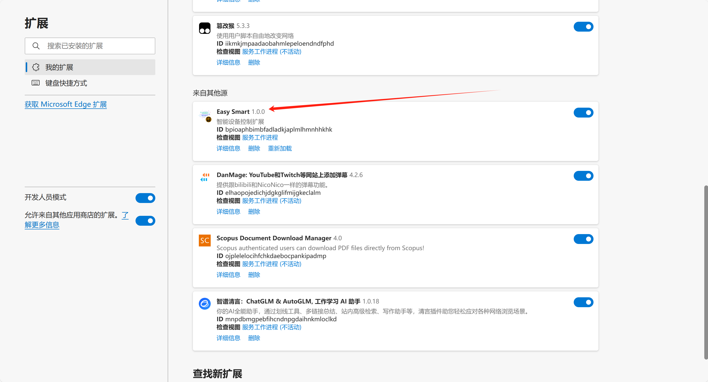
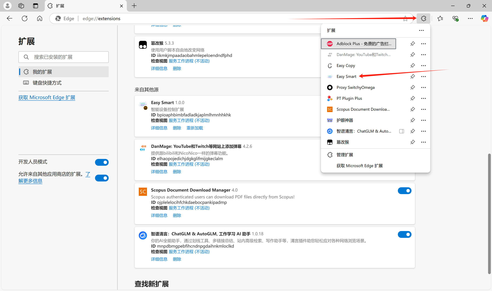
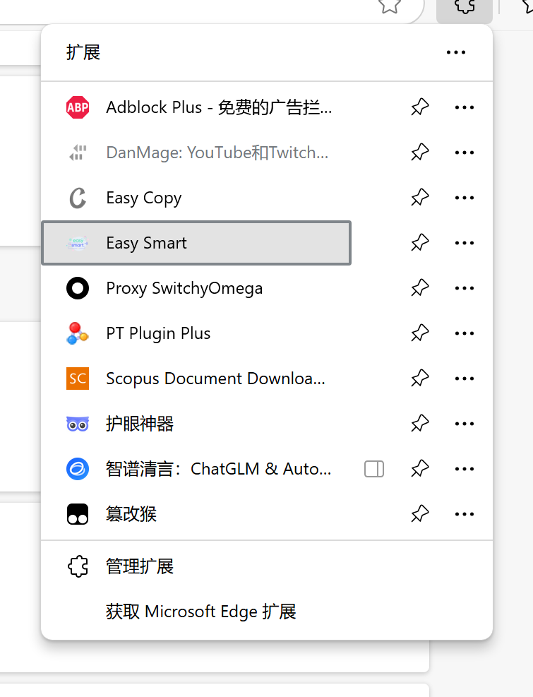
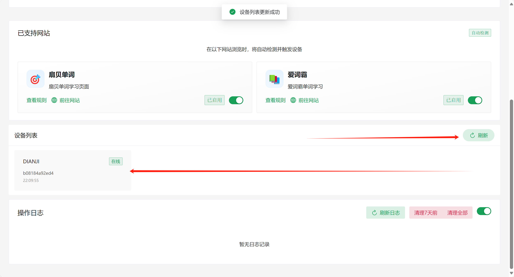
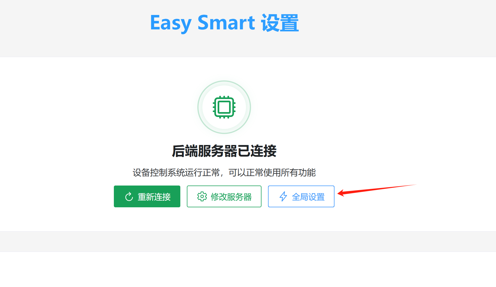
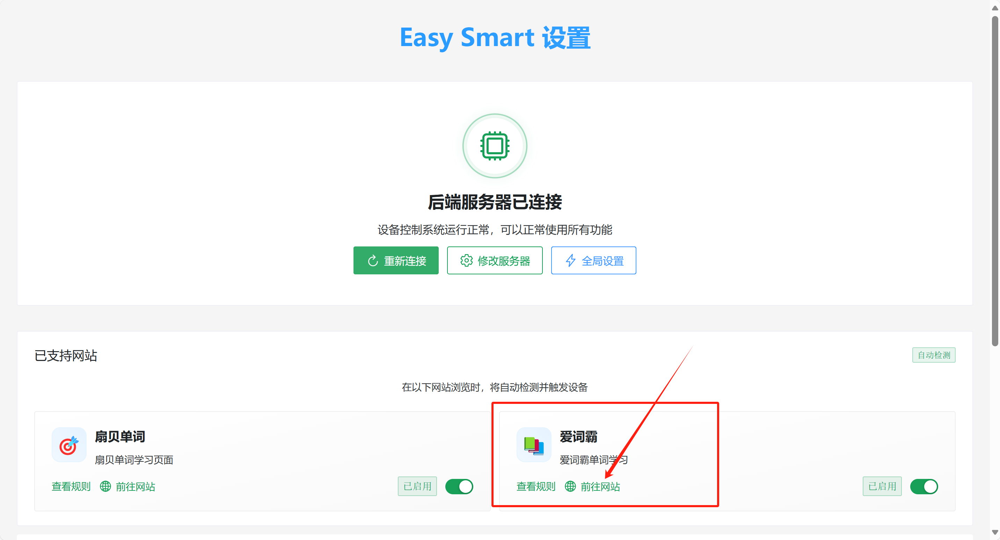

# Cone-Piercing-Assisted Vocabulary Learning Guide

# Gameplay Instructions:
Always feel drowsy when memorizing vocabulary?

Now you need a little stimulation to eliminate sleepiness.

Simply place the device on your body, and it will give you a refreshing boost when you answer incorrectly~

This way, efficiency will skyrocket.

# Prerequisites
1. Have 2.4GHz Wi-Fi at home.
2. The Wi-Fi and computer are on the same local network (connected to the same router).
3. The router supports mDNS (use mobile hotspot if not supported) [Check if the router supports mDNS (most routers do support it)](../../other/检测路由器是否支持mdns（大部分路由器都支持）.md).
4. Already have a simple smart pulse terminal: [Simple Smart Pulse (Electrical Stimulation) Terminal](../../device/简单智能脉冲（电击）终端.md) or [Taobao Link](https://item.taobao.com/item.htm?id=892309919507).

# Specific Usage Instructions
Related file downloads:

LanZou Cloud

[https://wwcg.lanzouu.com/ielL62nsy9cj](https://wwcg.lanzouu.com/ielL62nsy9cj)

Password: 95pt

Discussion group: [WeChat Group](https://www.yuque.com/easysmart/easysmart/az9i4x3us4xu870f)

## Install Browser Extension
1. Open Edge browser.
2. Type `edge://extensions/` in the address bar and press Enter.

1. Turn on Developer Mode.

1. Load unpacked extension.

1. Select the "easysmart" folder from Step 1.

1. Installation complete.

1. You can find it here afterward.

## Device Network Configuration
(Recommended to charge the device before first use.)

1. Flip the switch to turn on the device. The device will light up when turned on.
2. Launch the mini-program to configure the device's network.

For this step, please refer to [Connecting the Device to Wi-Fi via APP](../../other/设备连接wifi（配网）/通过APP将设备连接到wifi.md) or [Connecting the Device to Wi-Fi via Mini-Program](../../other/设备连接wifi（配网）/通过小程序将设备连接到wifi.md).

## Run the Server on the Computer
1. Run "Step 2 Start.bat" on the computer. It will take about 2 minutes to start (longer on the first run). Success is indicated by the red box content (download the file from the top of the document if not present).

1. You can connect the electrode pads to your body and insert them into the device.

## Voltage and Duration Settings
1. Click to open the extension.

After entering, it should look like this:

If the local program has started, click "Reconnect."

Now you can see the device below.

1. Click "Global Settings" to set voltage and delay.

Click "Test Settings" to emit a pulse voltage.

**Note: Please start testing from 20 volts. Test each level multiple times. If none feel strong, you can increase the voltage, suggested increments of 10V or less at a time.**

Then click "Save Settings."

## Start Learning Vocabulary
Just start using Shanbay Word directly.

Here, let's introduce Vocabulary Master.

Go to the website.

Select a vocabulary list, for example, CET-4.

Choose a lesson.

Click "Single Choice Challenge."

Now, if you select the wrong answer, an electrical pulse will be triggered.