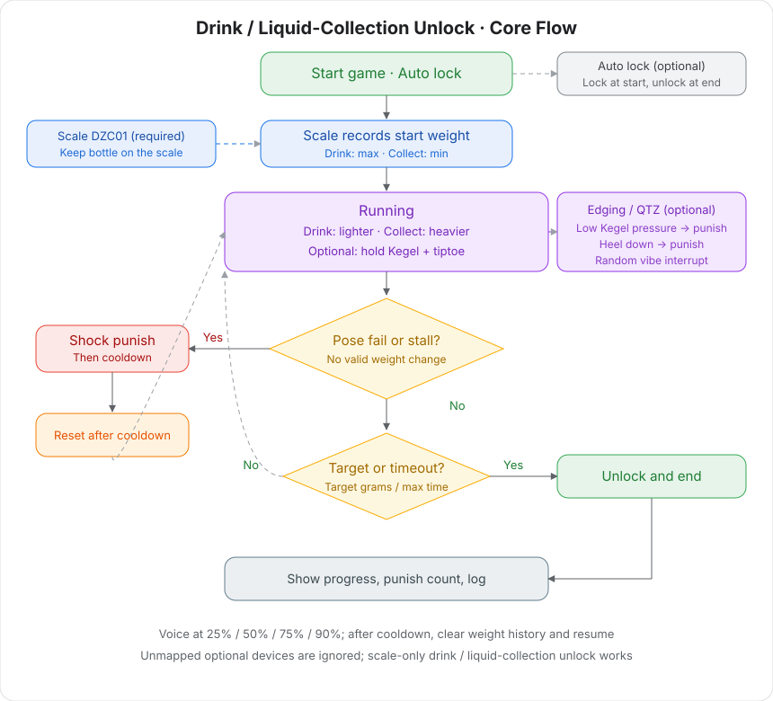

# Drink / Liquid-Collection Unlock

Keep a bottle or container on the scale. Drink to make it lighter, or collect liquid to make it heavier. Unlock after the target weight change or timeout. You can add Kegel and tiptoe monitoring; failure triggers a shock.

## Gameplay

- **Drink mode (default):** Keep the bottle on the scale and sip through a straw so the scale gets lighter. Unlock when the loss hits the target.
- **Liquid-collection mode:** Keep the container on the scale and collect liquid into it so the scale gets heavier. Unlock when the gain hits the target.
- **Pose constraints (optional):** After mapping air-pressure / tiptoe devices, you must hold Kegel and stay on tiptoe, or you get a shock.
- **Optional lock:** With an auto lock connected, it locks at start and unlocks only on target or timeout.

## Devices

| Device | Logic ID | Required | Role |
| --- | --- | --- | --- |
| [Electronic scale](/docs/device/electronic-scale) | scale / DZC01 | Yes | Live weighing; drink = lighter, collect = heavier |
| [Edging combo device](/docs/device/cunzhi01) | sensor / cunzhi / punish / vibe | No | Kegel air pressure, tiptoe pressure, shock, random vibe |
| [Auto lock](../device/简单智能锁定终端.md) | lock / ZIDONGSUO | No | Lock at start, unlock at end |

Unmapped optional devices are not used. With only a scale, it is pure drink / liquid-collection unlock.

One edging combo device can cover Kegel, tiptoe, shock, and vibe. Map each role to its slot in the client.

> 🛒 **Play kit**: [Buy on official shop](https://shop.undersilicon.cn/en/products/force-drink)

## Wear and connect

Install the client and connect devices first. See [Client Download and Device Connection](client/new-phone-client.md).

- **Scale**: Place on a flat floor. Keep the bottle (drink) or container (liquid collection) on the scale for the whole session. Do not lift the whole bottle off.
- **Pelvic-floor sensor (optional)**: Use lubricant. Lie on your side, relax, and insert slowly.
- **Pulse pads (optional)**: Stick one on each inner thigh. Do not place on the torso, heart, or head.
- **Tiptoe sensor (optional)**: Tuck into a sock against the heel, or put it at the heel inside a shoe.
- **Main unit (optional)**: Strap the edging host to the thigh.
- **Auto lock (optional)**: Standalone wireless device; it does not connect to the host.

Wiring: [Inch Stop + Kegel Play Guide](./寸止玩法二代使用教程.md#operation-steps).

## Software setup

1. In the client play library, choose "Drink / liquid-collection unlock".
2. Map the scale (required). Optionally map air pressure, tiptoe, shock, vibe, and auto lock.
3. Choose drink or liquid collection. Set target weight, max duration, and punish parameters.
4. Tap Start. Voice is on by default; you can turn it off in parameters.

## Rules

### Core rules

+ **Drink mode**: Uses the highest weight seen as the start. Progress is grams lost from that start.
+ **Liquid-collection mode**: Uses the lowest weight seen as the start. Progress is grams gained from that start.
+ If the history window (default 30 s) has no change above the "valid change threshold", it counts as a stall and you get punished.
+ With air pressure mapped, pressure must stay above the Kegel threshold.
+ With edging tiptoe mapped, heel pressure above threshold for longer than the debounce is treated as heel-down and punished.

### State loop

+ **Running**: Every second, check pose, stall, and random vibe, and accumulate weight progress.
+ **Punish**: Trigger a shock (if shock is unmapped, only the reason is logged) and play the matching voice.
+ **Cooldown**: Pause detection for 10 s by default. After that, clear weight history and resume monitoring.
+ **Unlocked**: Target reached, or max duration hit. Unlock and end.

### Voice and interrupt

+ Voice plays at start, punish reason, cooldown, target / timeout / manual end.
+ One voice line at 25% / 50% / 75% / 90% progress.
+ While running, random encouragement, plus reminders for mapped Kegel / tiptoe.
+ Each second has a chance to start a vibe interrupt (default about 5%).

### End of game

+ Cumulative change hits the target: success unlock.
+ Max duration reached: timeout unlock.
+ Manual end also unlocks.
+ The UI keeps progress, shock count, last punish reason, and the log.

## Parameters

### Basic

| Parameter | Default | Notes |
| --- | --- | --- |
| Mode | Drink (get lighter) | Drink: scale gets lighter to the target. Liquid collection: scale gets heavier to the target |
| Max duration | 1800 s | Auto-end and unlock after timeout. Beginners can start with 900–1800 |
| Target weight change | 500 g | Grams of change from start weight needed to succeed |
| Voice prompts | On | Stage, punish, and milestone lines |

### Detection and difficulty

| Parameter | Default | Notes |
| --- | --- | --- |
| Valid change threshold | 1 g | Smaller changes are noise and do not refresh the stall timer |
| History window | 30 s | No valid change in the window → punish |
| Pelvic pressure threshold | 20 kPa | Below this is treated as not squeezing (needs air-pressure sensor) |
| Tiptoe pressure threshold | 100 | Above this is treated as heel down |
| Tiptoe debounce | 300 ms | Filter for CUNZHI pressure jitter. Too small causes false triggers |

### Punish and interrupt

| Parameter | Default | Notes |
| --- | --- | --- |
| Punish cooldown | 10 s | Pause detection after a shock |
| Shock intensity | 24 V | Suggest 15–24 V, not above 30 V |
| Shock duration | 2 s | Duration of one shock |
| Vibe start chance | 0.05 / s | About 5% per second |
| Vibe intensity | 255 | 0–255 |
| Vibe duration | 3 s | Duration of one vibration |

## UI

+ **Task progress**: Changed grams / target grams, plus start weight.
+ **Current weight / air pressure / tiptoe state**: Live readings.
+ **Punish countdown**: Seconds until the next stall punish.
+ **Shock info**: Trigger count, mapped or not, currently shocking, cooldown left, last reason.
+ **System metrics**: Mode, min/max weight in the window, sample count, and so on.
+ **System log**: Start, progress, punish, cooldown, and end records.

## Tips

+ Keep the bottle or container on the scale the whole time. Drink through a straw. Do not lift the whole bottle off, or the weight will drop and may count as success immediately.
+ Do not stand on the scale. Body weight will break the judgment.
+ First run: scale only. Finish a drink session, then add Kegel, tiptoe, and shock.
+ Start with 200–300 g target and a 45–60 s window. Tighten later.
+ With shock connected, start at low voltage and short duration.

## Safety

+ Use only if you are in good health, with no heart disease, epilepsy, or similar conditions.
+ Start at lower intensity and shorter duration. Stop immediately if you feel unwell.
+ Adults 18+ only.
+ Do not place pulse pads on the heart, head, or torso, or let current pass through those areas. Body voltage must stay at or below 36 V.
+ Do not drink too much or too fast. Skip liquid-collection mode if you have GI or urinary discomfort.
+ With an auto lock connected, keep someone nearby who can help. Hold 60 s to force unlock. Battery below 20% auto-unlocks.
