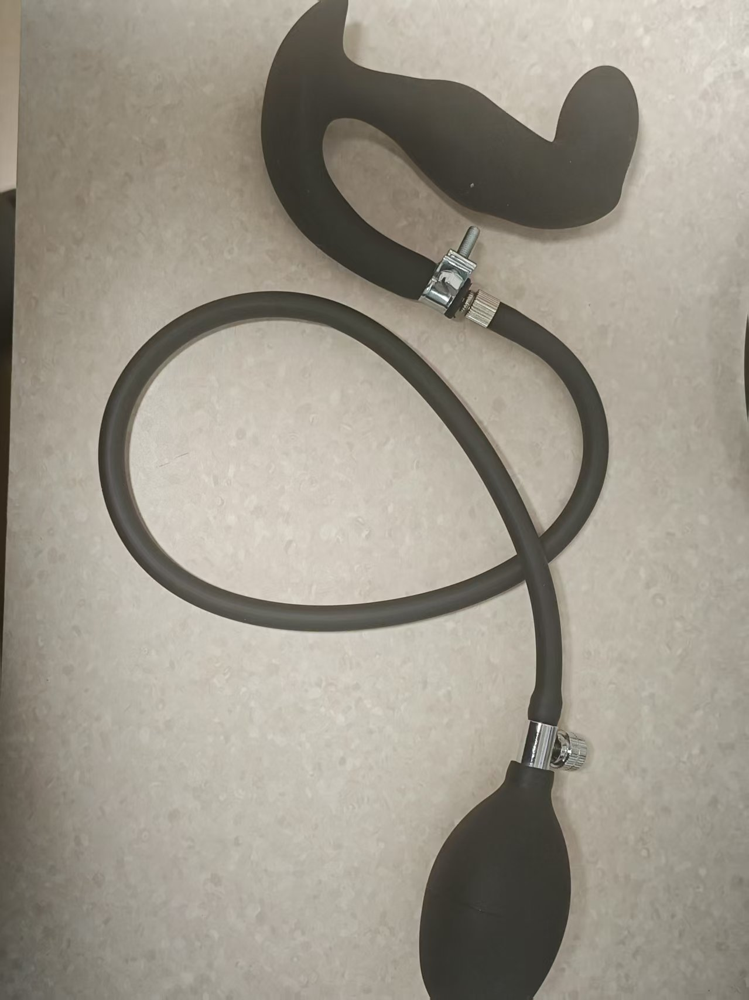

# Kegel Training Gameplay

# Gameplay Overview
+ Kegel training alternates between "Relaxation Phase" and "Kegel Phase"
+ The goal is to complete as many "Successful Kegels" as possible within the set time
+ Success or failure is visually indicated on the interface; failure triggers electric shock (if connected and enabled)

## Software Download and Preparation
Android smartphone: [Mobile Client](/docs/player/new-phone-client)

Windows PC: [PC Control Client](./client/PC版控制客户端.md)

# Equipment and Preparation
+ Required equipment: `Air Pressure Sensor (QIYA)`
+ Optional equipment: `Electric Shock Device (DIANJI)`, `Automatic Lock (ZIDONGSUO)`
+ Automatically locks when starting and unlocks when ending (if an automatic lock is connected)

## Device Assembly
Detach the inflator bulb from the inflatable anal plug and connect it to the air tube of the pressure sensor. Connect the tube of the anal plug to the three-way connector on the pressure sensor.

1. What the anal plug looks like when received (new version appearance may vary, with better sealing, similar to below)

2. Remove the inflator bulb

3. Connect to both ends of the pressure sensor

4. Final assembled product

5. Optional enhancement if pressure leaks too quickly

Tighten this clamp at the connection to reduce the leak rate

Purchase link for the clamp: [https://item.taobao.com/item.htm?id=724827233726](https://item.taobao.com/item.htm?id=724827233726) (11-13mm)

## Game Entry

# Parameter Description
+ `Duration (minutes)`: Total game duration
+ `Kegel Count Target`: Desired number of successful completions, used to show overall progress
+ `Pressure Change (kPa)`: The threshold pressure increase required during the Kegel phase (relative to the minimum pressure in the relaxation phase)
+ `Shock Strength (V)`: Electric shock intensity upon failure
+ `Shock Duration (seconds)`: Duration of electric shock upon failure
+ `Single Cycle Time (seconds)`: Duration of each phase, default 10 seconds (relax 10s → Kegel 10s → cycle)

# Gameplay Process
+ Relaxation Phase
    - Relax and breathe naturally; the system records the "minimum pressure" of this phase as reference
    - After the countdown ends, enter the Kegel phase
+ Kegel Phase
    - Need to increase the pressure to "minimum pressure + pressure change" within the phase duration
    - Achieving the target is marked as "Achieved," but you must still wait for the phase countdown to end before moving to the next round
    - If not achieved before the phase ends, it’s judged as "Challenge Failed · Starting Shock" (if shock device is available)
+ Phase Alternation
    - Each round cycles "Relax → Kegel → Relax → ..." until time ends or the target count is reached

# Interface Hints
+ Large text at the top shows the current phase (Relaxation Phase/Kegel Phase) and remaining time in this phase
+ Overall Progress
    - Progress bar by count: Completed count / Target count
    - Progress bar by time: Elapsed time / Total duration
+ Pressure & Target
    - Current Pressure (kPa)
    - Minimum Pressure During Relaxation (reference)
    - Kegel Target Pressure (minimum pressure + pressure change)
+ Success/Failure Indication
    - Success: Green capsule "Achieved" displayed after the number
    - Failure: Red capsule "Challenge Failed · Starting Shock" displayed after the number
+ Operations & Logs
    - Buttons: Pause, Manual Shock
    - Log: Shows recent messages and system prompts

**Ending & Statistics**

+ Ends when the set duration is reached or the target number of successes is achieved
+ Automatically unlocks upon ending (if an automatic lock is connected)
+ Interface displays cumulative successful counts, shock counts, etc.

**Usage Suggestions**

+ For first-time use, set "Pressure Change" low to get familiar with the rhythm
+ If using an electric shock device, start with low intensity and adjust gradually
+ Maintain steady breathing; focus on increasing pressure to the target during the Kegel phase

**Quick Start**

+ Connect the pressure sensor (optionally connect shock device and automatic lock)
+ Set parameters and start
+ Relax without effort during the Relaxation phase and wait; during the Kegel phase, exert effort to reach the target pressure
+ Once "Achieved" is shown, maintain until the phase ends; failure will prompt and trigger a shock
+ Repeat cycles until the game ends; check the statistics and progress bars to understand your performance