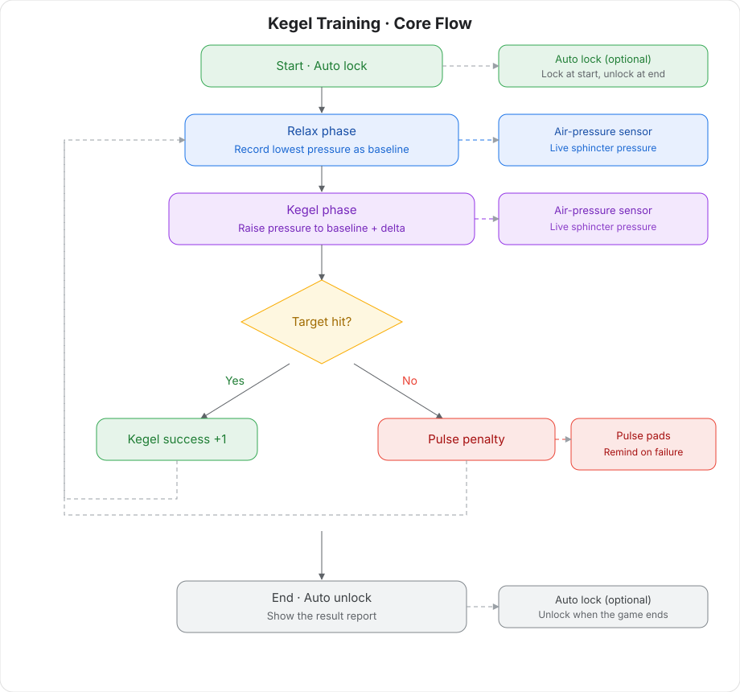

# Kegel Training (2nd Generation)

Alternate a relax phase and a Kegel phase. Finish as many successful Kegels as you can in the set time. A miss triggers a pulse reminder.

> 🛒 **Get the device**: [Buy on Taobao](https://item.taobao.com/item.htm?id=1044468799434)

## How it works

- **Kegel training:** an air-pressure sensor reads sphincter pressure and guides you between relax and Kegel.
- **Goal:** as many successful Kegels as possible in the set time. Success and failure show on screen.
- **Optional lock:** with an auto lock connected, the game locks at start and unlocks only at the end.

## Wear and connect

Install a client and connect the device first. See [Client download and device connection](client/new-phone-client.md).

- **Pelvic-floor sensor (plug):** use lubricant. Lie on your side, relax, and insert slowly. It reads sphincter pressure.
- **Pulse pads:** one on each inner thigh, for the reminder when you miss.
- **Host:** strap the edging combo host to the thigh.
- **Auto lock (optional):** a separate wireless device. It does not connect to the host. If connected, it locks at start and unlocks at the end. Buy: [simple smart lock terminal](https://item.taobao.com/item.htm?ft=t&id=925058360048)
- **Wiring:** connect each part to the host:

## Software setup

1. Open the play library in the client.
2. Choose Kegel training.
3. Set duration, target count, pressure delta, and shock intensity. You can change these during play.
4. Tap Start.

## Play

### Core rule

Cycle relax → Kegel → relax. A Kegel counts as a success when pressure reaches the target during the Kegel phase.

### Flow

+ **Relax phase**
    - Relax and breathe. The system records the lowest pressure of this phase as the baseline.
    - When the countdown ends, the Kegel phase starts.
+ **Kegel phase**
    - Within this phase, raise pressure to "lowest pressure + pressure delta".
    - Reaching the target counts as achieved, but the next round waits for this phase's countdown to end.
    - If the phase ends below the target, it is a miss and a shock starts.
+ **Alternation**
    - Each round is relax → Kegel → relax, until time runs out or the target count is reached.

### End

+ The game ends at the set duration or when the success count hits the target.
+ A connected auto lock unlocks.
+ The screen shows success count, shock count, and related stats.

## Parameters

+ `Duration (minutes)`: length of the session
+ `Kegel target count`: successes you want, used for the progress bar
+ `Pressure delta (kPa)`: how far above the relax-phase low the Kegel phase must go
+ `Shock intensity (V)`: intensity on a miss
+ `Shock duration (seconds)`: how long that shock lasts
+ `Cycle time (seconds)`: length of each phase. Default 10 seconds (10 s relax → 10 s Kegel → repeat)

## Suggestions

+ The first time, set a low pressure delta so you can learn the rhythm.
+ If a shock device is connected, start low and raise it slowly.
+ Keep breathing steady. In the Kegel phase, focus on reaching the target pressure.

## Safety

+ Do not use this if you have a heart condition, epilepsy, or a similar condition.
+ Start with a lower intensity and a shorter time.
+ Stop immediately if you feel unwell.
+ Adults 18 and older only.
+ Set pulse intensity carefully. Too high can cause injury. You accept that risk.
+ Do not use the pulse function on the heart, head, or torso, and do not let current pass through those areas. Voltage on the body must not exceed 36 V.
+ Keep the space safe. Having someone nearby is recommended.

## Version note

In the 2nd generation, the separate air-pressure sensor (QIYA) and shock device (DIANJI) are combined into one edging combo device (pressure + vibration + pulse). Setup is otherwise the same.

Legacy devices: [Kegel training (legacy)](./old/提肛训练玩法.md)
