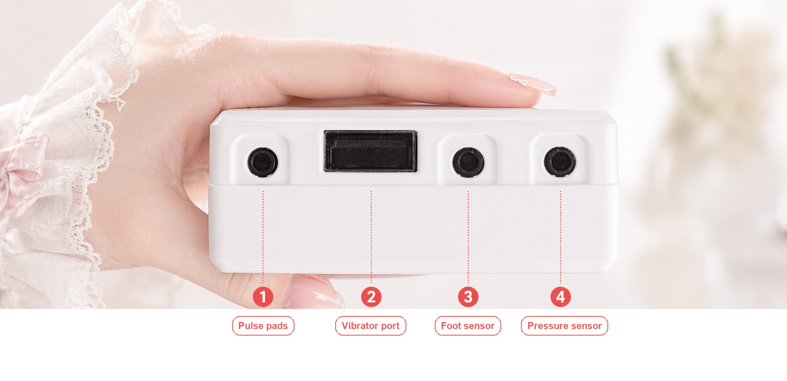

# Pressure-Surge Edging

## Introduction

This edging play adjusts vibration from air-pressure changes. While you are calm, vibration rises. A sudden pressure rise stops vibration. After the pressure falls and a cooldown finishes, the next round starts.

Compared with 3-phase edging, it still cycles through calm, middle, edge, and cooldown. The trigger is the **size of a short pressure rise**, and the middle pressure is recalibrated after each trigger. That reduces the effect of a slow leak or other baseline drift on a fixed threshold.

| | 3-phase edging | Pressure-surge edging |
| --- | --- | --- |
| Enter the edge phase | Pressure reaches the set critical pressure | The recent peak is above the previous average by the set amount |
| Pressure setup | Set middle pressure and critical pressure by hand | Set the surge window and rise threshold; middle pressure recalibrates each round |
| What you tune | Whether the fixed pressure values fit you | Whether surge detection is too sensitive or too slow |

[3-phase edging guide](./气压寸止玩法3阶段升级版说明.md)

Parameters below match game **1.1.2** defaults. A pressure change is only a program signal. It is not a direct reading of your body.

:::caution Launch phase before the end
By default, the last **60 seconds** no longer trigger edging from pressure, and no longer drop into the weaker middle phase. Vibration rises toward the set limit instead. If you want the edging loop for the whole session, set "Launch phase before end" to **0 seconds** before you start.
:::

## Devices

| Mapping | Required | Role |
| --- | --- | --- |
| Air-pressure sensor | Yes | Live pressure reading |
| TD01 stimulator | Yes | Vibration at the game's target intensity |
| Shock penalty device | No | A pulse when the edge phase starts |
| Auto lock | No | Lock at start, unlock on a normal end |

With the edging combo device, you can map pressure, vibration, and shock slots to the same device if it supports those functions. "TD01 stimulator" is the mapping name in the game. The pressure and vibration loop still runs if shock or the auto lock is not mapped.

[Edging combo device](../device/寸止综合设备.md)

## How to use {#use_instruction}

1. Assemble the device and confirm the pressure reading and vibration control before you wear it.
2. Install a client and connect the device.
3. In the play library, choose "Pressure-surge edging". Map the pressure sensor and the vibration device. Map shock and the auto lock if you want them.
4. Set duration, max intensity, and whether the launch phase is on. For surge detection, start with the defaults: **500 ms window, 1 kPa rise threshold**.
5. Start the game, watch the pressure curve and phase changes, then tune the parameters from how often it triggers.

[Assembly and wear](./寸止玩法二代使用教程.md#operation-steps)

[Phone client and device connection](./client/new-phone-client.md)

[PC control client](./client/PC版控制客户端.md)

The edging combo ports are shown below. This play does not need the foot sensor.

## Game flow

**Calm rise → adjust intensity after middle pressure → stop vibration on a pressure surge → pressure falls or the phase times out → cooldown → back to calm.**

A pressure surge can trigger from the calm phase directly. You do not have to pass through the middle phase first.

### 1. Calm phase

The game starts at zero intensity. By default it rises by **2** per second, up to a max intensity of **50**. Reaching "middle pressure" enters the middle phase. A pressure surge enters the edge phase directly.

### 2. Middle stimulation

Target intensity falls as pressure rises. By default, between "middle pressure" and "middle pressure + 1 kPa", target intensity falls from **20** to **5**. Above that, it stays at the floor.

Example: middle pressure **30 kPa**, and no surge. 30 kPa maps to target intensity 20, 30.5 kPa maps to 12.5, and 31 kPa or above maps to 5. Actual output is also limited by max intensity, rise rate, and send interval.

Pressure below middle pressure returns to calm. A surge enters the edge phase.

### 3. Edge stop

In the edge phase, vibration goes to zero and one edge trigger is recorded. If a shock device is mapped, it also fires one pulse. The default is **20 V for 3 seconds**.

Cooldown starts when either of these is true:

- Current pressure is below "the previous-window average recorded at the trigger + 0.2 kPa".
- The edge phase exceeds its max length, **5 seconds** by default.

Example: the average before the trigger was 30 kPa. Falling below 30.2 kPa enters cooldown. If pressure never falls, the max length still enters cooldown.

### 4. Cooldown

Vibration stays at zero. The default wait is **5 seconds**. New surges are not detected during this time. The lowest pressure in the cooldown is recorded for the next automatic calibration.

Cooldown returns to calm first. Pressure then decides whether to enter the middle phase. Restored intensity follows the gap between current pressure and middle pressure, and is limited by the rise rate.

### 5. Launch phase and the end

By default, the last 60 seconds are the launch phase. The game leaves middle, edge, or cooldown and keeps raising intensity with the calm-phase rise rule. **A pressure surge no longer stops the device.**

When the duration ends, vibration and pulse stop, and a mapped auto lock receives unlock. If the launch phase is at least as long as the whole session, the game starts in the launch phase.

## How a pressure surge is judged

By default the last 1 second is split into two half-second windows:

- **Previous window**: the average pressure of the half-second before the current window.
- **Current window**: the highest pressure of the most recent half-second.

The edge phase triggers when "current-window peak − previous-window average" reaches **1 kPa**, and that comparison stays true for at least **100 ms**.

Example: previous average 30 kPa, current peak 31.2 kPa, difference 1.2 kPa, above the default threshold. After the minimum duration, it triggers. What has to last is the window comparison, not every sample at 31.2 kPa.

So **a slow climb to a high pressure may not trigger, and a sudden rise from a lower pressure may.**

## How middle pressure recalibrates

Middle pressure starts at **50 kPa**. Each time the edge phase starts, the new middle pressure is the largest of:

- This trigger peak minus "middle-pressure offset", **1 kPa** by default.
- The lowest pressure of the previous cooldown, plus **1 kPa**.
- A floor of **1 kPa**.

Example: peak 31.2 kPa and previous cooldown low 29 kPa. The new middle pressure is 30.2 kPa. If the previous cooldown low was 30 kPa, the floor raises middle pressure to 31 kPa.

"Middle pressure nudge" on the screen changes it by **0.1 kPa** at a time. The next edge phase recalibrates it again.

## Settings

These are program defaults. They are not a recommended intensity for everyone.

### Basics and surge detection

| Parameter | Default | Meaning |
| --- | --- | --- |
| Game duration | 20 minutes | Length of the session |
| Launch phase before end | 60 seconds | Final rise with no edging stop. Set to 0 to turn it off |
| Surge window | 500 ms | Width of each window. Two windows cover the last 1 second |
| Surge rise threshold | 1 kPa | Minimum gap between the current peak and the previous average |
| Minimum surge duration | 100 ms | How long the window comparison must stay true |
| Middle-pressure offset | 1 kPa | Pressure subtracted from the trigger peak during calibration |
| Max edge length | 5 seconds | If pressure does not fall, enter cooldown after this |
| Cooldown | 5 seconds | Zero vibration after the edge phase |
| Voice prompts | On | Announce start, phase changes, and the end |

### Intensity and optional shock

| Parameter | Default | Meaning |
| --- | --- | --- |
| TD01 max intensity | 50 | Intensity cap. Range 1 to 100 |
| Calm rise | 2 per second | Target rise in calm and launch phases |
| Rise rate cap | 2 per second | How fast actual intensity may rise. Falling is not limited by this |
| Middle intensity floor | 5 | Target after "middle pressure + offset" |
| Middle intensity ceiling | 20 | Target when pressure equals middle pressure. Cannot exceed the overall cap |
| Intensity jitter | 0% | Random change of the calm target. 0 is off |
| Intensity send interval | 2000 ms | Interval for normal intensity commands. A stop-to-zero does not wait |
| Shock intensity | 20 V | Voltage when a mapped shock device enters the edge phase |
| Shock duration | 3 seconds | Length of one pulse |

## Screen and controls

- **Pressure curve**: solid blue is pressure, dashed red is vibration intensity, dashed orange is middle pressure. Green dots mark trigger peaks. Red dots mark pressure samples in the edge phase.
- **Pause / resume**: pause stops vibration and keeps showing pressure. Resume collects a new surge window.
- **+10 intensity**: temporarily changes the current target. Later automatic rules recalculate it. It does not raise the max intensity cap.
- **Shock**: fires one pulse at the configured voltage and duration. A shock device must be mapped.
- **Count and log**: edge triggers, phase changes, and the latest trigger peak.

**Pause does not extend the original end time, and it does not unlock or cut a pulse that has already started.** A pulse that has started still runs for its configured length. Do not treat pause as an emergency stop for every device.

When you tune it:

- **False triggers**: check the air line and whether the reading is stable, then raise the surge threshold or lengthen the minimum surge duration.
- **A clear change does not trigger**: confirm the pressure reading is still updating, and that you are not in cooldown or the launch phase, then lower the rise threshold.
- **The stop is too short**: increase cooldown. Max edge length is only the cap while waiting for pressure to fall. It is not a fixed rest.
- **You do not want the final continuous rise**: set "Launch phase before end" to 0 seconds before you start.

## Safe use

Confirm control works before you wear the device. Start at a lower intensity and a shorter duration, and stop immediately if it feels wrong. Follow the existing device tutorials for pulse use and wear. Do not let current pass through the heart, head, or torso.

[Wear and pulse notes](./寸止玩法二代使用教程.md#operation-steps)

Before you connect an auto lock, confirm you have an independent way out. Do not rely only on the automatic unlock at the end of the program.

[Solo play safety](./单人游玩必读.md)
