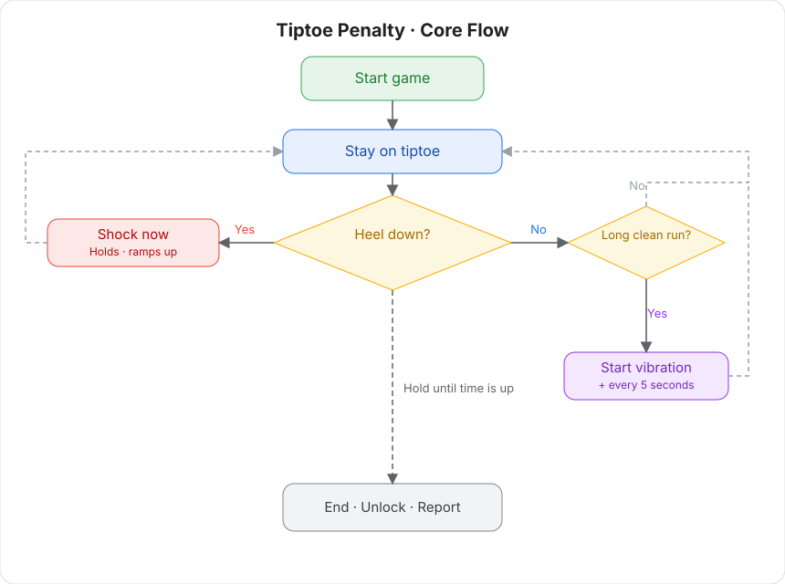

# Tiptoe Penalty v2 (2nd Generation)

A motion training game: stay on tiptoe. A heel on the ground is punished.

> 🛒 **Get the device**: [Buy on Taobao](https://item.taobao.com/item.htm?id=1044468799434)

## How it works

- **Tiptoe penalty:** the device watches your heel. When the heel touches down, a pulse fires, so you have to stay on tiptoe.
- **Optional lock:** with an auto lock connected, the game locks at start and unlocks only at the end.

## Wear and connect

Install a client and connect the device first. See [Client download and device connection](client/new-phone-client.md).

- **Pulse pads:** one on each inner thigh, for the penalty.
- **Tiptoe sensor:** tuck it into a sock against the heel, or put it at the heel inside a shoe.
- **Host:** strap the edging combo host to the thigh.
- **Wiring:** connect each part to the host.

## Software setup

1. Open the play library in the client.
2. Choose Tiptoe penalty.
3. Set duration, pulse intensity, progressive mode, and the other parameters. You can change these during play.
4. Tap Start.

## Play

### Core rule

Stay on tiptoe. The heel must not touch the ground.

### Monitoring

+ The tiptoe sensor watches heel position in real time.
+ Heel down = a violation, and a pulse starts immediately.
+ The penalty stops only after the heel is up again.

### Penalty

+ **Immediate:** the pulse starts the moment the heel touches down.
+ **Progressive:** more violations raise the pulse intensity.
+ **Continuous:** the pulse continues for as long as the heel is down, until it is fully up.
+ **Vibration ramp:** after a clean stretch with no violation, the host starts a vibration distraction and the intensity climbs.

### Vibration ramp

+ **Delayed start:** it starts after the set time with no pulse.
+ **Rising intensity:** intensity increases over time.
+ **Auto stop:** a pulse stops it and resets the timer.

### End

+ When the set time is reached, a connected lock unlocks.
+ The report shows violation count, penalty count, and related stats.

## What it tests

+ **Endurance:** holding tiptoe works the calves.
+ **Will:** you still have to hold the posture when you are tired.
+ **Precision:** a small heel drop is detected.
+ **Focus:** stay calm under the pulse.
+ **Two pressures:** avoid the penalty, and deal with the vibration distraction.

## Result bands

Finish the set time. Fewer violations is a better result:

+ **Perfect:** 0 violations
+ **Excellent:** 1–2 violations
+ **Good:** 3–5 violations
+ **Needs work:** more than 5 violations

## Safety

+ Do not use this if you have a heart condition, epilepsy, or a similar condition.
+ Start with a lower intensity and a shorter time.
+ Stop immediately if you feel unwell.
+ Adults 18 and older only.
+ Set pulse intensity carefully. Too high can cause injury. You accept that risk.
+ Do not use the pulse function on the heart, head, or torso, and do not let current pass through those areas. Voltage on the body must not exceed 36 V.
+ Keep the space safe. Having someone nearby is recommended.

## Version note

In the 2nd generation, TD01 (vibration), shock, and the tiptoe sensor are combined into one edging combo device. Setup is otherwise the same.

Legacy devices: [Tiptoe penalty v2 (legacy)](./old/踮脚惩罚玩法v2.md)
