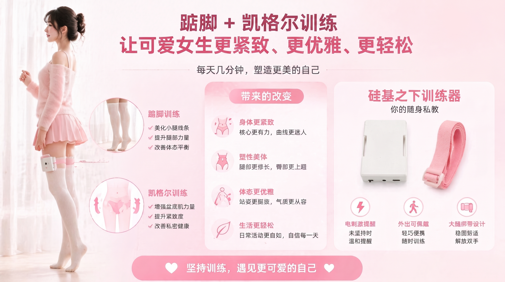

Tiptoe combined with Kegel is an effective posture training method that helps strengthen the pelvic floor muscles and calf muscles. This tutorial will teach you how to use smart training equipment for tiptoe Kegel exercises.

> 🛒 **Get the Device**: [Purchase on Taobao](https://item.taobao.com/item.htm?id=1044468799434)  
> 🎬 **Video Tutorial**: [Silicon Under Video Station](https://video.undersilicon.com/w/pcesS2gYvbfuU5Wcf5v7fQ) | [YouTube](https://youtu.be/Q7ti6oOdhpc)

## Preparation

1. **Connect the Client**: First, install the APP and connect to the host. For details, refer to [Client Download and Device Connection](new-phone-client.md).
2. **Wear the Equipment**:
   - **Pelvic Floor Muscle Sensor**: Use with lubricant. Insert slowly while lying on your side and relaxed. Proceed gradually; do not rush.
   - **Electrode Pads**: Attach to the thigh area (one on each side) to provide training feedback stimulation.
   - **Tiptoe Sensor**: Insert into socks or shoes, snug against the heel.
   - **Host**: Secure the host to your thigh using a strap, and connect the cables from the above accessories to the host. The connection method is shown below:

   

## Start Training

1. **Select Device**: Tap on the connected device in the APP.
2. **Choose Mode**: Select "**Tiptoe Kegel**" as the mode.
3. **Set Parameters**: Configure appropriate feedback intensity (EMS electrical pulse parameters).
4. **Begin Experience**: Tap start to enter the training state.

## Training Rules

The device will monitor your body movements in real time. During training:
- You must **maintain continuous contraction of the pelvic floor muscles**.
- You must **keep your heels suspended (off the ground)**.

When the device detects improper movement, it will provide a reminder via electrical pulses to help you readjust your posture. Persist in training to gradually improve core control.

### Precautions
1. The sensors are not fully waterproof; do not immerse them in water for cleaning. Use disposable protective covers. Replace the covers for cleaning, and simply wipe the sensors.
2. After cleaning, store the sensors in a sealed bag. Prolonged exposure to dry environments may cause the outer skin to crack.
3. Do not use the electrical pulse function on or allow current to pass through core areas such as the heart, head, or torso. The voltage must not exceed 36V for use on the human body. Do not use this product if you experience physical discomfort or have other underlying health conditions.