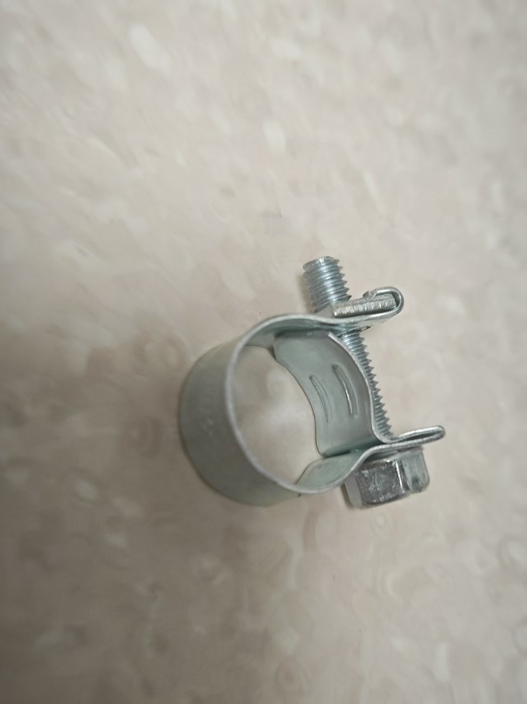

# Edge Control (寸止) Gameplay

A 寸止 training game based on air pressure sensors, detecting sphincter pressure changes, combined with an off-axis motor controller and electric shock device for intelligent stimulation control.

Purchase link for the gameplay kit:

[https://item.taobao.com/item.htm?id=1017049175869](https://item.taobao.com/item.htm?id=1017049175869)

# Mobile Version Tutorial:
[https://www.bilibili.com/video/BV1xA1fBsErr/](https://www.bilibili.com/video/BV1xA1fBsErr/?share_source=copy_web&vd_source=3dd9ee8089c213072e87f2745c7050aa)

Original Yuque tutorial: https://www.yuque.com/easysmart/easysmart/oe8gsvyhtflb9pqt

# PC Version Related Tutorials:

Client Download: [New PC Client User Guide](../PC版控制客户端.md)

Video Tutorial: [【玩法教程】寸止套装大公开：3步玩出巅峰体验，视频教你征服它_哔哩哔哩_bilibili](https://www.bilibili.com/video/BV1WXWpzUEoW/?spm_id_from=333.1007.top_right_bar_window_dynamic.content.click)

It is recommended to use hotspot or default WiFi. This method does not require network configuration. If you want to use the router method, please **<font>configure the network</font>** for the device before starting to play. Please check the network configuration section in the left-hand directory.

# Precautions
1. The inflatable butt plug has been upgraded for better sealing and reduced air leakage. Its appearance is different from the one shown below.
2. During play, the air pressure **<font>should not be too high</font>** (which can cause leakage). Generally, 22-24 is fine, as long as there is a change when clenching.
3. You can inflate a little pressure before insertion, otherwise it might be too soft to enter.

# Kit Assembly (Required Reading)
Pull off the inflator bulb from the inflatable butt plug and connect it to the air tube of the pressure sensor. Connect the air tube of the inflatable butt plug to the three-way connector on the pressure sensor.

1. How the butt plug looks upon arrival


2. Remove the inflator bulb


3. Connect to both ends of the pressure sensor


4. Finished product appearance


5. Optional enhancement if pressure leakage is too fast



Tighten this locking buckle at the connection point to reduce the speed of pressure leakage.

Locking buckle purchase address: [https://item.taobao.com/item.htm?id=724827233726](https://item.taobao.com/item.htm?id=724827233726) (11-13mm)

### Game Mechanics
1. **Pressure Monitoring**: The air pressure sensor detects sphincter pressure changes in real-time.
2. **Intelligent Adjustment**: Reduces stimulation when pressure is high, enhances stimulation when pressure is low.
3. **Electric Shock Warning**: Triggers an electric shock when pressure exceeds the critical value to alert the user.
4. **Delayed Start**: Delays stimulation for a period when pressure is low before starting slow stimulation.
5. **Dynamic Balance**: Maintains a balanced state near the critical pressure.

## State Transition Diagram


## Device Requirements
### Device Configuration
| Device Type | Logical ID | Device Name | Required | Function |
| --- | --- | --- | --- | --- |
| QIYA | pressure_sensor | Air Pressure Sensor | Yes | Detects sphincter pressure changes |
| TD01 | motor_controller | Off-axis Motor Controller | Yes | Provides adjustable intensity stimulation |
| DIANJI | shock_device | Electric Shock Device | No | Warning shock when pressure is too high |
| ZIDONGSUO | auto_lock | Auto-lock Device | No | Locks at game start, unlocks at game end |

## Game Parameter Configuration
### Basic Parameters
| Parameter Name | Type | Range | Default Value | Description |
| --- | --- | --- | --- | --- |
| duration | Number | 1-120 minutes | 20 minutes | Game duration |
| criticalPressure | Number | 0-40kPa | 20kPa | Critical air pressure value |
| maxMotorIntensity | Number | 1-255 | 200 | TD01 maximum intensity |

### Stimulation Control Parameters
| Parameter Name | Type | Range | Default Value | Description |
| --- | --- | --- | --- | --- |
| lowPressureDelay | Number | 1-30 seconds | 5 seconds | Delay time for stimulation when pressure is low |
| stimulationRampRateLimit | Number | 1-50 | 10 | Stimulation intensity ramp rate limit (change per second not exceeding this value) |
| pressureSensitivity | Number | 0.1-5.0 | 1.0 | Pressure change sensitivity coefficient |
| stimulationRampRandomPercent | Number | 0-100% | 0% | Stimulation intensity random perturbation percentage |

### Electric Shock Parameters
| Parameter Name | Type | Range | Default Value | Description |
| --- | --- | --- | --- | --- |
| shockIntensity | Number | 10-100V | 20V | Electric shock intensity |
| shockDuration | Number | 0.5-5 seconds | 1 second | Electric shock duration |

## Algorithm Logic
### Pressure-Intensity Mapping Algorithm
```plain
if (currentPressure >= criticalPressure) {
    motorIntensity = 0
    triggerShock()
} else if (currentPressure < criticalPressure) {
    pressureDiff = criticalPressure - currentPressure
    targetIntensity = (pressureDiff / criticalPressure) * maxMotorIntensity
    
    // Delayed start mechanism, gradual stimulation intensity change, random stimulation intensity perturbation
}
```