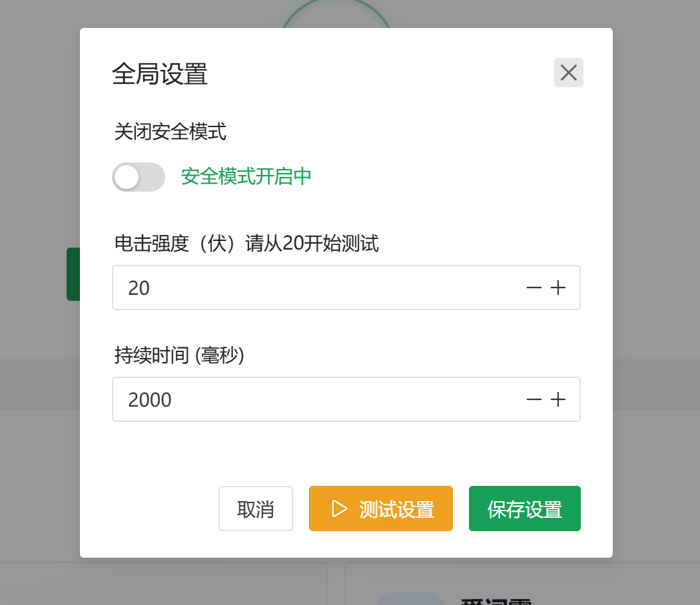

# Thorn-in-Thigh Vocabulary Learning Guide

# How to Play:
Feeling sleepy while memorizing vocabulary?

It's time for a bit of stimulation to shake off the drowsiness.

Simply place this device on your body, and it will give you a refreshing jolt when you make a mistake while studying.

This will cause your efficiency to skyrocket!

# Prerequisites
1.   Have a 2.4G Wi-Fi network at home.
2.   Your Wi-Fi and computer are on the same local network (connected to the same router).
3.   The router supports mDNS. (If not supported, you'll need to use a mobile hotspot.) [Check if your router supports mDNS (most routers do)](../其他使用说明/检测路由器是否支持mdns（大部分路由器都支持）.md)
4.   Already have the Simple Intelligent Pulse Terminal: [Simple Intelligent Pulse (Electrical Stimulation) Terminal](../设备介绍&购买/简单智能脉冲（电击）终端.md) or [Taobao Link](https://item.taobao.com/item.htm?id=892309919507)

# Detailed Usage Instructions
Related file downloads:

Blue Lake Cloud
[https://wwcg.lanzouu.com/ielL62nsy9cj](https://wwcg.lanzouu.com/ielL62nsy9cj)
Password: 95pt

Discussion & Support: [WeChat Group](https://www.yuque.com/easysmart/easysmart/az9i4x3us4xu870f)

## Install Browser Extension
1.  Open Microsoft Edge browser.
2.  Type `edge://extensions/` in the address bar and press Enter.

3.  Turn on Developer mode.

4.  Load unpacked extension.

5.  Select the `easysmart` folder from the "Step 1" folder.

6.  Installation complete.

7.  You can find it here later.

## Device Network Configuration
(Recommended to charge the device before first use.)

1.  Toggle the switch to turn on the device. The indicator light will illuminate when powered on.
2.  Start the Mini Program to configure the device's Wi-Fi connection.

Refer to this step in [Connecting Device to WiFi via APP](../其他使用说明/设备连接wifi（配网）/通过APP将设备连接到wifi.md) or [Connecting Device to WiFi via Mini Program](../其他使用说明/设备连接wifi（配网）/通过小程序将设备连接到wifi.md).

## Run the Server on Your Computer
1.  Run the `Step 2 Launch.bat` file on your computer. It will take about 2 minutes to start up (longer on first run). A successful startup is indicated by the red-boxed content appearing. (If you don't have this file, please download it from the link at the top of the document.)

2.  You can now connect the electrode pads to your body and insert them into the device.

## Voltage and Duration Settings
1.  Click to open the extension.

After entering, it looks like this:

If the local program has started successfully, click "Reconnect".

You should now see the device listed below.

2.  Click "Global Settings" to configure the voltage and delay.

Clicking "Test Settings" will trigger a pulse voltage.

**Note: Please start testing from 20 volts. Test each level multiple times. If none feel strong enough, you can increase the voltage. It is recommended to increase by 10V or less at a time.**

Then click "Save Settings".

## Start Memorizing Vocabulary
You can start using Shanbay Word directly.

Here, we'll introduce using Ciba for vocabulary.

Go to the website.

Choose a vocabulary list. Let's take CET-4 as an example.

Select a lesson.

Click "Single-Choice Challenge".

Now, if you select the wrong answer, an electrical stimulation will be triggered.