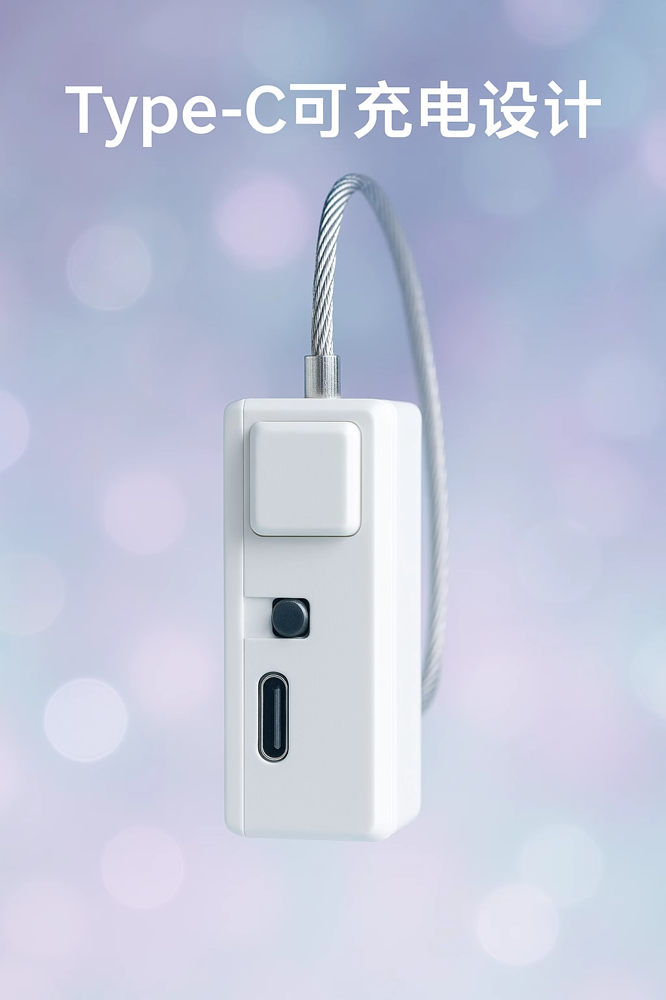

# Simple Intelligent Lock Terminal

Purchase link: [https://item.taobao.com/item.htm?id=925058360048](https://item.taobao.com/item.htm?id=925058360048)

Features:

Connect to Wi-Fi, support wireless control for locking/unlocking the terminal, Type-C charging.

Long press the button for 60 seconds to force unlock.

Automatic unlock when battery voltage drops below 20%.

Switch direction: Moving away from the charging port turns it ON, otherwise OFF.

Note:

1. Please have escape tools ready when using this device! The device cannot guarantee unlocking due to network issues, etc.!