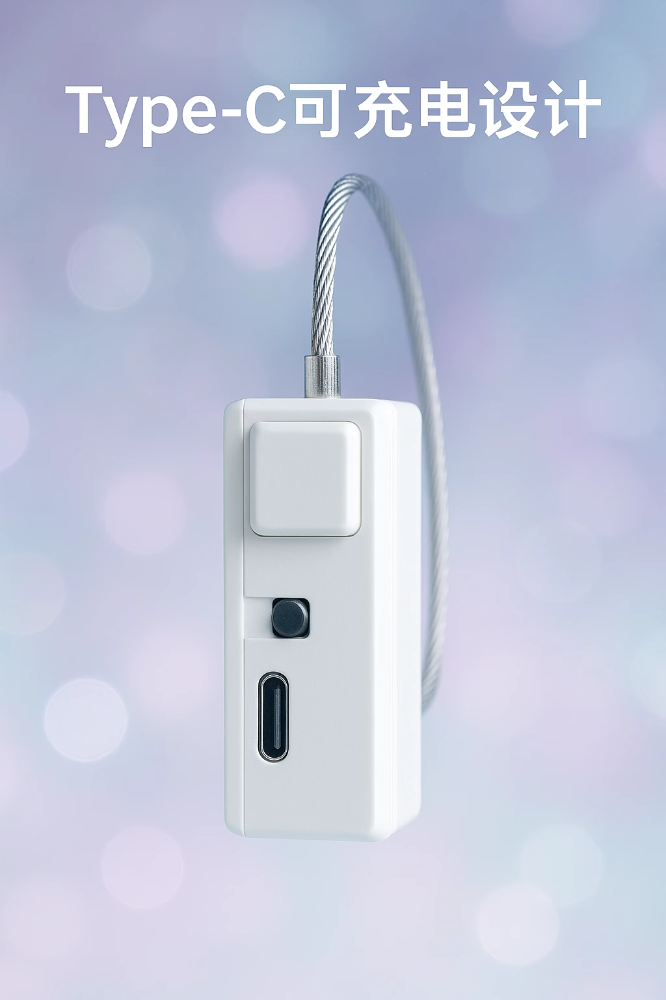

# Terminal de Bloqueo Inteligente Sencillo

Enlace de compra: [https://item.taobao.com/item.htm?id=925058360048](https://item.taobao.com/item.htm?id=925058360048)

Introducción de características:

Conectar wifi, admite control inalámbrico, bloqueo y desbloqueo del terminal, carga mediante typec.

Mantenga presionado el botón durante 60 segundos para desbloquear forzosamente.

Se desbloquea automáticamente cuando el voltaje cae por debajo del 20%.

Dirección del interruptor: alejándose del puerto de carga es encendido, de lo contrario está apagado.

Atención:

1. ¡Prepárese con herramientas de rescate durante el uso! Debido a problemas de red, etc., el dispositivo no puede garantizar el desbloqueo.