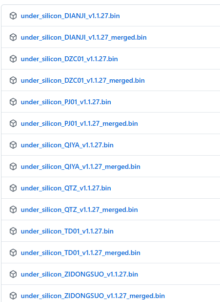

# Instrucciones para la Grabación de Firmware de Hardware

1.  Instalar los controladores
    1.  Controlador del chip serie CH340: [https://www.wch.cn/downloads/CH341SER_EXE.html](https://www.wch.cn/downloads/CH341SER_EXE.html)
    2.  Controlador del chip serie CH343: [https://www.wch.cn/downloads/CH343SER_EXE.html](https://www.wch.cn/downloads/CH343SER_EXE.html)
    3.  Después de descargar, ejecútelo directamente.
2.  Descargar la herramienta de grabación (flash tool)
    1.  [https://dl.espressif.com/public/flash_download_tool.zip](https://dl.espressif.com/public/flash_download_tool.zip)
    2.  Descomprimir y ejecutar.
    3.  Instrucciones de uso:
    4.  [https://docs.espressif.com/projects/esp-test-tools/zh_CN/latest/esp32/production_stage/tools/flash_download_tool.html#id5](https://docs.espressif.com/projects/esp-test-tools/zh_CN/latest/esp32/production_stage/tools/flash_download_tool.html#id5)
    5.  En el tercer paso de las instrucciones, es necesario modificar el puerto COM; el resto de las secciones no requieren cambios.
3.  Descargar el firmware
    1.  [https://github.com/jiandanzhineng/hardware/releases/latest](https://github.com/jiandanzhineng/hardware/releases/latest)
    2.  
    3.  Descargar el firmware según el tipo de dispositivo (descargar el firmware con la palabra "merged"):
        *   Motor eléctrico - DIANJI
        *   Sensor de presión barométrica - QIYA
        *   Controlador de motor de eje descentrado - TD01
        *   Sensor de distancia - QTZ
    4.  Utilice la herramienta para grabarlo en la posición 0x0 del dispositivo.