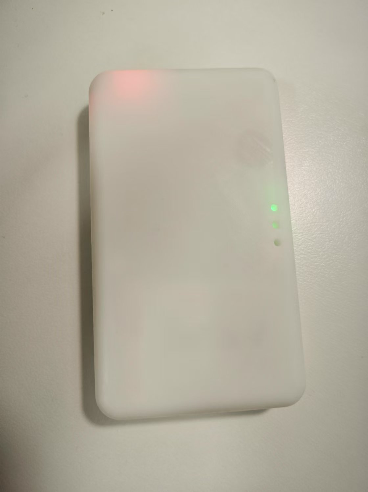

# Conectar dispositivos a WiFi mediante mini programa

Todos los dispositivos pueden conectarse a WiFi siguiendo este documento.

**Nota: Si desea utilizar el WiFi predeterminado, no configure la red. El WiFi predeterminado es: nombre easysmart, contraseña 11111111. El dispositivo se conectará automáticamente al WiFi predeterminado.**

Tutorial en video:

Douyin: [https://v.douyin.com/l_QWua94sRA/](https://v.douyin.com/l_QWua94sRA/)

YT: [https://www.youtube.com/watch?v=W7ITGIC0lw8](https://www.youtube.com/watch?v=W7ITGIC0lw8)

**Requisitos previos:**

1.  El espacio debe tener WiFi inalámbrico de 2.4G.
2.  El teléfono móvil debe estar conectado actualmente a esa red WiFi (si es una red combinada 2.4G/5G con el mismo nombre, también se puede conectar a la red 5G con el mismo nombre).

Si no puede tener éxito, también puede [conectar el dispositivo a WiFi mediante la APP](./通过APP将设备连接到wifi.md).

## Paso 1: Encender el dispositivo. El dispositivo debería encender su luz en este momento.
Ejemplo:

## Paso 2: Buscar el mini programa "物联地带蓝牙配网" en WeChat y hacer clic para entrar.
Nota: Active el Bluetooth del teléfono antes de operar.

Después de entrar, se verá como en la siguiente imagen:

Haga clic en "Comenzar configuración de red". Después de unos segundos, se verá como en la siguiente imagen:

(Nota: Solo se puede buscar después de encender el dispositivo.

Si el dispositivo se configura exitosamente y se conecta al WiFi, tampoco se podrá buscar).

Seleccione el dispositivo encontrado.

Ingrese la contraseña del WiFi al que está conectado actualmente su teléfono móvil (debe ser 2.4G o 2.4/5G con el mismo nombre).

Haga clic en "Siguiente".

Después de unos segundos, la configuración de red se completará exitosamente.

Si muestra "Configuración de red fallida", no afecta. También es exitoso. En este momento, la configuración de red está completa.

**Nota: Después de que el dispositivo se conecte al WiFi, el Bluetooth se apagará automáticamente. Si muestra fallo pero al buscar de nuevo no encuentra el dispositivo, significa que ya fue exitoso.**

