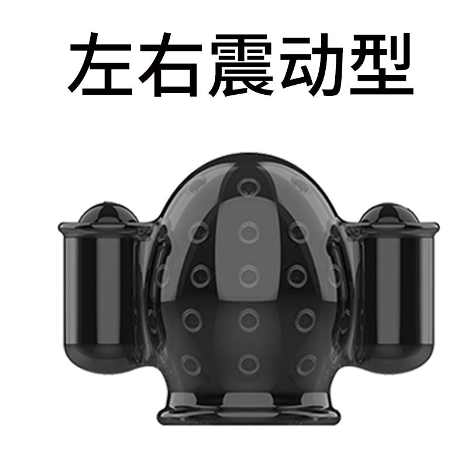
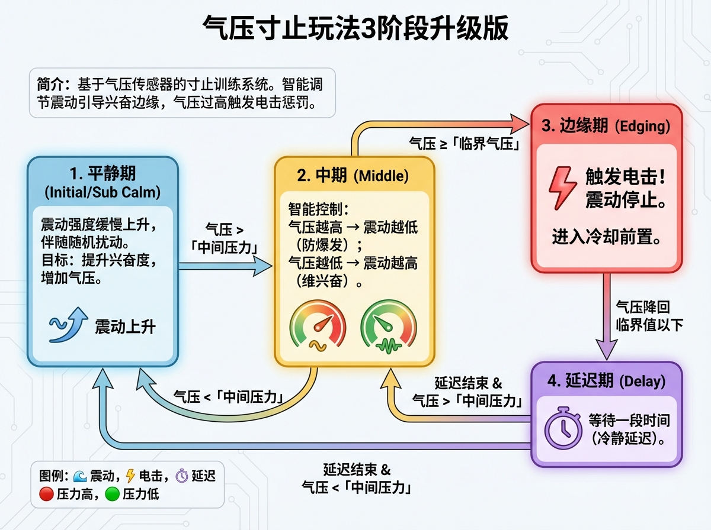

# Versión mejorada del juego de contención (Edición de 3 fases)

## Introducción
Esta es una modalidad de entrenamiento de contención basada en un sensor de presión de aire. El sistema ajusta inteligentemente la intensidad de la vibración según el valor de presión, guiando al usuario para mantenerse al borde de la excitación. Cuando la presión excede el valor crítico, se activa un castigo de descarga eléctrica.

## Grupo de QQ

970326066 Información de verificación: Bajo el silicio

## Presentación del juego

Bilibili: https://www.bilibili.com/video/BV1ZicuzkESJ/
YouTube: https://youtu.be/HvIN5CQ44dI

[Instrucciones de uso antes de comenzar (lectura obligatoria)](#use_instruction)

## Enlaces de compra e información relacionada con las versiones {#buy-link-info}

Taobao: https://item.taobao.com/item.htm?id=1028272889035

### Guía de compra

1. Consulta si es para hombres o mujeres. Para hombres: ver [**Edición Básica**], [**Edición Avanzada**], [**Edición de Lujo**]. Para mujeres: ver [**Edición Básica-V**], [**Edición Avanzada-V**], [**Edición de Lujo-V**], [**Edición de Lujo-X**].
2. Solo quieres jugar a la contención -> **Edición Básica**
3. Quieres añadir la función de descarga eléctrica -> **Edición Avanzada**
4. No puedes irte sin terminar (añade función de bloqueo) -> **Edición de Lujo**
5. Ya tienes un dispositivo OSR -> **Edición OSR6**
6. Mujeres que quieran usar un máquina percusora -> **Edición de Lujo-X**
7. Para cualquier otra pregunta, puedes contactar al servicio de atención al cliente de Taobao o unirte al grupo para consultar.

### Descripción de versiones

#### Versión para hombres

[**Edición Básica**] Sensor de presión + Vibrador + Producto individual para hombres

[**Edición Avanzada**] Sensor de presión + Vibrador + Descarga eléctrica + Producto individual para hombres

[**Edición de Lujo**] Sensor de presión + Vibrador + Descarga eléctrica + Bloqueo + Producto individual para hombres

[**Edición OSR6**] Sensor de presión + Descarga eléctrica + Bloqueo

#### Versión para mujeres

[**Edición de Lujo X**] Sensor de presión + Vibrador + Descarga eléctrica + Bloqueo + Producto individual para mujeres

[**Edición Básica-V**] Sensor de presión + Vibrador

[**Edición Avanzada-V**] Sensor de presión + Vibrador + Descarga eléctrica

[**Edición de Lujo-V**] Sensor de presión + Vibrador + Descarga eléctrica + Bloqueo

### Explicación de términos

Sensor de presión = Sensor de presión de aire + T de tres vías + 2 secciones de tubo + Tapón anal inflable

Vibrador = Controlador de huevo vibratorio + Huevo vibratorio de tamaño normal

Descarga eléctrica = Terminal de descarga eléctrica + Parches

Bloqueo = Candado automático

Producto individual para hombres = Huevo vibratorio pequeño + Funda para pene (ver imagen abajo)

Producto individual para mujeres = Máquina percusora + Controlador de máquina percusora

## Introducción a los dispositivos de estimulación

## Flujo del juego
El juego consiste en el siguiente ciclo de estados:

1.  **Período de calma (Inicial/Sub Calma)**
    - La intensidad de la vibración aumenta lentamente, acompañada de perturbaciones aleatorias.
    - **Objetivo**: Aumentar la excitación, incrementar la presión.
    - **Transición**: Cuando la presión supera la «presión media», se pasa a la fase media.

2.  **Fase media**
    - Control inteligente: A mayor presión, menor intensidad de vibración (para evitar el clímax demasiado rápido); a menor presión, mayor intensidad de vibración (para mantener la excitación).
    - **Transición**:
        - Presión >= «presión crítica»: Se activa la **descarga eléctrica** y se entra en la fase límite (edging).
        - Presión < «presión media»: Se regresa al período de calma.

3.  **Fase límite (Edging)**
    - ¡**Se activa la descarga eléctrica**! La vibración se detiene.
    - **Transición**: Una vez que la presión baja por debajo del valor crítico, se entra en el período de retardo de enfriamiento.

4.  **Período de retardo**
    - Se espera un tiempo determinado (retardo de enfriamiento).
    - **Transición**: Al finalizar el retardo, según la presión actual, se decide volver a la fase media (si es mayor que la presión media) o al período de calma (si es menor).

## Dispositivos necesarios

1.  **Sensor de presión de aire (QIYA)**: Obligatorio. Se utiliza para monitorear el nivel de excitación.
2.  **Controlador de motor excéntrico (TD01)**: Obligatorio. Se usa para proporcionar estímulo vibratorio.
3.  **Dispositivo de descarga eléctrica (DIANJI)**: Opcional. Se usa como castigo en el límite.
4.  **Candado automático (ZIDONGSUO)**: Opcional. Se bloquea automáticamente al iniciar el juego y se desbloquea al finalizar.

## Instrucciones de uso {#use_instruction}

1.  Complete el ensamblaje del dispositivo de presión de aire.
    - Video tutorial de ensamblaje: https://youtu.be/QQaT823gKHc
    - Quark: https://pan.quark.cn/s/03b8d2dab2ff
    - Para la versión OSR6, consulte [**Instrucciones de uso de OSR6**](../../device/osr6-control-plugin.md)
2.  Conecte todos los dispositivos a la red.
    - Referencia para teléfonos móviles: [**Cliente para móvil**](../client/new-phone-client.md)
    - Referencia para ordenadores: [**Cliente de control para PC**](../client/PC版控制客户端.md)

2.  Coloque el dispositivo de presión en el cuerpo, generalmente inflándolo hasta 20-25 kPa. Asegúrese de que la presión sea lo suficientemente baja para que haya un cambio notable al aplicar una ligera presión, lo que ayuda a ralentizar las fugas.
Nota: Durante los primeros 3 minutos después de encender el sensor de presión, puede haber inestabilidad en la lectura (descenso o aumento continuo). Esto se debe al calentamiento del sensor. Si ocurre esto, espere un momento antes de comenzar el juego.
3.  Configure la presión media y la presión crítica. Para principiantes, es recomendable ajustarlas mientras juegan: si es difícil contenerse, reduzca los valores; si no hay sensación, auméntelos.

## Explicación de configuración

| Nombre del parámetro | Descripción | Valor recomendado |
| :--- | :--- | :--- |
| **Duración del juego** | Tiempo total de ejecución del juego (minutos). | 20 |
| **Presión crítica** | Umbral máximo de presión (kPa) para activar la descarga eléctrica y la contención. | 23 |
| **Intensidad máxima TD01** | Intensidad máxima de la vibración (1-255). | 255 |
| **Presión media (excitación)** | Umbral de presión (kPa) para entrar en la fase de control inteligente. | 22 |
| **Intensidad de descarga** | Intensidad del voltaje (V) durante el castigo. | 20 |
| **Duración de la descarga** | Duración del castigo (segundos). | 3 |
| **Retardo por baja presión** | Tiempo de descanso y enfriamiento tras activar la contención (segundos). | 5 |
| **Límite de tasa de incremento de intensidad** | Velocidad máxima de aumento de la vibración, evita cambios bruscos. | 10 |
| **Perturbación aleatoria de intensidad** | Amplitud de fluctuación aleatoria de la intensidad de vibración (%). | 0 |
| **Aumento gradual tras retardo** | Valor que la vibración aumenta automáticamente por segundo durante el período de calma. | 10 |

## Instrucciones de seguridad

1.  No configure el voltaje del dispositivo de impulsos eléctricos demasiado alto. No permita que la corriente pase a través del torso.