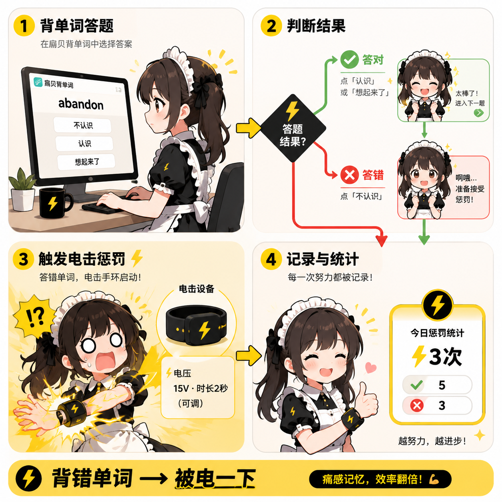

## ¿Por qué un electrochoque?

¿Por qué los juegos son más emocionantes que estudiar? Porque tienen una consecuencia — no puedes permitirte perder, por lo que te concentras al máximo en cada paso, y la sensación es increíble.

Pero, ¿y aprender palabras? Si la "conoces" o si "no la conoces", acertar o fallar es tan soso. El sistema operativo de tu cerebro piensa "da igual, siguiente", y la palabra simplemente no entra en tu mente 😭

Pero ¿y si **recibes un electrochoque por fallar**? Dar un precio real al error convierte cada palabra en una cuestión de vida o muerte — esto es el Juego de Electrochoque de Shanbay Words: **Fallar → Electrochoque → La recordarás definitivamente la próxima vez** 🔌⚡

---

El Juego de Electrochoque de Shanbay Words es una extensión basada en la página web de aprendizaje de vocabulario de Shanbay: cuando la extensión detecta que haces clic en 'No Conocida' (respuesta incorrecta), o detecta 'No me acordé' después de activar el castigo, activará el dispositivo de electrochoque conectado para darte una sacudida ⚡.

> 🛒 **Obtener el dispositivo**: [Comprar en Taobao](https://item.taobao.com/item.htm?id=1065205279302) | [Comprar en el sitio web oficial](https://shop.undersilicon.cn/zh/products/beidanci) | [Obtener cupón de descuento](../优惠券.md)  
> 🎬 **Tutorial en video**: [Sitio de videos de UnderSilicon (no subido aún)](https://video.undersilicon.com/w/pcesS2gYvbfuU5Wcf5v7fQ) | [YouTube (no subido aún)](https://youtu.be/Q7ti6oOdhpc)

<!-- TODO: El tutorial en video usa temporalmente un video del juego de parada como marcador de posición, será reemplazado por un enlace exclusivo para Shanbay Words Electrochoque -->

## Instrucciones del Juego

El ciclo completo en una frase: **Responder en Shanbay → La extensión juzga si es correcto o incorrecto → Si es incorrecto, activa el dispositivo de electrochoque** — memoria por dolor, eficiencia duplicada.

## Pasos de Operación

### 1. Preparativos

Primero, instala el cliente y conecta el dispositivo. Consulta [Cliente de Control para PC](./client/PC版控制客户端.md).

Antes de iniciar, confirma estos puntos:

- El cliente de control ya está conectado al dispositivo de electrochoque (sin conexión no habrá electrochoque)
- En el mapeo de dispositivos, hay al menos un dispositivo con capacidad `shock`
- El navegador puede abrir normalmente la página de aprendizaje de vocabulario de la versión web de Shanbay
- En el primer uso, prueba primero con baja intensidad y duración breve, no empieces al máximo de inmediato ⚠️

### 2. Entrar a la librería de juegos

En el panel de control, encuentra "Shanbay Words Electrochoque" en la librería de juegos.

### 3. Abrir la configuración previa al inicio

Haz clic en "Configurar e iniciar" para entrar a la página de configuración de la extensión.

### 4. Mapear el dispositivo de electrochoque

En "Mapeo de dispositivos", selecciona un dispositivo con capacidad `shock`. Si no hay ninguno, conecta uno primero 😉.

### 5. Configurar parámetros

Ajusta los siguientes parámetros según sea necesario:

- Intensidad del electrochoque (se recomienda comenzar baja y aumentar gradualmente)
- Duración del electrochoque (igualmente, primero breve y luego más larga)
- ¿Castigar también por "No me acordé"? (opción exclusiva para los valientes 💀)

### 6. Iniciar la extensión

Haz clic en "Iniciar Extensión", luego continúa en la ventana de confirmación. ¡La última oportunidad para arrepentirte!

### 7. Comienza tu viaje de aprendizaje con electrochoque ⚡

La página de estudio mostrará primero la palabra actual, la transcripción fonética y dos opciones de juicio.

Después de responder correctamente, cambia al estado de resultado, indicando que esa palabra no se estudiará más hoy. ¡Felicidades, te has librado 🎉!

## Reglas de Señales

| Señal de la página de Shanbay | Juicio de la extensión | ¿Electrochoque por defecto? |
| --- | --- | --- |
| `Conocida` | Respuesta correcta | ❌ No (buen estudiante) |
| `No Conocida` | Respuesta incorrecta | ⚡ ¡Electrochoque! |
| `Me acordé` | Respuesta correcta | ❌ No (recuerdo exitoso) |
| `No me acordé` | Falla en el recuerdo | Indulgencia por defecto. Con castigo activado ⚡ |

## Preguntas Frecuentes 🛠️

- **No se activa el electrochoque**: Comprueba si en el mapeo de dispositivos se ha seleccionado un dispositivo `shock`, y asegúrate de que la página de configuración de la extensión no muestre errores. ¡Que no te dé corriente no es bueno!
- **Se activa con demasiada frecuencia**: Desactiva "Castigar también por 'No me acordé'", o reduce la intensidad y duración. Sé amable contigo mismo 😅.
- **La página no entra en estado de estudio**: Primero confirma en la versión web de Shanbay que has iniciado sesión en tu cuenta y puedes comenzar normalmente el aprendizaje de palabras.

## Sugerencias de Uso 💡

- Confirma primero que el dispositivo de electrochoque está mapeado correctamente (con el electroshock en la mano, el mundo es tuyo)
- Prueba primero con baja intensidad y duración breve para encontrar tu "umbral de dolor" adecuado
- Al cambiar de página o salir de la extensión, detén primero la ejecución actual
- Después de terminar un grupo, date una pequeña recompensa, porque al fin y al cabo — quien puede perseverar es un valiente 💪⚡