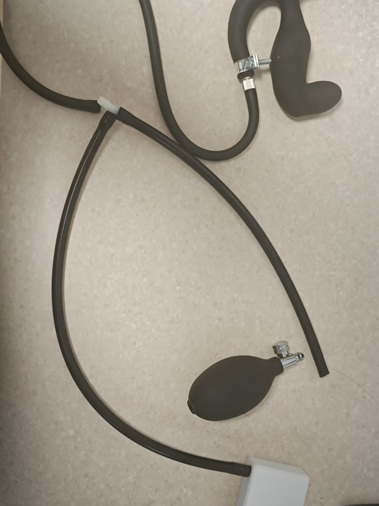
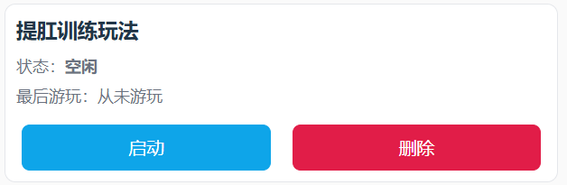

# Modo de juego de entrenamiento de Kegel

# Introducción al juego
+ El entrenamiento de Kegel alterna entre la "fase de relajación" y la "fase de contracción"
+ El objetivo es completar tantas "contracciones exitosas" como sea posible en el tiempo establecido
+ El éxito o el fracaso se indican visualmente en la interfaz; el fracaso activa una descarga eléctrica (si el dispositivo está conectado y habilitado)

## Descarga del software y preparación
Teléfono Android: [Cliente para móvil](/docs/player/new-phone-client)

Computadora con Windows: [Cliente de control para PC](./client/PC版控制客户端.md)

# Equipo y preparación
+ Equipo obligatorio: `Sensor de presión (QIYA)`
+ Equipo opcional: `Dispositivo de descarga (DIANJI)`, `Cerradura automática (ZIDONGSUO)`
+ La cerradura se activa automáticamente al comenzar y se desactiva al finalizar (si está conectada)

## Ensamblaje del equipo
Retira el inflador del tapón anal hinchable y conéctalo a la manguera de goma del sensor de presión. Luego, conecta la manguera del tapón anal a la conexión en T del sensor de presión.

1. Aspecto del tapón anal al recibirlo (los tapones nuevos tienen un diseño modificado, ofreciendo un mejor sellado, similar al siguiente)

2. Retirar el inflador

3. Conectar a ambos extremos del sensor de presión

4. Aspecto final

5. Opcional: refuerzo si se percibe una fuga rápida de presión

Aprieta este collar en la unión para reducir la velocidad de fuga de presión.

Enlace de compra del collar: [https://item.taobao.com/item.htm?id=724827233726](https://item.taobao.com/item.htm?id=724827233726) (11-13 mm)

## Entrada al juego

# Explicación de parámetros
+ `Duración (minutos)`: Tiempo total de la sesión de juego.
+ `Objetivo de contracciones`: Número esperado de contracciones exitosas, utilizado para mostrar el progreso general.
+ `Variación de presión (kPa)`: Umbral de incremento de presión que debe alcanzarse durante la fase de contracción (respecto a la presión mínima de la fase de relajación).
+ `Intensidad de descarga (V)`: Intensidad de la descarga eléctrica en caso de fallo.
+ `Duración de la descarga (segundos)`: Tiempo que dura la descarga eléctrica en caso de fallo.
+ `Tiempo por ciclo (segundos)`: Duración de cada fase. Por defecto son 10 segundos (10 segundos de relajación → 10 segundos de contracción → ciclo).

# Flujo del juego
+ Fase de relajación
    - Relájate y respira con naturalidad. El sistema registrará la "presión mínima" de esta fase como referencia.
    - Tras la cuenta atrás, comienza la fase de contracción.
+ Fase de contracción
    - Debes aumentar la presión hasta alcanzar "presión mínima + variación de presión" dentro del tiempo establecido para esta fase.
    - Al alcanzar el objetivo, se considera "logrado", pero debes esperar a que termine la cuenta atrás de la fase para pasar a la siguiente.
    - Si no se alcanza antes del final de la fase, se determina "desafío fallido · comienza descarga eléctrica" (si el dispositivo de descarga está disponible).
+ Alternancia de fases
    - Cada ciclo sigue el orden "relajación → contracción → relajación → ...", repitiéndose hasta que se agote el tiempo o se alcance el número objetivo.

# Indicaciones en la interfaz
+ En la parte superior, texto grande muestra la fase actual (relajación/contracción) y el tiempo restante.
+ Progreso general
    - Barra de progreso por número: contracciones completadas / contracciones objetivo.
    - Barra de progreso por tiempo: tiempo transcurrido / tiempo total.
+ Presión y objetivo
    - Presión actual (kPa).
    - Presión mínima en fase de relajación (valor de referencia).
    - Presión objetivo en fase de contracción (presión mínima + variación de presión).
+ Indicadores de éxito/fracaso
    - Éxito: se muestra una cápsula verde "logrado" junto al número.
    - Fracaso: se muestra una cápsula roja "desafío fallido · comienza descarga eléctrica" junto al número.
+ Operaciones y registro
    - Botones: pausar, descarga manual.
    - Registro: muestra información reciente y mensajes del sistema.

**Finalización y estadísticas**

+ El juego termina al alcanzar la duración establecida o al completar el número objetivo de contracciones exitosas.
+ Se desbloquea automáticamente al finalizar (si está conectada la cerradura automática).
+ La interfaz muestra el número total de contracciones exitosas, descargas eléctricas, etc.

**Recomendaciones de uso**

+ Para principiantes, se recomienda establecer un valor bajo en "variación de presión" para familiarizarse con el ritmo.
+ Si se conecta el dispositivo de descarga, comenzar con baja intensidad y ajustarla gradualmente.
+ Mantener una respiración estable y concentrarse en alcanzar el objetivo de presión durante la fase de contracción.

**Guía rápida**

+ Conectar el sensor de presión (opcionalmente conectar descarga eléctrica y cerradura automática).
+ Configurar los parámetros y comenzar.
+ En la fase de relajación, no aplicar fuerza y esperar la cuenta atrás; en la fase de contracción, esforzarse para alcanzar el objetivo de presión.
+ Al ver "logrado", mantener hasta el final de la fase; en caso de fallo, se indicará y se aplicará descarga.
+ Repetir el ciclo hasta el final. Consultar las estadísticas y la barra de progreso para conocer los resultados.