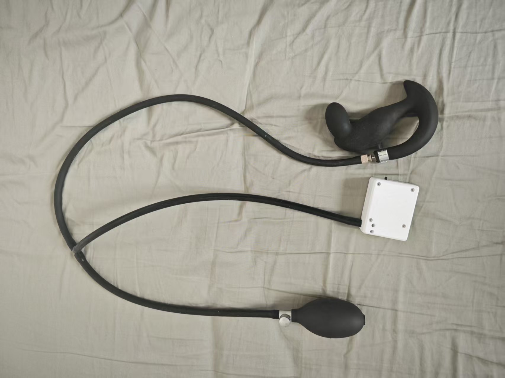

# Juego de Control en el Borde (Edging)

Un juego de entrenamiento de edging basado en un sensor de presión, que detecta cambios en la presión del esfínter, combinado con un controlador de motor de eje descentrado y un dispositivo de electrochoque para un control inteligente de estímulo.

Enlace de compra del kit de juego:

[https://item.taobao.com/item.htm?id=1017049175869](https://item.taobao.com/item.htm?id=1017049175869)

# Tutorial de juego para la versión móvil:
[https://www.bilibili.com/video/BV1xA1fBsErr/](https://www.bilibili.com/video/BV1xA1fBsErr/?share_source=copy_web&vd_source=3dd9ee8089c213072e87f2745c7050aa)

Tutorial original de Yuque: https://www.yuque.com/easysmart/easysmart/oe8gsvyhtflb9pqt

# Tutoriales relacionados con la versión para PC:

Descarga del cliente: [Cliente de control para PC](./client/PC版控制客户端.md)

Video tutorial: [【Tutorial de juego】 Conjunto de edging revelado: 3 pasos para la experiencia definitiva, video te enseña a dominarlo_哔哩哔哩_bilibili](https://www.bilibili.com/video/BV1WXWpzUEoW/?spm_id_from=333.1007.top_right_bar_window_dynamic.content.click)

Se recomienda usar punto de acceso Wi-Fi y Wi-Fi por defecto. Este método no requiere configuración de red. Si prefieres el método del router, antes de comenzar a jugar, **<font>configura la red</font>** del dispositivo. Consulta la sección de configuración de red en el menú de la izquierda.

# Precauciones
1.  El tapón anal inflable ha sido mejorado para mayor sellado, reduciendo fugas de aire, y su apariencia es diferente a la que se muestra a continuación.
2.  Durante el juego, la presión del aire **<font>no debe ser demasiado alta</font>** (puede causar fugas). Generalmente, entre 22 y 24 está bien, lo suficiente para que haya cambios al apretar.
3.  Al introducirlo, se puede inflar un poco para que no esté demasiado blando y sea difícil de insertar.

# Ensamblaje del kit (lectura obligatoria)
Desconecta la pera del tapón anal inflable y conéctala al tubo de goma del sensor de presión. Conecta el tubo de goma del tapón anal al conector en T del sensor de presión.

1.  Apariencia del tapón anal al recibirlo


2.  Retirar la pera de inflado


3.  Conectar a ambos extremos del sensor de presión


4.  Apariencia final



5.  Refuerzo opcional si la pérdida de presión es rápida


Apretar esta abrazadera en la conexión puede reducir la velocidad de fuga de presión.

Enlace de compra de la abrazadera: [https://item.taobao.com/item.htm?id=724827233726](https://item.taobao.com/item.htm?id=724827233726) (11-13mm)

### Mecánica del juego
1.  **Monitoreo de presión**: El sensor de presión detecta los cambios en la presión del esfínter en tiempo real.
2.  **Ajuste inteligente**: Reduce el estímulo cuando la presión es alta, lo aumenta cuando es baja.
3.  **Advertencia por electrochoque**: Activa un choque eléctrico cuando la presión supera el valor crítico para alertar al usuario.
4.  **Inicio retardado**: Cuando la presión es baja, espera un tiempo antes de comenzar el estímulo de forma gradual.
5.  **Equilibrio dinámico**: Mantiene un estado de equilibrio cerca de la presión crítica.

## Diagrama de transición de estados


## Requisitos del equipo
### Configuración del equipo
| Tipo de equipo | ID Lógico | Nombre del dispositivo | Necesario | Función |
| --- | --- | --- | --- | --- |
| QIYA | pressure_sensor | Sensor de presión | Sí | Detecta cambios en la presión del esfínter |
| TD01 | motor_controller | Controlador de motor de eje descentrado | Sí | Proporciona estímulo de intensidad ajustable |
| DIANJI | shock_device | Dispositivo de electrochoque | No | Choque eléctrico de advertencia cuando la presión es demasiado alta |
| ZIDONGSUO | auto_lock | Dispositivo de bloqueo automático | No | Se bloquea al iniciar el juego, se desbloquea al finalizar |


## Configuración de parámetros del juego
### Parámetros básicos
| Nombre del parámetro | Tipo | Rango | Valor por defecto | Descripción |
| --- | --- | --- | --- | --- |
| duration | Número | 1-120 minutos | 20 minutos | Duración del juego |
| criticalPressure | Número | 0-40 kPa | 20 kPa | Valor de presión crítica |
| maxMotorIntensity | Número | 1-255 | 200 | Intensidad máxima del TD01 |


### Parámetros de control de estímulo
| Nombre del parámetro | Tipo | Rango | Valor por defecto | Descripción |
| --- | --- | --- | --- | --- |
| lowPressureDelay | Número | 1-30 segundos | 5 segundos | Tiempo de retardo del estímulo cuando la presión es baja |
| stimulationRampRateLimit | Número | 1-50 | 10 | Límite de tasa de incremento de intensidad del estímulo (no más de este valor por segundo) |
| pressureSensitivity | Número | 0.1-5.0 | 1.0 | Coeficiente de sensibilidad a cambios de presión |
| stimulationRampRandomPercent | Número | 0-100% | 0% | Porcentaje de perturbación aleatoria en la intensidad del estímulo |


### Parámetros de electrochoque
| Nombre del parámetro | Tipo | Rango | Valor por defecto | Descripción |
| --- | --- | --- | --- | --- |
| shockIntensity | Número | 10-100 V | 20 V | Intensidad del electrochoque |
| shockDuration | Número | 0.5-5 segundos | 1 segundo | Duración del electrochoque |


## Lógica del algoritmo
### Algoritmo de mapeo Presión-Intensidad
```plain
if (currentPressure >= criticalPressure) {
    motorIntensity = 0
    triggerShock()
} else if (currentPressure < criticalPressure) {
    pressureDiff = criticalPressure - currentPressure
    targetIntensity = (pressureDiff / criticalPressure) * maxMotorIntensity
    
    // Mecanismo de inicio retardado, aumento gradual de intensidad, perturbación aleatoria de intensidad
}
```