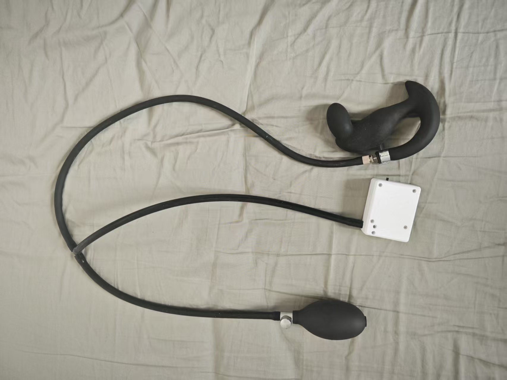

# Modo de juego de Entrenamiento de Elevación Anal

# Introducción al modo de juego
+ El entrenamiento de elevación anal alterna entre la "fase de relajación" y la "fase de elevación anal"
+ El objetivo es completar la mayor cantidad de "elevaciones anales exitosas" posible dentro del tiempo establecido
+ El éxito o el fracaso se indican visualmente en la interfaz; el fracaso activa una descarga eléctrica (si está conectado y habilitado)

## Descarga del software y preparación
Teléfono Android: [Cliente para móvil (se recomienda utilizar la WiFi por defecto, no configurar la red)](../手机客户端（建议采用默认wifi，不要进行配网）.md)

Ordenador con Windows: [Guía de uso del nuevo cliente para ordenador](../（电脑版）控制客户端/新版电脑客户端使用指南.md)

# Equipo y preparación
+ Equipo necesario: `Sensor de presión de aire (QIYA)`
+ Equipo opcional: `Dispositivo de descarga eléctrica (DIANJI)`, `Cerradura automática (ZIDONGSUO)`
+ La cerradura se activa automáticamente al inicio y se desbloquea al finalizar (si está conectada la cerradura automática)

## Ensamblaje del equipo
Desconecta la pera de inflado del tapón anal inflable y conéctala a la manguera de goma del sensor de presión de aire. Luego, conecta la manguera de goma del tapón anal al extremo T del sensor de presión de aire.

1. Aspecto del tapón anal al recibirlo (el diseño del nuevo tapón anal ha cambiado, tiene un mejor sellado y es similar al de abajo)

2. Retirar la pera de inflado

3. Conectar a ambos extremos del sensor de presión de aire

4. Aspecto del producto terminado

5. Refuerzo opcional si se percibe una fuga de presión rápida

Aprieta este abrazadera en la conexión para reducir la velocidad de fuga de presión.

Enlace de compra de la abrazadera: [https://item.taobao.com/item.htm?id=724827233726](https://item.taobao.com/item.htm?id=724827233726) (11-13mm)

## Entrada al juego

# Explicación de parámetros
+ `Duración (minutos)`: Duración total de la partida.
+ `Objetivo de número de elevaciones`: Número esperado de elevaciones exitosas, utilizado para mostrar el progreso general.
+ `Grado de cambio de presión (kPa)`: Umbral de incremento de presión necesario durante la fase de elevación anal (en relación a la presión mínima de la fase de relajación).
+ `Intensidad de descarga (V)`: Intensidad de la descarga eléctrica al fallar.
+ `Duración de la descarga (segundos)`: Tiempo que dura la descarga eléctrica al fallar.
+ `Tiempo de ciclo individual (segundos)`: Duración de cada fase, por defecto 10 segundos (relajación 10s → elevación anal 10s → ciclo).

# Flujo de juego
+ Fase de relajación
    - Relájate y respira naturalmente; el sistema registrará la "presión mínima" de esta fase como referencia.
    - Al finalizar la cuenta regresiva, se pasa a la fase de elevación anal.
+ Fase de elevación anal
    - Debes aumentar la presión hasta alcanzar "presión mínima + grado de cambio de presión" dentro del tiempo de esta fase.
    - Alcanzar el objetivo se considera "Logrado", pero aún debes esperar a que termine la cuenta regresiva de esta fase para pasar a la siguiente ronda.
    - Si no se alcanza el objetivo antes de que termine la fase, se considera "Desafío fallido · Iniciando descarga eléctrica" (si el dispositivo de descarga está disponible).
+ Alternancia de fases
    - Cada ronda sigue el ciclo "relajación → elevación anal → relajación → …" hasta que se acabe el tiempo o se alcance el número objetivo de veces.

# Indicaciones de la interfaz
+ En la parte superior, texto grande muestra la fase actual (Fase de relajación/Fase de elevación anal) y el tiempo restante en esta fase.
+ Progreso general
    - Barra de progreso por número de veces: Veces completadas / Objetivo de veces.
    - Barra de progreso por tiempo: Tiempo transcurrido / Tiempo total.
+ Presión y objetivo
    - Presión actual (kPa)
    - Presión mínima durante la fase de relajación (valor de referencia)
    - Presión objetivo para la elevación anal (presión mínima + grado de cambio de presión)
+ Indicación de éxito/fracaso
    - Éxito: Muestra una cápsula verde "Logrado" después del número.
    - Fracaso: Muestra una cápsula roja "Desafío fallido · Iniciando descarga eléctrica" después del número.
+ Operaciones y registro
    - Botones: Pausar, descarga eléctrica manual.
    - Registro: Muestra información reciente y mensajes del sistema.

**Finalización y estadísticas**

+ La partida termina al alcanzar la duración establecida o al lograr el número objetivo de elevaciones exitosas.
+ Se desbloquea automáticamente al finalizar (si está conectada la cerradura automática).
+ La interfaz muestra el número acumulado de éxitos y descargas eléctricas, entre otros datos.

**Recomendaciones de uso**

+ Para usuarios primerizos, se recomienda establecer un "grado de cambio de presión" bajo para familiarizarse con el ritmo.
+ Si se conecta un dispositivo de descarga eléctrica, comenzar con una intensidad baja y ajustar gradualmente.
+ Mantener una respiración estable; durante la fase de elevación anal, concentrarse en aumentar la presión para alcanzar el objetivo.

**Guía rápida de inicio**

+ Conectar el sensor de presión de aire (conectar opcionalmente el dispositivo de descarga y la cerradura automática).
+ Configurar los parámetros y comenzar.
+ En la fase de relajación, no esforzarse, solo esperar la cuenta regresiva; en la fase de elevación anal, esforzarse para aumentar la presión hasta el objetivo.
+ Al ver "Logrado", mantenerlo hasta que termine la fase; el fracaso mostrará un mensaje y activará la descarga.
+ Repetir el ciclo hasta el final, revisar las estadísticas y barras de progreso para conocer el desempeño.