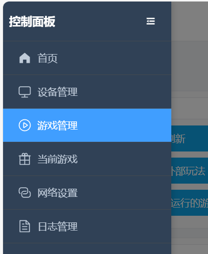

# 肛門括約筋トレーニングゲーム

# ゲーム概要
+ 肛門括約筋トレーニングは「リラックスフェーズ」と「収縮フェーズ」を交互に行います
+ 目標は、規定時間内にできるだけ多くの「収縮成功」を達成することです
+ 成功または失敗はインターフェースで直感的に表示され、失敗時は電気刺激が発生します（接続・有効化されている場合）

## ソフトウェアのダウンロードと準備
Androidスマートフォン：[スマートフォンクライアント（デフォルトWiFiを使用し、ネットワーク設定を行わないことを推奨）](../手机客户端（建议采用默认wifi，不要进行配网）.md)

Windows PC：[新版PCクライアント使用ガイド](../PC版控制客户端.md)

# デバイスと準備
+ 必須デバイス：`気圧センサー（QIYA）`
+ オプションデバイス：`電気刺激デバイス（DIANJI）`、`自動ロック（ZIDONGSUO）`
+ 開始時に自動ロック、終了時に自動アンロック（自動ロックが接続されている場合）

## デバイスの組み立て
インフレータブル肛門プラグの手動ポンプを取り外し、気圧センサーのチューブに接続します。肛門プラグのチューブは気圧センサーの三方弁に接続します。

1. 肛門プラグの到着時の状態（新型プラグは形状が変更され、シール性能が向上しています。下記と類似）

2. 手動ポンプを取り外す

3. 気圧センサーの両端に接続する

4. 完成品の状態

5. 気圧漏れが速いと感じる場合、オプションで強化可能

このロックカプラーを接続部で締め付けると、気圧漏れ速度を低減できます。

ロックカプラー購入先：[https://item.taobao.com/item.htm?id=724827233726](https://item.taobao.com/item.htm?id=724827233726) （11-13mm

## ゲームエントリー

# パラメータ説明
+ `持続時間(分)`：ゲーム全体の所要時間
+ `収縮目標回数`：達成を目指す成功回数。全体進捗の表示に使用
+ `気圧変化度(kPa)`：収縮フェーズで達成する必要がある気圧増加量の閾値（リラックスフェーズの最低気圧に対して）
+ `電気刺激強度(V)`：失敗時の電気刺激強度
+ `電気刺激持続時間(秒)`：失敗時の電気刺激持続時間
+ `単一サイクル時間(秒)`：各フェーズの時間。デフォルト10秒（リラックス10秒 → 収縮10秒 → 繰り返し）

# ゲームフロー
+ リラックスフェーズ
    - リラックスして自然に呼吸します。システムはこのフェーズの「最低気圧」を基準値として記録します
    - カウントダウン終了後、収縮フェーズに移行します
+ 収縮フェーズ
    - このフェーズの時間内に、気圧を「最低気圧 + 気圧変化度」まで上昇させる必要があります
    - 目標に達すると「達成済み」と判定されますが、このフェーズのカウントダウンが終了するまで次のラウンドには進みません
    - フェーズ終了までに目標に達しない場合、「挑戦失敗・電気刺激開始」と判定されます（電気刺激デバイスが利用可能な場合）
+ フェーズ交代
    - 各ラウンドは「リラックス → 収縮 → リラックス → …」のサイクルで繰り返され、時間終了または目標回数達成まで続きます

# インターフェース表示
+ 上部の大きな文字で現在のフェーズ（リラックスフェーズ/収縮フェーズ）とそのフェーズの残り時間を表示
+ 全体進捗
    - 回数ベースのプログレスバー：完了回数 / 目標回数
    - 時間ベースのプログレスバー：経過時間 / 総時間
+ 圧力と目標
    - 現在の圧力（kPa）
    - リラックス期最低圧力（参考値）
    - 収縮目標圧力（最低圧力 + 気圧変化度）
+ 成功/失敗表示
    - 成功：数字の後に緑色のカプセル「達成済み」を表示
    - 失敗：数字の後に赤色のカプセル「挑戦失敗・電気刺激開始」を表示
+ 操作とログ
    - ボタン：一時停止、手動電気刺激
    - ログ：最近の情報とシステムメッセージを表示

**終了と統計**

+ 設定した持続時間に達するか、成功回数が目標に達すると終了します
+ 終了後、自動的にアンロックされます（自動ロックが接続されている場合）
+ インターフェースに累積成功回数と電気刺激回数などが表示されます

**使用上のアドバイス**

+ 初回使用時は、「気圧変化度」を低く設定してリズムに慣れることをお勧めします
+ 電気刺激デバイスを接続する場合は、低強度から始め、徐々に調整してください
+ 呼吸を安定させ、収縮フェーズでは目標圧力に達するよう集中して力を入れます

**クイックスタート**

+ 気圧センサーを接続します（オプションで電気刺激デバイス、自動ロックを接続）
+ パラメータを設定して開始します
+ リラックスフェーズでは力を入れず、カウントダウンを待ちます。収縮フェーズでは目標まで力を入れて圧力を上げます
+ 「達成済み」が表示されたら、そのフェーズが終了するまで維持します。失敗の場合は表示され電気刺激が発生します
+ 終了までサイクルを繰り返し、統計とプログレスバーで完了状況を確認します