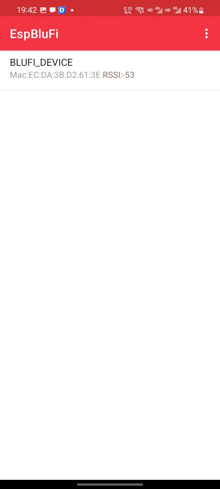
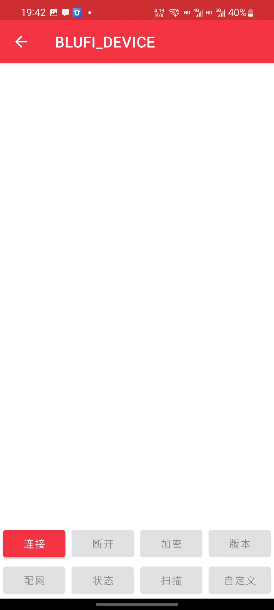
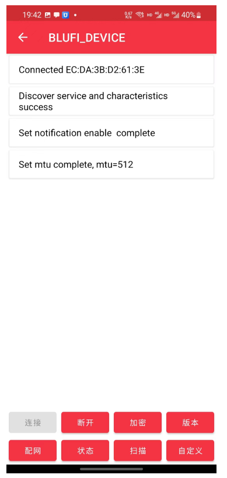
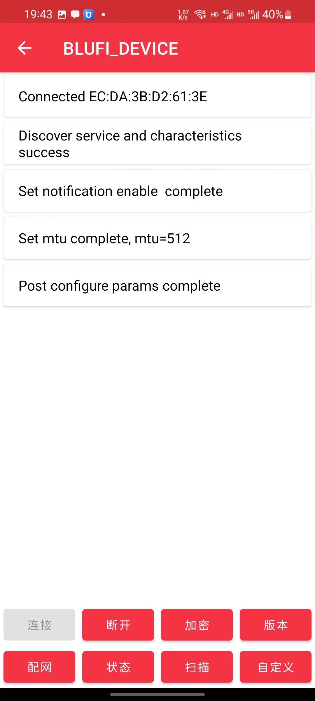

# APP経由でデバイスをWi-Fiに接続する

**注意：デフォルトWi-Fiを使用する場合、ネットワーク設定は不要です。デフォルトWi-Fi名: easysmart、パスワード: 11111111。デバイスは自動的にデフォルトWi-Fiに接続します**

**前提条件：**

1. 設置環境に2.4GHz無線Wi-Fiがあること

接続に失敗した場合は、[ミニプログラム経由でデバイスをWi-Fiに接続する](./通过小程序将设备连接到wifi.md)方法もご利用いただけます。

### 1. バッテリーをデバイスに挿入するか、USB電源を接続してください
### 2. （初回使用時に必要）ネットワーク設定用アプリをダウンロード
Android：[https://github.com/EspressifApp/EspBlufiForAndroid/releases](https://github.com/EspressifApp/EspBlufiForAndroid/releases)

iOS：[https://apps.apple.com/cn/app/espblufi/id1450614082](https://apps.apple.com/cn/app/espblufi/id1450614082)

### 3. Androidクライアントを例にネットワーク設定を開始
注意：操作前にスマートフォンのBluetoothをオンにしてください

1. クライアントを起動

1. 下にスワイプしてデバイスを更新

1. デバイスをタップ

1. 「接続」をタップ

1. 「配網」をタップ

1. Stationモードを選択（デフォルト）、Wi-Fi名とパスワードを入力（2.4GHz Wi-Fiのみ対応）

1. デュアルバンド統一の場合は「続行」を選択

1. 以上で完了です

**注意：デバイスがWi-Fiに接続するとBluetoothは自動的にオフになります。画面上では失敗と表示されても、再度検索してデバイスが見つからない場合は、接続は成功しています。**

