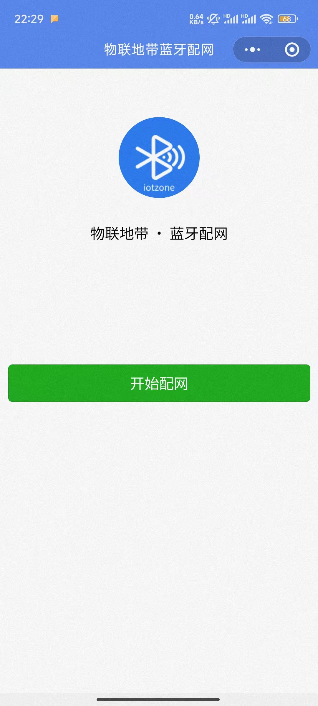
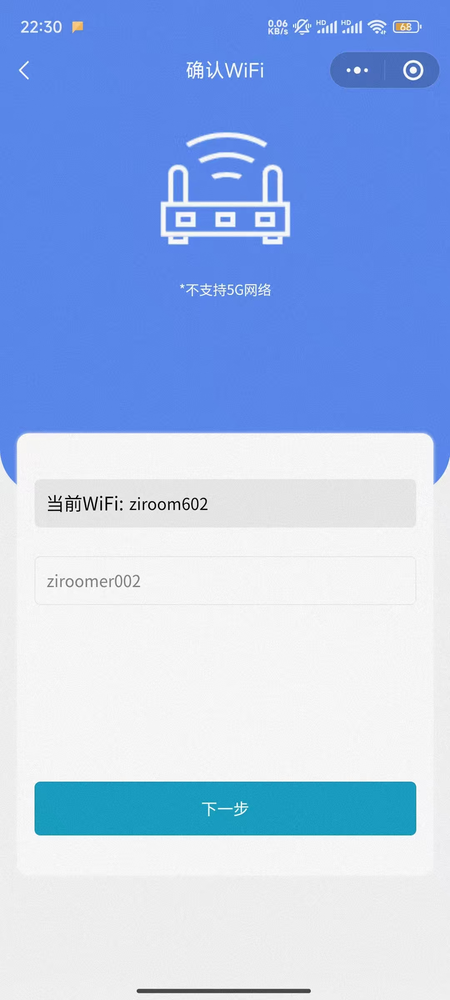
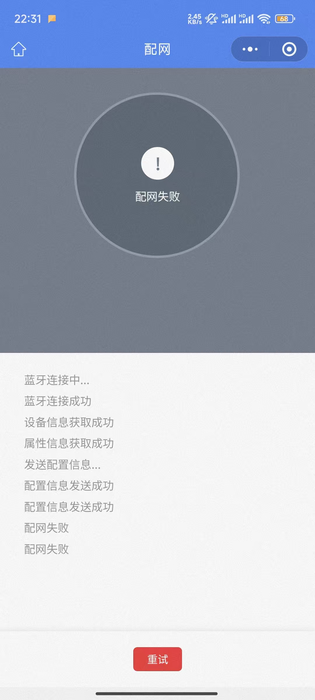

# ミニアプリでデバイスをWi-Fiに接続する

すべてのデバイスは、こちらのドキュメントに従ってWi-Fiに接続できます

**注意：デフォルトのWi-Fi（SSID: easysmart、パスワード: 11111111）を使用したい場合は、ネットワーク設定を行わないでください。デバイスは自動的にデフォルトのWi-Fiに接続します**

ビデオチュートリアル: 

抖音: [https://v.douyin.com/l_QWua94sRA/](https://v.douyin.com/l_QWua94sRA/) 

YT: [https://www.youtube.com/watch?v=W7ITGIC0lw8](https://www.youtube.com/watch?v=W7ITGIC0lw8)

**前提条件：**

1. 環境に2.4GHz無線Wi-Fiがあること
2. 携帯電話が現在その無線Wi-Fiに接続していること（2.4Gと5Gが統合されたWi-Fiの場合、同じSSIDの5G Wi-Fiに接続していても可能）

成功しない場合は、[アプリでデバイスをWi-Fiに接続する](./通过APP将设备连接到wifi.md)こともできます

## ステップ1: デバイスを起動する デバイスは点灯しているはずです
例：

## ステップ2: WeChatで「物联地带蓝牙配网」というミニアプリを検索し、クリックして起動する
注意：操作前に携帯電話のBluetoothをオンにしてください

起動後は下図のようになります

「开始配网」をクリックすると、数秒後に下図のようになります

（デバイスが起動している場合のみ検索可能です。

デバイスのネットワーク設定が成功し、Wi-Fiに接続されている場合、検索できません）

検出されたデバイスを選択します

現在携帯電話が接続しているWi-Fiのパスワードを入力してください（2.4Gまたは2.4Gと5Gが同じSSIDである必要があります）

「下一步」をクリックします

数秒後にネットワーク設定が成功します

ネットワーク設定失敗と表示されても、実際は成功していることがあります。この時点でネットワーク設定は完了です。

**注意：デバイスがWi-Fiに接続すると、自動的にBluetoothがオフになります。失敗と表示されても、再検索でデバイスが見つからない場合は、すでに成功しています。**

